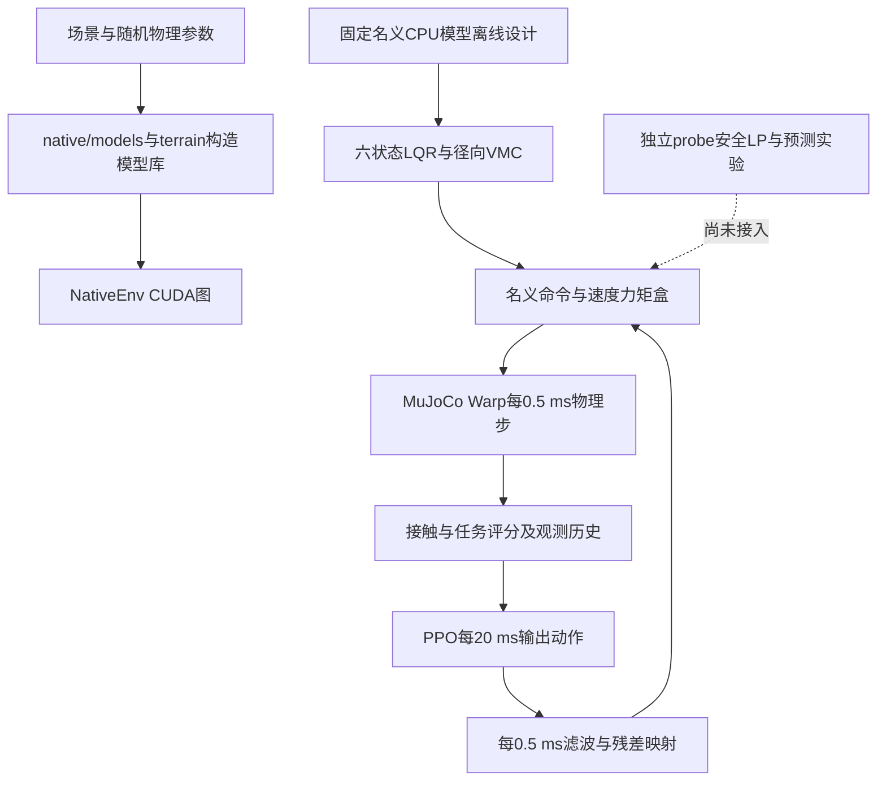

# 轮腿论文代码架构与模型约束审计

本次以 `wheelleg_warp/` 为当前论文工作目录，核对实际执行入口、动力学模型、控制输出、模型约束、安全实验与训练评估。结论是：**闭链初始几何、VMC映射和已测延迟积分没有发现符号错误；当前瓶颈集中在低位名义控制与安全域不一致、实际几何与环境验收不一致、共模控制权限和在线预测误差尚未闭合。现有LP无解不等于机器人在0.115 m物理不可控。**

原始审计对象为2026-10-01的工作树，基于提交 `4a5186f`。原审计仅作诊断；后续用户要求“修正错误并继续按计划推进”，实现和复验进展单列如下，原失败与历史证据保留。

## 第一阶段修正与复验

- 晚期标定入口已改为按实际响应数组长度迭代，并支持`--output`指定独立新目录。新[13臂单步复验](results/height_115_late_response_recheck_20261001/verification.json)完整落盘，CPU/Warp配对q差1.864e−6、v差1.927e−4、接触一致，paired_gate_pass；原结果不覆盖。1Nm模型仍无解、2Nm拟合模型仍有解，只是入口修复，未晋升在线域。
- `range115`默认采用独立的`height_safety='physical_v1'`契约，逐0.5ms记录真实A/B链腿长、八关节余量、闭链误差及实际/命令扭矩相对发令前速度包络的超额。终态要求完整逐步证据和真实几何/关节/电机门；不以理想FK替代实际几何。闭链误差暂只记录，未伪造未标定的鲁棒界或硬件认证。它是验收门，尚不是阻止越线的安全控制。
- 旧固定高度任务与旧0.16～0.38m默认协议不启用这项新契约；历史range115可显式使用`height_safety='legacy_fk'`，输出标签区分。手工拆分执行图若遗漏新监测核，证据计数不足时不得宣称新契约成功。
- [真实物理验收回归](results/height_physical_contract_20261001/verification.json)拒绝全部352个假安全逐腿帧；GPU实际A对归档最大差5.270e−9m、A/B及闭链对CPU site最大差5.246e−9m。有效、A越线、关节越限、实际扭矩超限、缺证据五个终态的success依次为1/0/0/0/0；40子步监测计数及重置通过。首次测试的被动关节扰动方向不符合预期，CPU核对后仅修正测试输入，未放宽生产门。
- [旧任务回归](results/height_physical_contract_20261001/legacy_task_regression.json)8世界轮心退出、奖励/评分、证据冻结、延迟环与重置均通过；现有[六高度×四地形物理回归](results/height_physical_contract_20261001/legacy_height_range.log)24/24通过，27mm单侧范围外诊断仍失败，不计入主任务门。新[六正常0.115m完整零残差基准](results/height_physical_baseline_20261001/verification.json)6/6轨迹完成，真实几何＋八关节＋电机及任务联合成功仍0/6，逐步证据数与物理步数全一致。

| 正常场景 | 最低真实A链 m | 最低八关节余量 rad | 最大实际扭矩超额 Nm |
| --- | ---: | ---: | ---: |
| 平地0.5m/s | 0.113784821 | −0.0225780 | 0 |
| 20mm对称台阶 | 0.112974753 | −0.0235068 | 0 |
| 3°横坡 | 0.107772892 | −0.0234761 | 0 |
| 4mm粗糙路 | 0.113776259 | −0.0228660 | 0 |
| 平地1m/s | 0.113250044 | −0.0657672 | 0 |
| 平地−1m/s | 0.113983843 | −0.0642164 | 1.147e−7 |

实际/命令扭矩门使用固定1e−6Nm浮点数值容差，没有放宽几何线或关节范围。本轮结果支持“验收口径已接线且能识别失效”，不支持“控制瓶颈已解决”。下一阶段仍需统一名义径向/角域请求、实际扭矩分配与动态制动约束；本轮没有修改控制/PPO或开启长训练。

## 第二阶段实际扭矩分配与采集图修正

range115/physical_v1现采用公开增益上界分配命令：`A_cmd=A_nom/max(1,g_upper)`，髋上界1，两轮统一1.05，来自冻结场景的±5%驱动差异。六状态/VMC输出、残差投影和最终限幅使用同一盒；固定名义LQR设计不读随机世界参数。真实世界增益仅用于检查模型是否超域或不支持，不参与在线分配。旧`control`与`residual_projection`接口保留名义协议。

LiveNativeEnv和RecordedEnv会重建执行图，原先未接第一阶段的监测核。本次三条图都改为继承控制模式并逐子步监测，采集元数据标注公开上界和实际/命令限幅口径，原32维观测与PPO保持不变。

[最终公开上界验证](results/actual_torque_public_bound_20261001/verification.json)覆盖4种域内驱动差异和4种轮速（含超空载及反向），16条件的旧实际扭矩超额峰0.225Nm降到1.788e−7Nm，低于既定1e−6Nm浮点门。同状态不同隐藏增益的控制命令逐值相同，Native、Live、Recorded各40子步证据齐全；向共享函数提供单位增益时，命令和诊断与旧实现完全一致。[旧残差投影回归](results/actual_torque_allocation_20261001/legacy_projection.json)1006例、非有限零命令及非绑定1s配对通过；[12000步CPU/GPU同状态控制校对](results/actual_torque_allocation_recorded_20261001/legacy_controller_pair.log)最大差4.700e−7Nm。

初轮测试误用冻结域外的±.1驱动差异而被拒绝，只修测试输入、不扩大域。两个早期精确增益诊断[第一版](results/actual_torque_allocation_20261001/verification.json)、[含遥测版](results/actual_torque_allocation_recorded_20261001/verification.json)读取了随机世界真实增益，具有额外信息，不能作为同信息在线成绩；结果及对应source源码包保留。当前默认与最终验证使用公开上界。

[最终六正常低位完整回合](results/actual_torque_public_bound_20261001/normal115/verification.json)6/6完成、实际扭矩超额全0，几何/关节/任务联合成功仍0/6，监测计数与物理步数逐例相同。最低A链约0.107773～0.113984m，关节余量最低−0.0229～−0.0660rad。修正实际扭矩门没有解决动态几何瓶颈，下一步仍应统一径向/角域请求与共模安全分配，并审查立即制动约束。独立host/GPU安全LP尚未接同一公开命令盒，初始oracle、模型误差、实时和全高度门仍未关闭，不启动PPO长训练。

## 原审计时的架构与范围



原生训练链见 `native/environment.py:337–346`。一个策略步包含40个0.5 ms子步，即策略50 Hz、名义控制和物理2 kHz。`baseline.py`、`gpu_env.py`、`fast_physics.py`是CPU控制配对或单世界物理桥接路径；它们不等于当前原生GPU训练路径。`native/safety_problem.py`与近期host-in-loop安全LP仍为独立实验。

全部137个非结果目录Python文件通过AST语法解析；详细阅读覆盖模型/地形库、原生控制与环境、CPU离线设计和VMC、训练入口/契约/评估、当前恢复/延迟/标定/安全LP及直接依赖。历史probe按当前失败链和调用关系选读，未逐行重新审查每份历史实验脚本；语法通过也不代表每个入口可运行。复用旧证据逐项区分源码匹配、历史来源与当前测量，不打开最终留出。

## 优先处理的问题

### 低位参考没有满足共同安全域

`native/controller.py:132–136`使用 `Lleft=Ltarget+offset`、`Lright=Ltarget-offset`，`offset=clip(0.30 roll+0.12 filtered_roll_rate,±0.035)`。默认参考只有三列，因此实验性的下限投影分支不启用。最终径向输出在170–171行继续使用这两个参考。

0.115 m目标距当前几何代理线0.1147044660616607 m仅 **295.534 µm**。只取3° roll和零角速度，代数重算得到offset=15.708 mm、低侧目标0.099292037 m，低于代理线15.412 mm。这是输入状态下的可复现参考冲突，不是宣称真实机器人必然保持3°倾斜。旧横坡事件窗口也存在相同方向的目标下探；其滤波状态是重建估计，不能当原内部状态逐值测量。

此外，0.115 m的站立连通支路只允许腿极角约±10.790°；每个主动关节留0.1 rad后约±8.901°。控制器没有将径向和角向请求联合约束在该工作空间内。169–171行用 `vl[1]+hub-average` 替换共模，左右对称时旧关节姿态PD的共同角向修正会被抵消。这是六状态共模替换的结构事实，不能单凭代数认定它是全部失效的原因。

已有目标下限投影把横坡最低真实轮心从约0.107773 m改善到0.113564 m，六个正常场景联合门仍0/6。**不能只夹住参考就宣布修复，平地的动态余量和角域是独立问题。** 直接证据见 `HEIGHT_115_ENGINEERING.md:38–44`、`results/height_115_target_floor_20260928/verification.json`。

### 环境验收使用理想FK，没有统一真实几何与八关节门

`native/environment.py:169–172,199–202`记录由四主动关节推得的理想闭链FK最小腿长，在回合终态加入success条件。没有逐步阻止越线，也没有八关节范围、真实A/B链与闭链残差的统一成功条件。MuJoCo XML中的关节范围和connect约束不能代替这个工程验收门。

本轮对 `results/height_115_passive_20260928/passive_trace.npz` 作只读独立核验：在有效轨迹中发现 **352个逐腿帧**满足理想FK≥代理线而真实A链轮心<代理线。首例是world5左腿t=2.061 s：FK=0.114716502845 m、真实A=0.114702653003 m，闭链误差16.376 µm，八关节仍在范围内。最深的此类假安全帧真实A低于代理线49.170 µm；有效帧最大|A−FK|约103.667 µm。四个代表状态经CPU `mj_forward` 的世界site位置独立重建，误差≤4.17e−17 m。

**这里证实的是瞬时谓词不等价，不是已经发现最终success误接收**：这14个旧回合后来连FK门也失败。原始NPZ哈希已核对；模型、环境、地形、CPU几何来源与当前一致，旧轨迹的控制器源码哈希与当前不同，所以这是历史几何证据，不是本轮当前控制性能复测。

MuJoCo将关节限位和闭链等式交给软约束求解器；`range`不意味着积分状态永远无法越界。这与旧轨迹中的软限穿越一致，不能靠把文档里的“限位”改称“硬止挡”消除。[MuJoCo约束计算说明](https://mujoco.readthedocs.io/en/latest/computation/)

### 安全LP代数正确，但当前形式过于保守且缺少误差保证

`probe_height_115_braking_budget.py:21–43`的腿长导数、方向二阶项和关节上下界符号一致。`probe_height_115_live_braking.py:32–55`对每个 `rate<0` 的收紧距离h要求

`a0 + g·c ≥ rate²/(2h)`，同时限制起点增量峰值≤1 Nm及名义绝对速度力矩盒。

这个公式在立即施加并维持恒定制动加速度的假设下有正确的停止距离含义。**它不等同于一般时变反馈的可行域，也不是有扰动界的鲁棒CBF证书。** 对仍距限位约0.44～0.46 rad的关节也要求立刻反向加速，会与腿长救援争夺同一个共模动作。已有持续20 ms分支34/40步不满足至少一个此类立即制动条件，却通过该窗口真实物理门，直接说明该条件比有限窗口安全更强；不说明可长期忽略关节约束。

同时，a0由上一0.5 ms速度差分减去已执行额外动作响应，G是固定局部拟合；LP右端未扣除在线名义加速度和G失配的有界不确定性。旧位置误差reserve不能自动转成加速度误差界，轴向拟合残差也不是连续组合或新状态的留出保证。动作切换、接触冲击和名义反馈变化都会使恒a0假设失配。延迟预测的闭式积分/索引检查通过，不能据此把模型误差也判通过。

最新 `height_115_scheduled_guard_20260929` 中，1 ms更新两个相位在998/998.5 ms到期时因模型无解停止；理想0.5 ms即时参考也在997.5 ms无解。实际A仍安全，因此**这次模型无解不是已经发生物理越界，也不能全归因于通信时延**。

### 原M3子空间不提供共同支撑，新安全层尚未进入默认执行图

`native/controller.py:189–196`的diff3映射为左右 `F,−F / H,−H / W,−W`，平均虚拟共模为零。已有三个局部六电机救援解投回M3的相对L2误差约99.998%～99.99999%；这与当前缺共同腿/轮权限的局部证据一致，但不证明所有时变M3反馈均不可能。virtual6允许共模，也没有自动获得经过验证的安全控制能力。

PPO输出每20 ms更新，内部滤波每0.5 ms最多改变0.01：请求0→1至少50 ms、完全反向至少100 ms。`environment.py:163–168`只观察最终执行残差，未提供内部滤波请求、λ和基础限幅状态。λ=0时，不同内部请求可映成同一观测，后续同一动作却执行不同残差，属于已证的隐藏执行状态。它是否是当前失败主因尚未独立证明。

当前CUDA图没有安全LP调用；安全实验不能直接算作PPO环境已经拥有的能力。`recovery_feedback.py:128–131`遇到模型失败会结束诊断；多臂比较中的失败后零增量只供其他臂继续且永久排除评分，未证明安全回退。GPU `execute_solution`失败输出名义命令的行为也尚未作为物理闭环回退验收。

### 电机约束限制了命令，没有限制所有随机模型的实际扭矩

`native/controller.py:61–65,174–188,230`的名义包络与CPU理想供电配置一致：髋峰40 Nm、175/280 rpm；轮峰4.5 Nm、490/710 rpm，超过额定转速后线性降到空载零力矩。该名义命令模型的单位与符号未发现错误。

但 `native/models.py:29–30`还把轮actuator gain乘以 `1±drive_difference`。XML的motor只有ctrllimited，没有force限幅。本轮纯CPU、零物理步的反例：`Scenario(drive_difference=.05)`，左轮ctrl=4.5 Nm，`mj_forward`得到actual actuator_force=**4.725 Nm**。所以名义命令盒正确不等于实际输出轴力矩始终≤4.5 Nm。`environment.py:390`已明确scope为nominal_command；这是已披露的模型定义与完整物理力矩门之间的缺口，不能称既有训练暗中违反其名义命令契约。[MuJoCo执行器控制与力限制](https://mujoco.readthedocs.io/en/stable/XMLreference.html#actuator-general)

若论文要声称物理峰值约束，应以实际扭矩统一控制分配、模型随机化和验收；如果有意将gain差异作为执行误差，则需单独记录真实输出，并明确约束口径。不能用额外1/2 Nm标定增量盒代替这项检查。

### 模型尚不覆盖连杆干涉与真实供电热约束

XML中腿杆、机身和电机壳碰撞均关闭；启用的非轮碰撞几何只有前后caster。因此“nonwheel_contact=0”不能证明连杆无自碰撞、电机壳不触地或低位结构无干涉。髋转子惯量为估计值，轮转子质量按惯量等效，均在 `hardware_profile.py`明确注明；这些是模型假设，不应包装成实测参数错误。

编译后的轮/地面/地形接触维数为condim=3，仅启用法向与切向滑动摩擦；摩擦向量中的0.02扭转和0.001滚动项不参与这类接触。没有证据证明缺少这两项造成当前失效，不能直接改condim追成绩。[MuJoCo接触维数说明](https://mujoco.readthedocs.io/en/stable/XMLreference.html#body-geom)

理想电源、无限峰值时间、不模拟热/压降/回生是当前纯仿真的显式约定。不能为了扩大训练范围擅自补一个未经标定的硬件模型，也不能拿现有仿真门证明实机安全。最短腿长加20 mm是确认过的模型代理线，不是CAD碰撞包络或硬件止挡。

## 最新证据与状态校正

`results/height_115_late_candidate_20260929/verification.json`已存在，status为 `single_step_pass`，当前所列源码哈希全部匹配。固定组合(F,H,W)≈(28.764393 N,−0.024319 Nm,1.199604 Nm)，实际附加电机峰1.199604 Nm，CPU/Warp q差1.696e−6、v差1.845e−4；组合首0.5 ms的真实几何/关节/姿态/电机及制动门通过。初始q/v、零响应和局部G仍为离线oracle，数值warmstart为零，名义力矩冻结，只支持这一单步，未支持持续闭环或1 ms调度扩域。原记忆中“下一步核一个组合”已经落后于证据，本轮更新为“该单步已完成，持续/在线仍未完成”。

当前还有一个确定的运行bug：`probe_height_115_late_response.py:67`的 `range(n)` 使用未定义的n。n只存在于 `paired_step()` 局部，`run()`在第55行写trace之后会报NameError，不能生成新的verification。旧归档源码哈希匹配提交 `61a6b57`，helper抽取后的当前源码不同；因此历史 `paired_gate_pass`不因当前bug自动失效。当前 `late_candidate`使用paired_step，不执行该坏的run路径。本次只报告，不修改被审查代码。

GPU装配/LP热点最新归档132次中位0.498972 ms、p95 0.607833 ms、最大0.790233 ms，65次超过0.5 ms，并且未覆盖完整名义控制、传感、物理和调度。它没有满足完整2 kHz控制链，也不能称PPO端到端训练加速。

## 已核实正确的部分与验证范围

| 检查 | 结果 | 能支持的结论 |
| --- | --- | --- |
| 137个Python文件AST解析 | 无语法错误 | 语法完整，不证明运行入口全部可用 |
| 0.115/0.16/0.30/0.38 m初始闭链与八关节 | CPU site闭合误差≤5.14e−16 m，0.115 m最小关节余量0.451125 rad | 初始化可达，不证明动态安全 |
| 名义质量与物理步长 | 7 kg、0.0005 s | 与当前配置一致，不是实测认证 |
| 48个六档构型解析VMC对FK有限差分 | 最大绝对差5.545e−10，门1e−7通过 | 已测映射符号正确，不证明整个奇异工作域 |
| `test_height_115_delay_prediction.py` | PASS闭式积分与旧forecast/LP接口等价 | 延迟传播数学自检通过，非真实噪声/接触预测保证 |
| 旧NPZ与四帧CPU site重建 | 哈希匹配，重建误差≤4.17e−17 m | 真实链与理想FK存在可量化差异 |
| 最新2 Nm标定域组合单步归档 | single_step_pass、源码匹配 | 该局部合法动作线索成立，不是在线持续安全 |

名义控制离线设计来自固定CPU模型，随机被控对象不隐式重新设计；这项分离正确。六状态设计显式保留径向PD并检查完整15状态局部闭环；离线节点稳定并不证明插值调度、限幅、接触切换下全局稳定。

现有v2正式地形流程已对源码/协议/ZIP/PKL冻结、VecNormalize只读评估、失败候选不覆盖最佳、终态deadline不bootstrap等作实际检查。未发现应把这些已修旧问题再次列为当前缺陷的依据。

## 当前论文入口与下一步顺序

`train_native.py`、`train_terrain.py`、`train_terrain_v3.py`默认仍为固定0.30 m历史任务。`train_height_capability.py:20–28,72–85`仅运行旧0.16～0.38 m、128世界/102400步公开能力探针，明确不晋升。新0.115～0.38 m采样/设计存在，完整新任务训练与安全层接线尚未完成；这是有意未通过工程门的阶段状态，不是应立即放开长训练的理由。高度探针保存哈希但尚未复用正式verify_protocol冻结流程，也不能直接升格正式训练。

建议按以下依赖顺序推进，每一阶段都记录失败后决策，不再靠放宽门或叠加启发式追通过：

1. **先统一验收事实。** 独立新模式按每0.5 ms实际A/B链、八关节、闭链残差、姿态、实际电机命令/扭矩评分；保留旧协议，新增门版本。门槛：已归档352帧不能被新真实几何谓词接受；不修改原0.114704466 m线、不掩盖旧失败。若此阶段不过，停止能力比较。
2. **再核名义控制与动态可行域。** 将径向参考、极角、关节和速度力矩盒放入同一安全分配语义；先区分可测的参考下探和即时制动的保守约束。门槛：六个正常0.115 m场景完整回合同时通过真实几何/八关节和原任务门，随后才查单侧场景。若仍无可行动作，做同信息、受限六电机上界或机械/任务可达性诊断，不能从一个LP点否定整个机械能力。
3. **关闭在线预测与时序。** 将初始20 ms oracle救援、未来零响应标定与在线可得输入分开；以独立状态/接触/动作组合核名义加速度和G误差，再选有明确误差裕量及可递归保持的约束。门槛：初始与恢复均因果可得、指定更新和总延迟下完整回合通过，完整计算路径尾延迟满足该时序；不把位置reserve或中位耗时当证书。失败则保留模型/权限/时序的独立诊断，不直接扩1 Nm域。
4. **最后评价学习增益。** 工程门通过后建立新高度协议及源码/归一化/检查点冻结，同场景同可见信息比较零残差、经典安全分配和差模PPO；全范围及独立场景按最差高度报告。PPO应解释剩余非对称控制收益，不能用它补救未定义的安全约束。若强经典控制已解决任务，先评估论文比较问题是否仍有研究空间。

当前最值得推进的是第一、二阶段；当前证据不支持再启动同配方PPO长训练，也不支持声称0.115 m本身物理不可达。

## 最小复现命令

延迟数学检查：`.venv/bin/python -B wheelleg_warp/test_height_115_delay_prediction.py`。实际扭矩反例可在项目根执行以下纯CPU代码，无物理积分：

```python
import sys
sys.path[:0] = ['wheelleg_warp', 'wheelleg_ppo/tools']
import mujoco
from ppo_env import Scenario
from native.models import model
m = model(Scenario(drive_difference=.05))
d = mujoco.MjData(m)
i = m.actuator('motor_wheelL').id
d.ctrl[i] = 4.5
mujoco.mj_forward(m, d)
assert abs(d.actuator_force[i] - 4.725) < 1e-12
```

原始几何NPZ SHA256：`88676f7c89f2aa658f8b5605fca2f9cf9fe46a9035f46609fbef467b656ce746`。本次未以当前入口重跑旧物理实验；标注的历史源码差异需按相应提交复原后才能声称原实验可复现。
