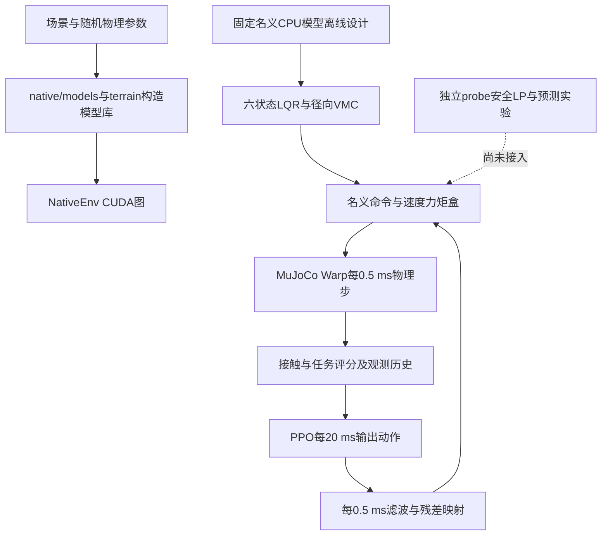

# 轮腿论文代码架构与模型约束审计

## 第21轮：原生调度通过，电机序列插值不保可行（2026-10-02）

**两版自动参考插值均拒绝；生产恢复第20轮v5，没有留下失败自动配置，也没有整体PPO准入。** 原生5ms调度技术本身已验证，但不能以此替代参考律的完整域验收。[只读复算](results/twentyfirst_round_native_reference_20261002/check.py)与[结果汇总](results/twentyfirst_round_native_reference_20261002/verification.json)保留。

首版把第18轮两条曲线接入NativeEnv.step的40子步图，每10个物理步更新，无宿主请求注入；按公开速度符号选择，按既有.115/.16m和.5/1m/s端点线性缩放。参考保持原逐电机1Nm与每5ms L1≤.1Nm，masked/整局重置、自动/手动互斥及来源包检查过。首次重置测试比较对象错误造成6.94e−18差，改为比较重置前后的实际值，仍要求逐位不变；失败测试来源与日志保留。

| 检验 | 物理门 | 设计门 | 任务/全门结果 |
| --- | --- | --- | --- |
| 初版原18例 | 18/18 | 16/18 | 15/18，组6/5/4 |
| 初版84例网格 | 84/84 | 80/84 | 79/84 |
| 修订版原84例 | 84/84 | 84/84 | 84/84 |
| 修订版预注册加密100例 | 100/100 | 86/100 | 86/100；名义50/50，训练组合36/50 |

各次原生请求与独立相位/权重计算峰差0，未打开最终集、未训练或扫描控制增益。首版失败集中在.115/.12m中低速和.12m反向，五个失败例在零参考对照中全部通过，开启参考全部失败；关节失败发生在制动后，原基控制可行而插值使其失效。

仅进行一次有依据的修订，将零修正端点改为已验证可直接通过的.12m与.75m/s，并在执行前注册.115/.11625/.1175/.11875/.12m×±.75/.8125/.875/.9375/1m/s×名义/训练组合100例。虽旧粗网格全过，内部仍有14处主动设计越界，最大约.00773rad。没有以粗网格替代加密失败，也没有进一步缩窄区域寻求表面通过。

结论是：两端完整可行的电机时间序列，其幅值插值不保证另一初始速度/高度下的完整轨迹可行；不能从本结果推出整个合法控制域无解。后续须先核实际状态与模板的动态相位/姿态/关节速度对应，再决定一个状态相关共同参考，不能继续只改标量权重或挑验证点。

活动环境和训练源码冻结清单已恢复v5，失败的调度模块、参考包及测试从活动目录移除；唯一版本源码和数据保存在source_v2，v1差异另存。若需重跑实验，应在隔离检出中覆盖source_v2对应路径；当前生产v5有意不提供该失败自动选项。默认名义4/6、完整运行配置、声明域、新协议与真实短PPO联调仍待，第25轮按约定再深评。

## 第20轮集中评判：统一真实运行与验收，停止继续堆控制层（2026-10-02）

**有条件保留VMC＋六状态LQR＋差模PPO方向；当前仍未达到整体训练准入，也未证明方法优势或高鲁棒。下一优先级是统一原生共同参考执行和正式运行配置，而非继续给单个失败加控制层。** 原高度、输入域、物理、1.4设计及任务阈值全部保留。[本轮证据账本](results/twentieth_round_admission_review_20261002/verification.json)可由review.py复算。

### 近五轮的客观收益与代价

| 工作 | 证据与收益 | 处置 |
| --- | --- | --- |
| 第16轮单因素 | 24例物理全过但全门18/24；质量、摩擦、驱动分别耗尽共同/差动余量 | 保留机制定位，不声称整个输入域不可行 |
| 第17轮静态过滤 | 恢复静态目标可行后实际停车仍0/2 | 拒绝晋升，不扫过滤阈值或增加第二层反馈 |
| 第18轮共同参考 | 离线优化约31.9min；制动段10/10，但全程9/10；完整面板14/18 | 保留参考和失败，修复评分范围，未把局部成绩写成全程通过 |
| 第19轮原阻尼保留 | 共用核14行量级改动、原增益不变，实际完整面板15/18 | 保留此根因修复；属于工程修复，不是PPO创新 |
| 第20轮契约统一 | 原生成功/奖惩纳入历史1.4设计门，与独立全程门逐例一致 | 保留v5契约，后续所有方法共用并冻结 |

工程进展来自少量根因修复与明确的完整轨迹检查。在线13臂预测/数值初始化没有贡献实际反馈收益，静态过滤未完成停车，不恢复这些分支。离线参考不是实时规划或PPO成果；标准PPO损失没有需要改造的证据。当前未形成同信息强对照、三种子学习及方法效应证据，不能把修复弱基线产生的收益包装为差模优势。

### 默认工厂与实验成绩仍然分离

新测**v5默认工厂**原六正常：物理6/6、任务4/6，正反高速停车.663554/.666538m，仍超过.6。**v5＋外置第18轮参考**原18例：名义6/6、训练组合5/6、压力4/6，共15/18。二者配置不同，不能将外置实验的名义6/6直接授予默认训练入口。第15轮五高度节点是旧版本名义证据，不能直接继承给尚未统一的v5运行配置。

因此下一块必须定义并实现同一个原生参考执行路径，覆盖声明的公开高度和速度，而不是仅在诊断脚本按±1m/s两个点取数组。保持每电机1Nm及5ms L1≤.1Nm、只用公开命令/目标与既有观测，所有对照共享；之后再核连续高度/速度、训练参数/地形及重复性。压力失败单列报告，不能额外要求所有外推压力点100%通过。

### 已关闭：1.4设计门没有进入原生成功与奖励

审查确认旧原生success仅含physical_v1（含主动±1.5物理门），1.4设计门依赖外部脚本。这既导致第18轮的范围误判，也会让训练成功标记与论文验收不一致。新高度工厂现在强制`design_joint_gate`：每个有效物理子步更新主动四关节最小设计余量，终态恢复不能擦除历史越界，成功和已有±10终态奖惩采用该门。

候选版本升为`height115-current-vmc-v5-full-design-candidate`及对应共同Nom/legacy格式版本。新增`active-1p4-v1`设计契约、余量与通过标志；physical_v1的±1.5物理安全仍独立报告。Actor观测仍38维，内部任务累计状态由38增至39列，控制核、设计增益、标准PPO损失未改；这是把既有验收要求接入原生任务，不是宣称状态不变性或放宽限制。旧原始NativeEnv不显式启用时保留原契约，历史内部快照缺少新设计历史，不能填默认值冒充有效。

[历史反例回归](results/twentieth_round_admission_review_20261002/native_contract/verification.json)同当前有效姿态、不同过去：两者物理均通过，历史设计越界者success为假，终态奖惩相差20；collector真实越界保留、masked/自动reset和原生40步通过。[18例原生回归](results/twentieth_round_admission_review_20261002/native_panel/verification.json)逐例success与全程原始q复算门一致。原physical_v1的352个FK假安全帧、真实力矩超额和缺证拒绝，以及观测/延迟/重置/保存恢复检查通过。

### 准入边界与明确下一步

原论文计划第6.3是接口、轨迹、重置、终止、逐物理步计量及信息隔离检查；第6.4及历史准入记录允许经典控制存在失败（当时B0/B1为28/32），并完整保留失败。不能将“每个训练困难样本零Actor必须成功”追加成无限推迟学习的条件。新高度方法仍必须接受原速度/姿态/设计等门，台阶失败继续计入失败，不删样本、不改阈值、不声称PPO一定能修复。

当前不启动整体训练的充分理由仍然存在：默认正常门4/6、共同参考未原生统一、同版连续域和新协议缺证、真实短PPO采样更新/优化器与归一化恢复尚未执行。工程准入、待学习性能和方法优势分开；完成统一配置及相关工程证据后，应按原计划进行有限的真实短学习联调，而非继续以每个性能失败为由堆经典模块。

下一轮执行顺序：统一可执行参考与配置→按原声明域复核并保留困难例→冻结同信息强对照/源码/动作分布→实际短PPO更新、恢复及评估。控制权不扩大，最终集不打开；第25轮再次集中评判。清理一份10850字节重复注册实体，相对链接保留原路径和SHA；独有失败/旧来源保留。

## 第19轮：恢复被几何投影覆盖的原有差动阻尼（2026-10-02）

**共用控制核已修复并标记v4。v4配合第18轮冻结参考的完整面板由14/18提升至15/18，关闭训练组合的起步设计越界；台阶速度仍失败，整体PPO不准入。** 冻结参考尚未自动接入默认工厂，15/18不等于默认工厂已有该运行能力。[完整回算](results/nineteenth_round_motion_reference_20261002/verification.json)与[可运行检查](results/nineteenth_round_motion_reference_20261002/analyze.py)保留。

### 机制证据与最小修复

对名义/训练组合的台阶及高速四个世界增加只读记录，独立累积速度误差与原生RMSE相符（1e−12核对）。高速训练组合约81.7%速度误差能量在起步斜坡；台阶约73.5%在首次接触之后，接触段约13.4%子步发生几何投影，有效速度参考最大下降.114917m/s。这些是时序关联与已知控制代数，不是删除投影的安全证明。

在旧实现的2.038s首次越界前，左alpha仍以约+.0890rad/s向外运动，右alpha已以−.0671rad/s向内运动。原角度投影仅减去并加回共用hd；两侧请求都被裁到几何边界时，既有直接电机速度阻尼的差动H部分随目标一起被覆盖。

修复只分离并保留这项原有反馈：在相同原电机/内部限幅下分别计算含阻尼与去掉原`−damping*dq`项的虚拟H，取左右差动贡献；左右投影使用各自hd，公共均值与原协调公式保留。没有新增阻尼系数、LQR成本、观测状态或Actor权限，非投影路径保持原输出。所有control_step包装调用共用此修复。

同状态发令夹具施加左右相反±.05rad/s角速度、保持共用角速度不变：未投影时差动H约±.268962Nm；旧双侧投影将其压至约4.6e−8Nm，新核保留原值，轮路均值变化约2.2e−8Nm。非投影/对称夹具旧新命令逐值一致。这是发令代数检查，不作为真实物理成功计数。

### 完整回归与版本

| 同18例 | 物理门 | 原任务门 | 任务＋主动1.4设计门 |
| --- | --- | --- | --- |
| 修复前 | 18/18 | 15/18 | 14/18 |
| 私有候选 | 18/18 | 15/18 | 15/18 |
| 实际v4共用核 | 18/18 | 15/18 | 15/18 |

实际v4分组为名义6/6、训练组合5/6、压力4/6，共306240个逐步物理/证据计数一致。训练组合正向全程最小设计余量从−.001135325rad变为+.000878596rad，参考启动前余量+.009783292rad；同状态旧/新Nom差峰约.24718Nm，属于保留原反馈的变化。所有原物理、设计、任务及冻结额外请求域保持，零Actor未被计入经典量惩罚。生产v4核与对应外置量影子总命令差0。

版本为`height115-current-vmc-v4-damping-preserved-candidate`，共同Nom开关为相应`-nominal-boundary-candidate`，legacy32为相应`-legacy32-candidate`。旧观测格式仍可用，但历史控制行为需按旧提交复现；新协议需冻结v4源码。Nom/Actor、38维/延迟/重置/保存恢复、virtual6与两种共同边界的阻尼回归均过，仍无学习更新。未启用几何投影的12000步CPU/GPU命令峰差4.69962e−7Nm，低于1e−5；不把它扩大为新投影全状态CPU/GPU等价证明。

首次生产阻尼测试的夹具误填.9m/s，未触发双投影；保存该测试来源及失败日志后改为已记录状态的.703645706m/s。该修复只涉及测试输入，控制和检查阈值未改。旧核、实验核及实际运行来源均已归档。

### 尚未关闭与第20轮评判

训练组合台阶速度RMSE生产复跑为.102440m/s，仍高于原.1门。私有/生产运行的连续量有波动，不能将微小差值归因于修复或宣称速度收益。压力两高速仍有任务/设计失败，保持外推报告口径。连续高度/速度/训练参数、非零Actor、统一原生参考执行及真实短PPO更新/恢复未获本轮证明。

第20轮将集中核对方法收益、复杂度、鲁棒性与原计划准入条款，特别是外置参考尚未成为正式运行配置、全程设计门在原生评价/训练契约的对应，以及工程安全与待学习性能的边界。保留所有真实失败与原阈值，不盲加积分/PD，不以默认工厂继承实验成绩。清理两份逐字节相同注册载荷21700字节，以相对链接保留路径与哈希；独有失败和源码保留。

## 第18轮：跨参数制动可行，但全程评分暴露起步缺口（2026-10-02）

**最新完整结论为原18例14/18全门，仍不准入。此前本轮“10/10”的说法只成立于制动段设计检查，已更正；不能作为全程设计通过证据。** 当前权威回算为[full_verification.json](results/eighteenth_round_robust_reference_20261002/full_verification.json)，旧verification.json保留作历史并配[范围更正](results/eighteenth_round_robust_reference_20261002/scope_correction.json)。

### 实际求解与得到的收益

复用原六个时间节点、18参数、原固定7kg十五状态Q/R/P、原逐电机1Nm及5ms L1≤.1Nm，初版用制动段48项与原生全程任务统计联合约束名义、仅7.5kg、仅摩擦.6/1、仅驱动差+.03、既有训练组合五组；全程设计遗漏见下文。从站立完整运行实际v3物理，不用在线预测器或恢复不完整数值快照；优化可以看公开开发仿真结果，执行时不按质量/摩擦真值选计划。最终集未开、无PPO。

正向120次批评估用尽注册预算，反向86次评估后达到40迭代上限；均未证明收敛/最优。按原成本保留可行候选并独立新批次重跑。两方向优化合计约31.9min，不是在线速度或PPO端到端吞吐。选定制动段名义代价相对原计划为+0.402%/−2.242%，仅说明原代价下的候选结果。

初次评分发现高度指标需复用原history的“每条腿先float32取整再求平均”，修复记录顺序后CPU/GPU RMSE仍按1e−12核对，停车/尾速与原统计一致。参数化重建相对存档最大差1.11e−16Nm，按原预检1e−15核对，未称逐位同序列。源版本和首次失败保留。

### 全程设计检查遗漏与修复

最初48项回算使用参考启动后的整段q/v，而原生success只含±1.5物理限位。因此“全程物理统计完整”不能证明全程±1.4设计预留。18例回归发现训练组合正向alphaL在2.038s已经越设计界，起步/行驶段最小余量−.001135325rad；到达4.5715s才启用制动参考，后段最小余量反而+.00009849rad。任何停车后参数都无法修复这个已经发生的历史失败。

已在共同评价器record核、每次reset与数据输出加入每物理步全程主动关节q、全程/参考前设计最小余量及首次越界步，并将全程值合入原设计门。优化器遇参考启动前已越界直接记录并拒绝。新评价器从站立重跑两条冻结参考；[可运行verify.py](results/eighteenth_round_robust_reference_20261002/verify.py)从原始q独立回算全程与前缀、确认首次4076步，并以真实记录验证一批后拒绝优化的路径。没有放宽原关节或任务门，没有更改生产控制。

| 独立高速复验 | 制动段设计/任务 | 全程物理/任务 | 全程含主动设计 |
| --- | --- | --- | --- |
| 正向五组 | 5/5 | 5/5 | 4/5；训练组合起步已越界 |
| 反向五组 | 5/5 | 5/5 | 5/5 |

不能将9/10写成整体高鲁棒：正向训练组合之外，即使通过的边界也有限，反向最小全程主动设计余量约.000117rad。离散公开组不是连续参数/高度证明，Actor仍为零。

### 同版完整面板与下一步

冻结两条参考后复用原18例，306228个逐物理步/证据计数一致，公共Nom/Actor归属及原请求域保持。其他四个正常场景额外量为零。

| 参数组 | 物理门 | 原任务门 | 任务＋主动设计门 |
| --- | --- | --- | --- |
| 名义 | 6/6 | 6/6 | 6/6 |
| 训练组合 | 6/6 | 5/6 | 4/6 |
| 压力组合 | 6/6 | 4/6 | 4/6 |

全门由此前13/18到14/18，属于公开记录上的工程进展，不能据此宣称方法优势。训练组合20mm台阶速度RMSE本轮.101831m/s，仍高于.1；该例不使用制动修正，跨运行小差不能归因于新参考。压力正反停距.604623/.602182m且仍越设计门，作为外推边界报告，不新增压力必须全过的训练门。

下一项聚焦起步/行驶段：核1～2s速度参考、实际误差、角向投影和关节速度的时序，再作一个最小共同控制修正，并连同已改善的停车一起回归。不得继续只优化无法改变前缀的停车序列；不追加经验PD、扫门槛或直接训练。默认候选尚未装入这些实验参考；同版连续高度/训练域、同信息新协议、真实短PPO更新与恢复仍待，第20轮再深评。

删除两份与保留报告逐字节相同的中间副本，共3507字节，见[清单](results/eighteenth_round_robust_reference_20261002/cleanup.json)。独有失败、范围错误的旧报告及执行来源保留。

## 第17轮：共同修正破坏静态目标约束，但重投影仍不能完成停车（2026-10-02）

复用第16轮24例，仅增加发令前只读记录：既有投影目标、已接受Nom、合成共同修正后的电机命令及当前J。用`inverse(J)`还原虚拟H，再按原Kg/阻尼项还原静态等效极角目标。全程原物理/设计与任务成绩仍6/4/4/4；[独立复算](results/seventeenth_round_projection_order_20261002/analyze.py)以401个均匀帧核CPU当前J和逆解，目标角峰差1.35e−15rad，完整有效子步用向量逆解计算约束。

8个高速世界都出现修正后重新请求不可行静态目标：所对应主动关节的最大设计超额约.06447～.07607rad，修正前已接受Nom的最大超额约1.23e−8rad（float32舍入量级），原投影目标自身均在边界内。每例有1636～1755个子步出现实质新增超额。分析中的1e−6rad只用于区分舍入与实质变化，不替代任何实际物理/设计/任务门；首次请求时间按发令区间起点/终点分别记录，避免将积分后时刻当发令时刻。

这证实串联投影不封闭，但不能将其直接判为动态失效的唯一根因：同样存在静态目标越界的名义两例，其实际完整轨迹仍通过。因此追加“静态目标始终可行”会比原实际关节门更保守，必须通过完整任务验证其代价。

随后只做一次当前静态目标投影候选：原名义正反高速、原冻结计划作指引，每5ms由当前q/v和已有Nom计算几何目标与公共力矩盒，复用HiGHS求最近请求，保留逐电机1Nm与每5ms L1≤.1Nm；不预测未来、不改增益/Q/R、无新信息输入。800次世界更新中371次请求改变，实际请求与求解记录逐值对应、原域及26253个真实物理子步完整证据通过。

| 候选 | 物理/主动设计 | 停距正/反 | 尾速正/反 | 原完整任务 |
| --- | --- | --- | --- | --- |
| 当前静态目标投影 | 2/2、2/2 | .616321/.617713m | .032419/.022936m/s | 0/2 |

主动设计余量为.018027/.004535rad，但两例停车均超.6m，正向尾速也超.03。**拒绝晋升，不把守住关节但停不住当修复；不继续扫描该投影阈值或堆反馈。** 源码仅在结果目录，生产v2/v3未改。[候选实际结果](results/seventeenth_round_projection_order_20261002/static_candidate_checked/verification.json)与原失败都保留。

首次试验中HiGHS默认精度报告成功，但独立不等式残差检查未过1e−9，当前请求未被放行；当时未落盘迭代号/部分轨迹，不作物理成绩。保留当时源码与日志后，将求解器原始/对偶可行精度设为1e−10并完善失败保存，原独立检查1e−9不变；最终候选最大线性残差1.14e−15。该数值修复不算控制性能提升。

下一项复用已有完整时域轨迹参数化及原成本，设计一条同时受名义、已见单因素及训练组合场景约束的共同动态参考；评价使用离线完整物理执行，实际控制不读取参数标签选择轨迹。先核评价器与独立执行一致，再按已有有界求解预算求共同可行计划；不继续维护在线13臂预测，不把静态参考代理当真实轨迹约束，也不以名义近零余量作鲁棒证据。若共同可行性仍未找到，明确保留失败，不改门、不包装成训练准入。此项是重设计现有共同参考，不改变差模PPO研究权限；仍须后续反馈/随机域与学习接口的实际验收。

清理2份逐字节相同注册副本共14171字节，以相对链接保留原路径和哈希，见[清单](results/seventeenth_round_projection_order_20261002/cleanup.json)。独有原始轨迹、候选失败和数值拒绝证据保留。全目标未完成，第20轮集中评判安排不变。

## 第16轮：扰动分别耗尽共同与差动关节余量（2026-10-02）

按第15轮决定，原六正常场景分别采用名义、仅质量7.5kg、仅左右摩擦.6/1、仅驱动差+.03，其余配置逐字段相同，Actor及延迟均为零。复用v3公共Nom边界和原两份400×6冻结制动序列，8个高速世界的请求逐值对应原序列，不读取物理参数选择控制。完整407772个2kHz子步的计数、实际物理约束及同状态旧路径影子发令核对通过。[原始结果](results/sixteenth_round_parameter_isolation_20261002/verification.json)、[独立单因素与首次越界复算](results/sixteenth_round_parameter_isolation_20261002/analyze.py)均保留。

| 组别 | 物理门 | 原任务门 | 任务＋主动1.4设计门 | 正/反高速设计最大越界 |
| --- | --- | --- | --- | --- |
| 名义 | 6/6 | 6/6 | 6/6 | 无；正向最小余量仅3.84微弧度 |
| 仅7.5kg | 6/6 | 4/6 | 4/6 | .016861/.016656rad |
| 仅摩擦.6/1 | 6/6 | 6/6 | 4/6 | .003395/.003566rad |
| 仅驱动差+.03 | 6/6 | 6/6 | 4/6 | .001721/.004061rad |

因此物理24/24、原任务22/24、完整原门18/24；不能用任务22/24或物理全过隐藏设计预留失败。7.5kg正向停车.598001m尚过，但尾速.033456m/s超过.03；反向停车.601560m超过.6。摩擦/驱动单因素的两高速均通过原任务，却越设计界。原1.5物理门未越，不将设计失败描述成真实机械越限。名义正向余量与第9/11轮有微小数值差，不声称跨运行逐位重复。

将首次设计越界与名义世界按相同已执行计划阶段对齐后，质量组首次越界出现在到达后.270/.8115s，共同关节偏移峰约.00887/.01235rad，左右差异分量约1～2微弧度；摩擦组为.312/.8445s，共同偏移≤.0000424rad、差异分量最大约.00476rad；驱动组为.3335/.8395s，共同偏移≤.0000102rad、差异分量最大约.00458rad。这里共同/差异是同阶段关节差的半和/半差，代数重构已核，不是同一完整物理状态或外推误差界。它支持共同质量偏移与左右不对称偏移分别耗尽薄关节余量，排除“只补质量就能使这份计划鲁棒”的解释。

下一块核共同修正与既有几何参考投影的串联关系：当前额外电机量在参考投影/径向保护之后加入，力矩盒接受不保证修正后的虚拟请求仍满足几何参考约束。先对原记录/冻结状态核该请求是否越出可行目标，再只对同一公共分配顺序做最小受控修正；不能以本轮单点差值直接充当连续域误差上界，不叠新的同增益PD或恢复13臂预测器。若该机制证据不成立，保留反例后重新判断，不先改默认控制。

本轮未改生产控制、计划、增益、原门或PPO损失，无学习/晋升，组合角点额外失败的相互作用仍未由本单因素测试解释。完整声明范围、公平协议与短PPO更新/恢复继续开放。独有注册/轨迹/来源保留，无新增可证明冗余文件；第20轮再集中评判。

## 第15轮集中评判：保留主架构，停止堆预测初始化（2026-10-02）

**整体PPO仍不准入。VMC＋六状态LQR＋差模PPO方向有条件保留；第12～14轮在线有限差分分配尚无任务或鲁棒收益，不继续增加完整Data快照、重置变体或扫描增益。下一项转为已知可行制动序列的参数敏感性隔离，用真实完整回合找出需要反馈修正的量。** 不改变0.115～0.38m、1.4/1.5rad、原几何/任务门、修正1Nm/.1Nm每5ms或PPO动作权限。

### 新增覆盖证据与五轮收益

本轮先注册原六正常场景×原五个设计节点，在同一当前v2/38维工厂、名义参数、零Actor下运行30例。生产控制、设计和任务判据不变，记录每例全程2kHz物理证据；[注册与原始结果](results/fifteenth_round_direction_review_20261002/height_panel.json)和[复核入口](results/fifteenth_round_direction_review_20261002/panel.py)保留。

| 目标腿长 | 物理门 | 原任务门 | 正/反高速停车距离 | 主动1.4rad设计余量保守下界 |
| --- | --- | --- | --- | --- |
| 0.115m | 6/6 | 4/6 | .663554/.666539m | .004512rad |
| 0.16m | 6/6 | 6/6 | .300287/.301274m | .093453rad |
| 0.25m | 6/6 | 6/6 | .265674/.265383m | .642042rad |
| 0.30m | 6/6 | 6/6 | .263417/.262471m | .889446rad |
| 0.38m | 6/6 | 6/6 | .263612/.260777m | .226812rad |

设计余量下界由逐物理步八关节最小物理余量减去.1rad得到；已核主动关节物理限位±1.5，故本次所有下界非负足以证明这些实际轨迹守住主动±1.4。它比只看50Hz快照更强，但不证明未来不变集；负下界时不能反推主动越界。本次30/30物理与设计、28/30任务支持保留主架构并聚焦最低位停车，不覆盖节点之间、参数随机域、单侧边界或非零Actor。与外置计划v3的6/3/4成绩是不同候选，不能拼成一个全范围通过版本。

第11轮收益是公共Nom/Actor归属修复：逐状态306224步命令对应、经典量不进Actor惩罚，但18例任务/设计仍13/18，名义6、训练角点3、压力4。第12轮首窗拒绝；第13轮过去一步模型重放将配对通过前缀延长到95窗；第14轮公开重置在冻结输入16/16通过，连续仍第96窗拒绝。没有把未完成回合计作成功。

[本轮独立汇总](results/fifteenth_round_direction_review_20261002/verification.json)对第12/13/14轮全部1/96/96个实际请求与原可行计划逐值比较，均完全相同：在线LP尚未实际贡献修正。第13/14轮两世界诊断决策中位39.59/39.42ms，属于实测额外成本；不外推1024吞吐、不把5ms壁钟追加为纯仿真硬门。有限差分、线性分配、非线性重核、过去一步重放与公开重置增加了复杂度，目前只改善数值校对前缀，没有完成整个停车，更未改善训练域任务。

### 约束正确性与鲁棒性判断

1. 同输入控制代数/边界有局部证据，固定设计与随机对象分离、实际A/B轮心/八关节/真实力矩逐步计量有执行证据。未发现应通过修改PPO损失解决的问题。不能由当前几次误差直接判整套物理模型错误，也不能把XML软限位或physical_v1监控当约束控制器。
2. 名义预测配对与未知参数鲁棒性是两件事。原1e−5Nm发令校对门继续保留给该预测路线；即使名义校对全部通过，固定7kg平地模型仍没有7.5kg、摩擦/驱动差的误差支持。不得将通过预测门视为关闭随机域。若换成不依赖该预测器的控制，仍按原真实任务/物理/设计门验收，不将某个失败实现永久追加为所有方法的前置组件。
3. 冻结计划名义正向设计余量约0.739微弧度，训练/压力主动设计门有实际失败，不能称高鲁棒。参数角点同时改变质量、摩擦、驱动差，尚未隔离主因；零Actor试验不验证Actor延迟鲁棒。压力域应报告失效边界，不能偷换成全部必须100%成功的额外训练门，也不能当作训练域失败的解释。
4. 新高度观测/保存恢复证据只含0次学习；同版完整声明域、公平协议冻结、实际短PPO采样更新及优化器/归一化恢复仍待。旧范围策略、旧迁移训练不能代替这些证据。

### 下一步与停止条件

下一轮复用v3公共边界及原冻结计划，在同六正常场景做名义、仅7.5kg、仅μ_L=.6/μ_R=1、仅驱动差+.03的固定单因素对照；这是机制诊断，不是搜索新参数或新成功门。Actor为零时不额外扫延迟。记录首次设计越界、停车/速度门与请求实际执行量，确认是哪条真实动态约束先丧失余量，再决定一个最小的状态相关共同修正。若没有新的可解释收益，不恢复13臂预测LP或堆第二层反馈；不重跑已知失败来延长工作。

当前剩余准入按原范围保留：最低位共同控制的真实任务与设计门、同版本连续高度/训练参数/边界工程检查、同信息强对照与正式新协议、真实短PPO更新/恢复/评估。方法优势属于后续研究结论，不预先写成已实现；也不把实机认证追加为纯仿真前置条件。下次集中评判为第20轮。

清理复核：上一轮4份重复历史权重已去重且加载通过，本轮无新缓存/临时分支可删；目录相同脚本依赖自身路径，可变live文件及独有失败证据继续保留。不以删除失败来美化结果。

## 第14轮：公开数据重置仍不足以支持连续预测（2026-10-02）

同一冻结失败输入，新实例1/1、复用13/16、公开reset_data后16/16通过原配对门；但把公开重置加入每次预测后，连续运行仍在第96窗失败。command误差1.183748245e−4Nm超过原1e−5门，qpos1.19209e−7与qvel1.14441e−4仍过。公开重置只改善已测冻结输入，未关闭连续预测支持，不能晋升或宣称鲁棒收益。[独立回算](results/fourteenth_round_model_reset_20261002/check.py)核33组冻结预测、95窗通过及再拒绝、原请求域和源哈希；生产代码、控制增益、验收门不变。第15轮先集中评判继续该路线的收益与复杂度，不默认追加完整数据快照机制。

## 第13轮：模型自身过去状态重放与复用历史（2026-10-02）

[同状态同请求初始化对照](results/thirteenth_round_past_state_support_20261002/verification.json)只用已知上一物理步q/v及发令，由固定7kg模型自身forward/step重放过去，再注入当前已知q/v/传感器/控制器记忆。没有复制实际qacc_warmstart或读取实际未来。旧当前状态初始化仍为qpos1.19209e−7、qvel1.22070e−4、command1.79529e−4；过去状态自身一步初始化降至5.82077e−11、1.90735e−6、7.15256e−7，通过原2e−6/1e−3/1e−5门。只支持该冻结首窗，不作整体预测正确声明。

随后原分配/指引/域/阈值不变继续，两名义高速前95次5ms配对通过，第96次（step95，约停车后.48s）又因command1.51873e−4>1e−5拒绝，位置1.19209e−7、速度1.44005e−4仍过。实际480ms主动设计最小余量.000578308rad、已执行部分物理仍有效；回合未完成，诊断停止不是回退。96次请求逐值等于原名义指引，尚未实际触发状态修正，不能把预测前缀改善当鲁棒控制收益。

[冻结失败重查](results/thirteenth_round_feedback_checked_20261002/batch_check.json)重建新模型，在同过去/当前状态和请求上，13臂/1臂均过门（command2.38419e−7）。不支持批量大小是唯一原因；复用实例的数值历史/数据状态或重复性条件尚待隔离，不能据一轮重查直接放行。原失败、过去输入和预测均保留，[可运行复核](results/thirteenth_round_feedback_checked_20261002/check.py)检查首窗、95前缀、失败、原域与实际设计余量。

所有新预测代码仅在结果目录实验，生产第11轮v2/v3不变，默认旧预测器仍拒绝v3，未训练或晋升。下一块在相同冻结输入隔离复用模型数据/求解历史，验证一次重查与连续复用的差异，不继续猜初始化、扫描k/阈值或借局部通过作全域准入。第15轮深评安排不变。

## 第12轮：状态相关分配的预测支持门（2026-10-02）

尝试用既有名义可行序列作输入指引，而非再套八状态补偿：在当前q/v、控制器记忆、已知传感器和Actor目标上，用固定公开7kg平地模型自行初始化，重新计算共同Nom→Actor→约束的10个物理子步。13臂提供六电机.001/.0005Nm有限差分，原1Nm/L1≤.1Nm域内求最近指引请求，按原43物理/关节/几何及停车约束线性分配后，再非线性预测重核。没有改Q/R、扫描增益、参数真值或最终集，没有复制实际数值warmstart。

模型局部解可行，但首个实际5ms原配对门失败：qpos误差1.19209e−7、qvel1.22070e−4通过原2e−6/1e−3门，发令误差1.79529e−4Nm未过原1e−5Nm。实际首窗物理/设计仍过，仅一次请求被执行，后续停止；不算完整回合，也不是安全回退。一次已知过去发令初始化对照数值完全相同，不能把它写成修复。

[冻结拒绝复核](results/twelfth_round_causal_allocation_past_init_20261002/check.py)确认第一子步总命令逐值相同，差异从第一次积分之后出现；主要公开物理数组、100次求解器、步长和meaninertia一致。第一积分后径向保护未裁剪请求：正向实际/预测5.534354/5.535490N，反向6.965148/6.961042N；反向第二步发令差1.79529e−4Nm。这支持微小状态差在高增益保护/反馈中放大，但尚未证明唯一原因，不能放宽命令门或据此判定模型本体错误。

拒绝未获支持的动态分配及新预测模式，执行源码/请求/实际与预测首窗保留后，移除全部临时生产预测分支，旧预测器仍拒绝v3。当前v3公共Nom边界及默认v2不改，不启动训练。下一步应解决模型自身数值历史和强保护下预测误差支持，并在相同冻结输入上验证，不能继续使用这次未过门预测求关节准入、扫k/误差阈值或叠控制器。第15轮再集中评判；未发现可删的完全相同首窗，两次记录均保留。

## 第11轮：公共Nom与Actor贡献归属（2026-10-02）

新增默认关闭的nominal_correction路径，先接受原Nom再合成经典修正/公共电机约束，随后映射Actor、按已接受合成Nom算λ并约束总命令。诊断base记录合成Nom，实际残差及其观测/惩罚只记录Actor；原始Nom不可行计数保留，不能混作最终物理违规。仅显式v3/38维真实高度候选可用，默认v2与CPU控制不变，所有方法应共用配置。校验原1Nm及按物理时间的.1Nm/5ms域，重置清空；绕过setter的NaN/越域GPU缓冲也拒绝发令。没有改变PPO损失或请求尺度，但λ基输出从原始标志改为已接受公共Nom，必须独立冻结新候选。

[接口验收](results/eleventh_round_nominal_boundary_20261002/verification.json)零Actor静态/转速夹具总命令与旧外置路径逐值一致；非零Actor满足总命令=合成Nom+实际Actor，经典量不进入残差惩罚。原生80步、局部/整体reset、异常/域与旧接口拒绝过，virtual6同38维及Actor贡献分解过。旧外置执行图/预测器显式拒绝v3，不能借未升级预测给新控制背书。

[完整影子复核](results/eleventh_round_nominal_panel_checked_20261002/checks.json)在同18例、同冻结请求的306224个实际子步，复制本步相同q/v/传感器/控制器记忆，由旧控制＋外置修正算影子总命令，与新路径差0；零Actor实际残差所有步为0。完整门仍名义6/6、训练3/6、压力4/6，总13/18，不是鲁棒改善。独立回放存在到达/轨迹微差，首轮跨记录整数组比较因长度不一致被拒绝；没有扩大容差或声称逐位同轨迹，改以逐状态同输入验证控制对应性。默认12000步CPU/GPU命令峰差4.69962e−7Nm、公开实际扭矩分配和live/recorded路径回归过。

只关闭执行边界与计量错误，不授予整体训练准入。v3不内置固定时序、不被默认选择，关节动态可行性/误差支持仍未完成；下一轮回到一个共同动态参考/分配机制，原范围/Q/R/域不变，第15轮再集中评判。独有回放/影子记录保留，没有可证明新冗余运行文件。

## 第10轮集中方向、方法与鲁棒性评判（2026-10-02）

**决定：有条件保留纯仿真VMC＋六状态LQR＋差模PPO航向精度方向；当前方法未证明整体有效或高鲁棒，整体PPO不准入。停止继续叠PD、定时补偿、扫增益或扩大局部候选。下一块先统一公共Nom/Actor边界，再处理一个关节、径向及输入变化共同动态可行的机制。** 保持0.115～0.38m目标、原1.4设计/1.5物理门、Q/R、诊断修正域及M3权限，不把硬件认证/壁钟期限追加为纯仿真前置门。

### 五轮收益与失败

| 工作 | 新证据或收益 | 评判与处置 |
| --- | --- | --- |
| 第6轮八状态受限补偿 | 停距约0.580m，但两例实际关节>1.5，设计门0/6 | 不用停车收益抵销违规；拒绝晋升，不增加第二套主反馈 |
| 第7轮局部分配 | 200/s条件执行40次后因耦合/增量不相容停止，已执行部分未越界 | 局部可行不保证完整任务；停止不是安全回退，不继续用局部代理作准入 |
| 第8轮38维执行信息 | λ0旧32包不区分请求队列；同格式六请求、延迟/重置/形状恢复过 | 保留接口修复；仍为POMDP，0学习更新，不代替控制性能 |
| 第9轮完整冻结序列 | 同一次名义全门6/6，18例全门13/18，不重调计划或门 | 证实原名义域完整输入可行；训练/压力仍3/6、4/6，拒绝固定时序直接晋升 |
| 默认生产候选 | 没有装入外置计划 | 不继承诊断6/6，尚无新的整体任务准入 |

[本轮独立回算](results/tenth_round_direction_review_20261002/verification.json)确认同18例注册的描述性对照：名义任务4→6、训练域3→3、压力4→4，总体11→13只改善名义两高速。零Actor平均Jψ旧/新为名义0.166066→0.157382°、训练域0.502466→0.501989°、压力域0.561013→0.556562°。这是已见开发资料的跨记录描述，不是同码ABBA统计，不把微小变化归唯一因果，更不是M3对最强对照的15%且0.05°优势。新高度正式开发/强对照及三种子学习未冻结，最终集未开。

### 模型约束与鲁棒性

没有靠改PPO损失修复的证据：TimedPPO直接调用SB3采样和训练，仅计时。固定7kg设计、当前J映射/导数、原代价、同输入参数隔离已有有限检查。五节点局部线性通过明确排除单边保护、插值导数、参考投影、饱和与连续随机域，不能扩成全模型/轨迹正确证明，也不能仅因范围遗漏就断言局部失稳。

未关闭的是请求的动态可行性、误差支持和执行边界。Nom本身已有反馈，不能把外置冻结序列描述成整个闭环无反馈；再套同增益轨迹反馈，在未投影/饱和的线性区域可能与原目标反馈加前馈等价，不能作为现成修正。应处理串联静态投影、参考替换及径向/角向耦合，而非再加一层PD。

第9轮物理18/18只证明这些实际轨迹的1.5关节、几何及电机门；训练/压力高速仍超1.4设计域约0.019/0.040rad，名义正向余量仅0.739微弧度、尾速余量约35微米/秒。训练域台阶速度RMSE也失败。高鲁棒任务结论不成立；参数组同时改变质量、摩擦、驱动、Actor延迟，不能认定质量为唯一原因，零Actor不验证延迟鲁棒。XML软限位、motor-box投影与physical_v1监测不是未来关节不变性控制。

本轮检查7993个归档名义预测子步的M3单轴执行器上界：假设已接受总输出作为公共Nom，前0.75s F/H正反单位请求均有全余量，正向yaw+全余量约99.87%，反向100%。不支持“Nom吃尽所有执行器权限”，也不支持为PPO故意弱化Nom。此计算忽略原始base标志、未来关节/几何约束，不是当前真实Actor权限或安全可达集；近1.4边界时力矩合法仍不能保证动态安全。后续应测真实同版请求→λ→实际残差→约束全链。

### 简洁性与下一步

保留共享native.design、候选工厂、当前构型映射、38维契约、标准小MLP/SB3及2kHz证据。核心仍可维护，但角度投影→轮髋参考协调→径向保护→多次电机限幅尚非统一动态分配。全时域SLSQP仅保留离线可行性诊断：两初始规划约524s，后缀复核中位约1978ms/次。纯仿真不要求5ms壁钟，但将这些求解嵌入批量采样会增加代价，未有PPO端到端收益证据。

下一轮先修公共Nom/Actor边界：经典共同量归Nom，Actor实际残差/λ/惩罚只记Actor，最终物理约束仍覆盖总命令，所有比较方法共享。整合不得把冻结计划改称鲁棒控制或授予准入。然后只推进一个共同动态参考/分配机制，使用既有六状态设计、当前几何、原范围/代价/修正与增量域；需误差支持、完整回合及训练域原门，不只换时钟、扫参数或覆盖失败。

准入还缺：同一可执行公共控制的正常/声明高度/训练参数工程验收，压力与重复性如实评估；同信息38维、强对照及新协议/源码/归一化冻结；真实短PPO采样、更新、优化器恢复与评估联调。第8轮仅有0更新预检，历史CPU/旧高度不代用。主指标与最终集保护；第15轮再集中评判，明确失败即时停止无效分支。

清理7份逐字节重复的冻结源码/场景实体副本，以硬链接共用不可变内容，保留原路径、SHA及相对导入语义，释放文件分配112KiB（载荷102709字节）。[清单](results/tenth_round_direction_review_20261002/cleanup.json)注明Git本已按blob去重，新克隆不保证工作区硬链接。运行源码、独有原始轨迹/失败不删，归档哈希与失败重求仍过。本轮分析初始容差键名漏负号，数值始终按1e−6Nm计算；最终标签更正、数值不变，原执行源码/日志保留。

## 第9轮：统一执行的可行轨迹与参数敏感性（2026-10-02）

[一次完整18例复核](results/ninth_round_frozen_plan_panel_20261002/verification.json)使用当前v2/38维候选和第5轮原18例注册，原两份SLSQP计划先复核成本/完整门/1Nm及每5ms L1≤.1Nm，随后冻结不重求。六高速只依据公共正反命令及已知停车阶段使用同一源序列，其他12世界额外量零；完整306210个2kHz关节/活动记录与物理证据计数一致。没有按真实随机参数更改计划，不使用最终集。

外置序列下名义组一次统一物理/原任务/主动1.4设计门6/6，高速停距0.591598511/0.595853090m、尾速0.02996485/0.02620078m/s；没有拼历史四例与旧两例。[同注册对照](results/ninth_round_frozen_plan_panel_20261002/checks.json)全18物理18/18、原任务13/18（旧11/18）、主动设计14/18、全门13/18，分组6/3/4。名义正向主动设计余量仅0.739微弧度、尾速余量约35.15微米/秒；未做重复统计或误差支持，不能据此称高鲁棒。

训练域两高速分别超1.4设计域0.018934/0.019426rad，正向尾速0.033467、反向距离0.601479失守；压力域设计超额0.038158/0.040080rad，距离0.602876/0.606475，正向尾速0.034687。训练域对称20mm台阶速度RMSE仍失败。所有物理1.5门保持，不能把设计失守误报成真实物理越界；零Actor也不能验证延迟鲁棒。

这是完整时域原输入域的可行性和敏感性证据，不是在线反馈修复或差模PPO优势。factory尚未包含该序列，外置额外量被既有残差监控/惩罚记录，未形成正确公共Nom/Actor奖励与限幅契约，因此拒绝晋升及训练。没有新活动控制分支或冗余载荷可删，3MB独有原始证据保留。第10轮集中评判方法收益、轨迹机制的误差支持/代价及与论文主线的相容性；不靠调计划、放宽门或薄裕度作准入。

## 第8轮：执行请求信息与同格式观测契约（2026-10-02）

读写审计确认λ每个子步重算，持续影响后续输出的是滤波后的虚拟请求。候选默认改用`request_state_v1`38维/`height115-current-vmc-v2-request-state-candidate`：原32包保持场景延迟，追加当前已完成子步的归一化六通道`[F_L,F_R,H_L,H_R,W_L,W_R]`；diff3左右反号展开，virtual6直接记录，同一格式不增加动作权限、隐藏参数或未来地形。原NativeEnv默认32维、候选显式legacy32接口保留。控制/奖励/PPO损失不改，所有新对照须共同冻结此信息契约。

[最终接口检查](results/eighth_round_execution_packet_20261002/verification.json)显示λ0控制夹具的原32包相同而请求不同，新追加通道可区分；相同后续物理状态/新输入产生0.256439Nm发令差。夹具不能当真实可达/安全回合。实际20ms延迟仍作用于原包，当前自己请求不被当传感器延迟；40步证据、局部/整体重置、旧32/新38短原生配对q/v差0、固定名义设计/同输入隔离均过。旧32权重/VecNormalize恢复至38维被拒绝，38维策略/统计保存恢复过，学习更新和训练步数均0。[六维模式检查](results/eighth_round_execution_packet_20261002/checks.json)验证virtual6同格式、40步/延迟/重置及错误契约提前拒绝。

这只关闭自己的执行请求歧义，未知物理/接触、延迟及其他Nom滤波仍使问题部分可观测，不宣称完整Markov或学习收益。初始35维检查及来源保留并注明中间接口，不能当最终38维协议。论文计划4.4/训练说明同步，旧历史不替换；停车、完整声明域、公平协议/真实短PPO更新仍待。第9轮回到更早受限制动轨迹，第10轮集中评判；本轮未发现新的可证明冗余文件。

## 第7轮：当前状态分配与增量约束反例（2026-10-02）

已有GPU装配器依赖旧拟合G，不能直接适用于新轨迹。本轮[固定名义状态分配](results/seventh_round_joint_allocation_20261002/hocbf_all/verification.json)用公开7kg平地模型自身forward、当前q/v和已知Nom得到六电机响应，保留1Nm/公共速度包络/每5ms L1≤.1Nm，沿用固定200/s HOCBF及原八关节设计域、5ms位置与终态锥。仅为局部常加速度诊断，不是全域动态证书，不改生产控制或PPO。首常制动及仅关节HOCBF分支在首次停车更新无解，独立分析表明瞬时常制动规则过度拒绝，并非真实任务不可达；各失败来源保留。

统一径向/关节HOCBF执行40次分配，停车后0.2005s无解，六回合未完成。六世界已执行9530步/证据9530步，部分真实物理均过，主动1.4rad最小已录余量0.004534864、失败当前八关节设计余量0.010127807rad。[冻结重求](results/seventh_round_joint_allocation_20261002/hocbf_all/checks.json)显示取消增量限制才有局部解，去掉HOCBF、保留5ms位置/终态锥仍无解，各标量全1Nm条件单独可满足；不能推整个动作域不可达。没有执行放宽动作，诊断停止不作为安全回退，拒绝晋升。下一工作块关闭内部执行信息契约；控制仍需更早安排符合增量的动态轨迹，不能靠调k或扩大局部候选解决已证缺口。

本轮只归档运行入口/证据，12份完全相同的载荷改相对链接共用一份（429793字节），原路径和SHA不变；[清理清单](results/seventh_round_joint_allocation_20261002/cleanup.json)及三模式可运行`--check`核过。没有删不同源版本、失败、CPU校对或原始决策。已完成第7轮，第10轮集中评判，整体PPO准入仍未完成。

## 第6轮：受限联合反馈的关节轨迹反例（2026-10-02）

[完整六例受控诊断](results/sixth_round_coupled_feedback_20261002/verification.json)沿用既有八状态Q/R及固定7kg当前J设计，保留六状态Nom/保护，停车阶段仅加原1Nm/每0.5ms L1≤.01Nm共模修正。五节点局部线性检查均过；此结果不证明投影、限幅、切换后的整体闭环。没有扩M3、扫描参数或修改训练入口。

高速停距0.579843521/0.580834389m、尾速0.00563887/0.00556604m/s已过原门，但主动关节峰1.506516814/1.505777836rad真实超1.5物理限位。低速四例约1.486rad也超原1.4设计域。六例完整物理4/6、任务4/6、主动设计门0/6，因此拒绝晋升；不能以停车改善抵消关节违规。[独立检查](results/sixth_round_coupled_feedback_20261002/checks.json)及运行入口`diagnostic.py --check`回算原始2kHz请求增量/主动关节、证据计数和来源，六例首次设计越界均在到达后约0.209～0.212s。

本反例只否定这个具体受限分支，不能推八状态或原合法动作域不可达。它表明逐电机合法修正盒与径向保护不构成角向关节轨迹保证，后续共同输入分配需要使用关节状态及动态约束。保留六状态论文主线，不继续换反馈增益、放宽设计预留或堆补偿；生产控制逐值未改，诊断只归档。下一轮处理这一约束缺口与执行信息契约，第10轮集中评判；整体PPO准入仍未完成。

## 第5轮集中方向评判（2026-10-02）

**结论：保留纯仿真差动残差PPO的研究问题和原生执行框架；当前控制方法尚未证明整体有效或高鲁棒，不放行整体长训练。** 前四轮完成了排错、反例和装配统一，名义六正常任务成功数仍4/6，不能把这些工作量称为控制性能改善。判断依据是实际完整回合、原门和明确参数域，而非代码数量、损失、线性极点或单次离线成功。

| 维度 | 客观证据 | 保留/拒绝与下一步 |
| --- | --- | --- |
| 研究方向 | 共模离线制动不是差模策略或Jψ优势；PPO主问题仍是未知不对称接触补偿 | 保留原主问题，先统一公共基控制；不改PPO损失、主指标或最终集 |
| 方法简洁性 | 当前候选为GPU驻留VMC/6状态反馈和原保护，无每步全时域求解；原设计已迁共用模块 | 保留共有入口，拒绝扩全时域SLSQP为默认每步控制；串联静态投影/参考替换仍有明显副作用，应统一处理动态可行性而非继续叠补丁 |
| 方法有效性 | PD补偿与坐标替换均仍4/6且已拒绝；高速约.664/.667m | 未证明修复；下一工作块必须以完整任务提升为验收，不把新增probe/日志当主要进展 |
| 鲁棒性 | 下表物理18/18，但任务仅11/18；中间参数组比压力组更差 | 只有有限物理支持，无高鲁棒任务结论；角点不能替代连续域、全高度、真实策略和恢复检查 |
| 信息与公平 | 名义设计固定7kg且无真实参数泄漏；动作滤波状态仍部分隐藏，当前Actor为零 | 保留隔离检查；明确执行信息/历史，所有对照共用修正，不能以零Actor观测延迟标签宣称学习或全闭环延迟鲁棒 |
| 文件与依赖 | 失败临时分支已移除，设计重复函数体已合并，当前消费者直连native.design | 保留失败证据；删除终态重复进度，避免继续反向依赖实验脚本 |

[预注册开发扰动面板](results/fifth_round_registered_robustness_20261002/verification.json)把既有六正常场景与以下三组固定参数交叉。全部0.115m、100次求解器迭代、零Actor，没有打开最终集或改原Q/R/约束。

| 参数组 | 质量 kg | 左/右μ | 驱动差 | Actor观测延迟 ms | 物理通过 | 原任务通过 |
| --- | ---: | --- | ---: | ---: | ---: | ---: |
| 名义 | 7 | .8/.8 | 0 | 0 | 6/6 | 4/6 |
| 训练域边界组合 | 7.5 | .6/1.0 | +.03 | 10 | 6/6 | 3/6 |
| 冻结压力域组合 | 8 | .4/1.2 | −.05 | 20 | 6/6 | 4/6 |

三组高速正反均超.6m；训练域组合新增20mm对称台阶速度RMSE .100791m/s>原.1m/s门。名义/训练域/压力域两高速距离分别约.663554/.666541、.671449/.674815、.677947/.681429m。不是IID抽样或统计鲁棒保证，不能把18/18物理判断扩成所有范围通过。全范围0.115～.38m、全部左右障碍/连续参数、真实非零策略、执行状态/恢复及当前观测契约仍未完成。

第一次面板把驱动+.05误标“training_corner”，实际为训练域外压力组合，已另存范围更正并保留原结果；新面板严格按计划/生成器+.03注册再运行，不改原数据、不扩大训练范围。当前零Actor的观测延迟不会等于基控制延迟，禁止由此提出延迟鲁棒结论。

本次删除已终止保留备份实验中与`verification.json#decisions`完全相同的`progress.json`（166744字节，49条），清单及保留文件哈希见[清理记录](results/fifth_round_registered_robustness_20261002/cleanup.json)。原始失败状态/预测及决策仍在。无新增Python/pytest缓存；无直接import不能证明历史入口无用。此前83个GIF及本期无效临时控制分支/重复中间数据清理记录保留。

下一工作块：在统一候选上处理动态输入可行分配与零停车目标的兼容性，保持原成本/动作/门；同步关闭已证的执行信息缺口。然后依次同版本六正常/声明范围开发验收、公平协议冻结、短预算PPO采样更新与恢复检查，再决定整体长训练。第10轮再次评判；没有任务改善证据就不能给新的补丁或复杂模块晋升。

## 持续推进第4轮：统一可执行候选入口（2026-10-02）

`native/design.py`接收原当前J设计及输入映射/Jacobian的完整公式，原probe/audit路径保留同名导入兼容；生产候选不再反向依赖实验入口。`NativeEnv.height115_candidate`统一固定7kg设计、原32维观测/3维默认动作、原投影/保护和physical_v1，并标记`height115-current-vmc-v1-candidate`；旧默认构造、CPU设计及历史结果不替换。新增文件进入源码冻结清单，不能改设计后复用旧冻结协议。

[共享候选检查](results/shared_height115_candidate_checked_20261002/verification.json)复用原归档表比较1e−10门、不同7/8kg物理模型和不同驱动校准的相同输入命令逐值相等、实际40子步证据及动作/证据重置，全部通过。首fixture越冻结质量域时在创建环境前被拒绝，仅修fixture、不放宽范围；原234候选成本/选择/越界拒绝也保持。

[同版本六正常完整评估](results/shared_height115_normal_20261002/verification.json)仍物理6/6、任务4/6，高速停车0.663554/0.666542m，候选工厂不授予整体训练准入。本轮关闭了“实验装配与训练可调用版本不统一”的代码问题，未声称新增性能或高鲁棒性，未启动长训练。下一轮完成五轮方向评判，重点决定如何以最小控制修正处理动态可行性，避免继续孤立试验。

## 持续推进第3轮：实际制动参考与坐标反例（2026-10-02）

[当前J完整制动录制](results/current_vmc_braking_events_20261002/verification.json)复用原2kHz图与逐步物理验收，六例物理6/6、任务4/6。前后状态、过去控制器状态和冻结表保存，未改目标或控制增益。[独立投影分析](results/current_vmc_projection_audit_20261002/verification.json)从pitch-rate EMA反演当前已知gyro，再按原6状态公式重建未投影轮指令及协调改变量，峰误差<4.1e−14Nm；首样本因没有前一滤波状态排除代数核对。

高速两例4000个停车子步中1821/1830步发生角向请求投影（45.525/45.75%）。协调式`ΔW=(K_W,v/K_H,v)ΔH`对应速度参考改变量`Δv_ref=ΔH/K_H,v`；前0.75s沿原行驶方向最大约0.74646/0.74618m/s，不能将该内部等效参考称作原停车命令0不变。原任务评价命令仍为0，故没有改成功判据。

未投影轮路的同段平均请求约+8.821/−8.851Nm，已经超出原轮矩包络；投影后原始请求平均约−0.069/+0.068Nm。它说明参考与两输入共同改变，**不是证明未投影轨迹可执行，也不能据此删除投影/限幅**。只有2个停车子步最终电机盒裁剪，投影造成的改变主要发生在最终裁剪之前。

一次同当前J表、原高度/门/增益的[既有角度坐标对照](results/current_vmc_pose_coordinate_20261002/verification.json)仍物理6/6、任务4/6，高速距离0.686372/0.689484m，差于原0.663554/0.666541m。因此拒绝“只换参考坐标”的修复，临时试验CLI已移除，失败来源保存；不扩大为坐标/增益扫描。后续需要处理动态输入可行性与原速度目标的兼容，而非直接执行反事实请求或把单点指令变小当安全/任务证书。

## 持续推进第2轮：局部指令与设计范围核对（2026-10-02）

[局部控制审计](results/control_design_consistency_final_20261002/verification.json)在0.115m固定7kg平衡点检查9个对称腿长/腿速小扰动，成对关闭/开启保护18臂；没有物理积分或新控制增益。未开保护时，在线插值、当前J及径向PD的发令与独立代数峰差1.300e−6Nm，低于原1e−5门，且未激活角向投影或电机限幅。

径向保护在压缩10µm时额外施加约5.060N（每侧）、电机峰变化0.2112Nm；5µm为约2.529N/0.1056Nm，伸长方向为零，因而激活面没有唯一双侧Jacobian。现有线性设计只含当前J及原径向PD，没有此单边反馈。报告增加明确model_scope避免误读，原增益和实际控制未改变。

补查同一固定节点的保护关闭/激活两个仿射分支，离散极点模分别0.998951695/0.998951687，均<1。**不能从模型范围不完整就断言当前局部闭环失稳，或认定它造成高速停车失败。** 该检查仍排除插值导数、切换、参考投影、限幅及随机参数，不能作为全轨迹稳定/鲁棒证明。下一步检查实际制动轨迹的参考与两路输入变化，不凭猜测增加反馈项。

已清除与最终命令矩阵及样本结果逐值相同的中间目录（10338字节），最终原始数据、断言和来源保留。首入口返回值解包错误在控制采样前修复，未写成通过。周期计数和整体训练继续门见根目录项目记忆。

## 2026-10-02 方向、架构与方法复核结论

**架构可以保留，当前推进方法存在问题，不能直接进入新范围长PPO。** 本轮核对论文计划第1/4/6节、Native实际输出链、TimedPPO、训练入口、完整轨迹优化及保留备份原始证据。TimedPPO采样/更新调用SB3原实现，仅增加计时，未发现需要修改PPO剪切损失的依据；模型初始化、VMC映射、真实物理验收和公开力矩盒的此前修正仍有对应验证。本轮未重审每份历史probe，不将语法解析或有限回归当全库正确证明。

| 优先级 | 已证的问题 | 对研究的影响与处理 |
| --- | --- | --- |
| 高 | 共模离线制动与差模PPO问题混在同一推进路径 | SLSQP只诊断矢状面/停车可达性，成本不含yaw/roll，不能证明Jψ或M3优势。先统一共同基控制，再研究未知不对称接触的学习补偿；同一共模修正必须提供给所有对照 |
| 高 | 正式环境未接独立实验修正，新高度训练协议未冻结 | 默认训练不是最新实验候选，旧高度探针不是新0.115～0.38m正式入口。需同版本实际执行链和全范围开发验收，不拼历史成功 |
| 高 | 名义可行轨迹没有可持续备份或误差支持 | 重预测第48次设计余量−8.106e−7rad仅发生在未来betaR；当时真实关节余量0.118027rad、A/B≥线。不得将它误报为实际物理故障，也不得忽略严格设计门；失败后停止仿真不是物理安全回退 |
| 中 | 真实控制时限与纯仿真准入混淆 | 计划允许理想仿真状态，不要求先做实机传感认证。当前单备份复核中位1977.85ms/p95 2136.99ms远超所称5ms壁钟；不能称实时，且逐步嵌入会拖慢训练，但纯仿真步长本身不要求同等壁钟速度 |
| 中 | 32维观测未显式包含完整执行滤波状态 | 同观测不一定同后续残差，应明确POMDP/历史或状态扩充的契约并重新冻结，不能因标准PPO未学好而先改损失/加复杂网络 |

`model_lqr.sagittal_basis`的15状态为x/z/pitch、四关节位置及相应速度/轮速，排除了周期轮角；未发现“轮相位改变物理不变而成本仍使用轮角”的缺陷。当前P/终态关节锥均不是已证明的非线性递归安全集。MuJoCo关节range是软约束，physical_v1是逐步验收，不是阻止违规的控制屏障；这些边界继续保留。

新增预测器范围保护：拒绝非0.115m目标，避免把固定0.115m成本/模型标记误用为全高度算法；单候选保留模式拒绝越1Nm、非有限或批量维度错误输入。未改变已核合法13/19候选或原成本/物理门。最新[保留备份失败](results/braking_retained_backup_checked_20261002/verification.json)和原始当前状态/未来轨迹已保存，CPU检查独立回算其拒绝原因并确认当前实际物理证据有效。首入口在失败记录时重复world字段报错，已修复，失败源码单独保留。

本轮不继续盲扩全时域MPC或直接开长PPO。下一项按更新后的`wheelleg_ppo/PAPER_PLAN.md`统一基控制/执行与仿真信息契约，做同版本工程与小预算学习检查。实机认证、硬件实时、研究方法优势及学习收敛分别陈述，原0.115～0.38m范围、原门、旧CPU和最终留出保持。

本次以 `wheelleg_warp/` 为当前论文工作目录，核对实际执行入口、动力学模型、控制输出、模型约束、安全实验与训练评估。最新结论是：**已修正真实物理验收和公开力矩分配；独立低位候选已通过六场景物理门，最新离线时变序列让高速正反两例首次通过原完整任务门。在线反馈、信息、时序与统一全场景/全高度协议仍未闭合。闭链初始化和已测VMC映射未发现符号错误，不能据此声称全部模型约束正确或实机安全。此前LP无解也不能解释成0.115 m物理不可控。**

原始审计对象为2026-10-01的工作树，基于提交 `4a5186f`。原审计仅作诊断；后续用户要求“修正错误并继续按计划推进”，实现和复验进展单列如下，原失败与历史证据保留。

## 当前瓶颈复核：任务、物理与预测必须分开

本节基于归档提交 `a2cde41` 后的活动代码及已有原始结果，优先于下方标为“原审计”的历史问题。此次复核没有重新运行长物理试验、调参或训练；新增检查只复用既有数组。

| 层次 | 当前实现与证据 | 结论 |
| --- | --- | --- |
| 动力学与几何 | 固定名义CPU离线设计；随机被控对象由模型库构造；闭链与接触为MuJoCo软约束 | 分离方式正确；XML关节range和connect不是不可穿越的机械硬止挡 |
| 控制执行 | `NativeEnv`每策略步40×0.5ms：Nom→残差→最终盒分配→物理→接触与评分；策略50Hz | 2kHz是仿真子步频率；独立host预测器不能继承这项实时结论 |
| 实际物理验收 | `range115/physical_v1`逐子步记录A/B链、八关节、实际力矩与证据计数 | 已修正理想FK假安全和隐藏增益导致实际扭矩超额；闭链误差仍仅记录，没有标定后的拒绝阈值 |
| 低位可行参考 | 独立可行参考、轮髋协调、径向保护模式 | 六正常物理6/6、任务4/6；开关默认关闭，不能把独立候选效果当作默认训练效果 |
| 高速停车任务 | 环境按到达后历史最大平面位移≤0.6m、到达1.5s以后历史最大平面速度≤0.03m/s判分，到达2s结束；最新独立选择器已接这些任务状态 | 离线时变序列高速2/2完整通过；实时保留备份与反馈接线仍缺失，不能把两次离线成功当完整在线协议 |
| 预测与鲁棒性 | 固定7kg平地模型，当前完整仿真q/v、已知传感输出及过去滤波状态；已核18点/小动作/5ms | 未覆盖传感可得性、随机质量/摩擦/驱动、未知地形和接触变化的误差界，不构成递归安全 |
| 训练与论文 | 默认训练入口仍是历史固定高度；高度探针为旧0.16～0.38m协议 | 新范围的工程门、统一正式训练契约和公平比较未完成，当前不适合继续同配方长训练 |

### 已复现的停车契约缺口

此前版本的`native/environment.py:181–187,238`保存到达时间、到达位置、历史最大停车位移和尾速，并在success中使用。`probe_braking_feedback.py:71–109`只把当前q/v及控制器内部记忆传给 `select_braking_common_action.batch_scores`；没有传入环境到达位置 `state[:,2:4]`、历史最大位移 `state[:,6]`、到达时间 `state[:,1]` 或尾速历史 `state[:,7]`。本轮已通过独立`task_forecast`接入这些状态，原物理评分接口保留。

筛选器检查5ms内A/B几何、设计关节域、关节终态停止锥、姿态、电机盒和有限性；选择仍仅依据原15状态LQR成本。位置目标在未锁定时跟随当前x，锁定后跟随控制器anchor。**这是遗漏任务预算的局部控制器，不是满足0.6m与尾速期限约束的停车规划器。** 原DARE终端P来自原局部线性模型，也没有证明在当前J修正、参考投影、径向保护、限幅与接触切换下是可行终端控制或任务保证。

最小检查复用234个归档候选：原成本/物理有效性/18个选择一致性与旧失败轨迹拒绝继续通过；将同一平地运动及其控制器位置参考平移，在同一固定到达原点下，最大距离分别为 **0.052359m与0.752359m**，原物理评分仍均有效且成本相同，新增任务筛选已区分为通过/拒绝。坐标计算采用float64，避免把归档float32平移舍入混成代价差。该反例验证任务谓词补接；它不证明最佳动作或整个1Nm域不可达。复现：`.venv/bin/python -B wheelleg_warp/check_braking_batch_scores.py`。

### 最新失败证据与下一项交付

合并预测记录核并去掉无用time/warm轨迹的[13候选复验](results/braking_feedback_fused_record_20261001/verification.json)仍物理2/2、任务0/2，停车0.620239/0.624837m；决策中位6.244ms/p95 9.904ms，GPU传播中位3.970ms/p95 7.329ms。清理记录没有解决实时问题。

补齐公共F/H/W相反符号组合的[19候选复验](results/braking_feedback_mixed_signs_20261001/verification.json)仍物理2/2、任务0/2，停车0.620235/0.624897m，尾速0.01158/0.00320m/s通过；决策中位6.566ms/p95 10.242ms。新增方向被选85次，却没有明显停车收益；因此没有依据继续单纯加候选追分。每例逐步证据计数与物理步数一致，原±1Nm盒、L1≤0.1Nm更新域与验收门保留。

下一项交付应先把原到达位置、累计位移、尾速历史和剩余时间明确纳入独立规划接口，并核任务约束在预测及终端/备份轨迹上的可行性。只筛5ms未越界仍不足以保证以后能停住；不能用未验证的瞬时匀减速距离替代轮髋俯仰耦合，也不能放宽门、增大旧动作盒或把DARE值函数当安全证书。停车完成后才扩完整六场景及随机域，随后处理完整计算时序和传感信息。现有独立反馈的limitations已改为实际13/19候选数，并明确它未筛原停车任务门；控制和选择行为未改。

文件清理仅处理当前目录中4个可再生`__pycache__`目录、37个缓存文件（418340字节）。源码、归档失败、模型、结果和CPU校对基准均保留；缺少直接import不能证明实验入口无用。

## 原停车契约接入与首次闭环拒绝

原0.6m、1.5s、0.03m/s与2s常量集中在`training_contract.py`，生产`after()`和独立`task_forecast`共用，数值与成功判据保持。预测逐子步用固定到达原点的二维距离、二维速度范数及已有累计最大值检查；按环境相同时间计算，在到达2s的终止子步记录最后证据，其后冻结。日志记录剩余时间及5ms窗之外尚未验证的时间，不给出未验证的终端可行性声明。

[GPU/host八例配对](results/braking_task_contract_20261001/gpu_host_task_parity.json)逐值一致：历史距离0.6边界/下一浮点值、历史尾速0.03边界/下一浮点值、横向超速、二维距离、当前位置越界、正常对照；终态结果为1/0/1/0/0/1/0/1。原轮心、退出、奖励、证据冻结及延迟/重置回归同时通过。CPU检查另覆盖1.5s尾窗前后、2s终止后样本、历史不可恢复和非有限任务状态；原234候选等价检查保持。

[新高速正反闭环](results/braking_feedback_task_contract_20261001/verification.json)在iteration1103停止，未完成回合且不计成功：反向world1停车后0.953s，当前累计位移0.599838734m，19个候选均通过5ms物理筛选，但预测最大位移最小也为0.600704432m，全部被任务门拒绝。剩余1.047s、窗外未验证1.042s，说明当时的小步修正已经太迟；拒绝动作不是安全回退或完整停车通过。决策中位10.045ms/p9510.419ms，本轮仍不满足5ms实时门。源码哈希、各完成决策的任务窗及原±1Nm/L1≤0.1Nm执行域独立核过，失败和对应源码保存。

下一步从到达时的当前可得状态做贯穿原2s截止的有限名义备份轨迹检查：复用当前预测图、Nom和已定公共方向，在原每5ms增量L1≤0.1Nm及逐电机±1Nm域内构造未来动作，逐步核物理、累计距离和尾窗。先找得到可独立执行的完整可行序列，再接反馈保留该备份；不以当前5ms筛选或DARE终端成本宣称递归可行，不改原目标和门，也不扫Q/R或扩大动作域。

## 完整期限备份族与轮髋关节瓶颈

新增独立`probe_braking_terminal_backup.py`，复用公开固定名义预测器、当前VMC表与原公共方向；在到达后首个5ms边界启动，正反两例分别已经过0.0005/0.003s。19个方向每5ms沿原方向增加L1≤0.1Nm，逐电机在原±1Nm饱和，后续Nom仍每0.5ms因果重算。对每臂预测至原2s终止子步，检查设计关节、实际A/B、姿态和电机盒，同时录制每子步FK高度与非轮接触；将过去高度积分/任务历史和预测合并。选择只允许完整门通过者，冻结选择后才执行实际未来。

[完整备份结果](results/braking_terminal_backup_20261001/verification.json)每方向19臂均未通过任务门，12臂通过预测物理筛选，全部高度门通过、非轮接触零；没有冻结可行动作，因此没有执行实际未来或声称完整回合通过。零额外量预测停车0.663553/0.666541m；轮路单独持续斜坡的预测距离0.610117/0.612855m、尾速0.030577/0.030278m/s，仍双门失败。正向较短混合臂距离0.571665m，却尾速0.069616m/s且设计关节余量−0.104845rad；另一臂距离0.597276m，尾速0.033054m/s、设计关节余量−0.053224rad。部分主动关节约1.507rad，超过1.5rad物理限位；不是应减小0.1rad设计预留的依据。

正向轮路单独臂在停车后1s已走0.597833m但仍约0.118333m/s，1.25s峰值约0.610114m，之后退回并不能清除历史最大距离。失效是制动路径与关节/尾速约束共同作用，不是只把末位置或末速度改成通过就能关闭任务。固定方向备份族失败不证明整个1Nm连续域或机械不可达；下一项应在原域内优化随时间变化的轮髋序列，显式约束整条关节轨迹和任务期限，并保留原Q/R与验收门。

预测耗时约2493.8ms覆盖38臂近4000子步，仅为离线名义轨迹证据，不满足实时门。原始数组约24.9MB、源码和依赖哈希保留；未变依赖以基准提交`b691779`定位，只归档本轮改动源码，避免重复复制整个依赖树。`check_braking_terminal_backup.py --source wheelleg_warp/results/braking_terminal_backup_20261001`独立核期限覆盖、初始不可恢复证据、请求域、任务最大值、高度积分和CPU FK，全部通过。

共享5ms实际执行图及候选生成函数抽自原入口，使用环境已持有的公开增益数组。`--gpu-graph-check`从相同初态对比生产40子步图与4次共享图，累计每世界160子步，原q≤2e−6/v≤1e−3/发令≤1e−5及完整物理证据门通过。另一次[高速重跑](results/braking_feedback_task_contract_graph_20261001/checks.json)仍在iteration1103得到逐值相同的反向拒绝，但正向28次候选选择不同，最终位移差约10.49µm；没有通过该重跑证明逐值闭环等价，差异与完整来源一起记录。首次新入口语法检查发现表赋值元组缺括号，在任何物理执行前修复并通过AST。

## 时变轮髋序列首次通过高速原任务门

复用已安装SciPy SLSQP和完整预测图做一次有预算的离线轨迹求解。变量为六个原时钟/停车采样点上的公共F/H/W系数，Q/R/P、名义高度、逐电机±1Nm和每5ms L1≤0.1Nm全部保留；期望曲线经过同一盒及增量分配。约束覆盖原2s内全部0.5ms状态、历史最大位移、1.5s尾窗、设计关节及终态停止锥、真实双链、姿态、电机、FK高度和非轮接触。共享`batch_constraint_margins`把原物理谓词暴露为数值余量，旧234候选成本/有效性/18选择及失败拒绝检查保持。

求解器**未收敛**：正向40次迭代上限、97次完整预测；反向120次预测预算上限。但中途各自已找到并保存原门通过的序列，选择按同一原成本在可行序列中进行，冻结后才重新跑真实行驶前段和实际未来。[独立实际执行](results/braking_trajectory_slsqp_20261001/verification.json)两例均completed且success，不能将失败的求解器状态改写为收敛或最优证书。

| 原高速案例 | 实际最大停车位移 m | 实际尾窗速度 m/s | 实际高度RMSE mm | 最低A链 m | 最低八关节余量 rad | 逐步物理证据/物理步 |
| --- | ---: | ---: | ---: | ---: | ---: | ---: |
| +1m/s | 0.591601133 | 0.029965943 | 0.727678 | 0.114972307 | 0.100003242 | 13129/13129 |
| −1m/s | 0.595855236 | 0.026201213 | 1.236457 | 0.114975597 | 0.100347161 | 13124/13124 |

两例实际力矩超额均零，峰俯仰约1.155/1.055°，原0.6m、0.03m/s、5°、0.02m及几何线均保持。八关节最小物理余量≥0.1rad也证实实际主动关节保留1.4rad设计域，而非只在预测中满足。正向尾速和设计关节预留额外空隙较小，本批只有标准7kg/平地/无噪声无延迟证据。

`check_braking_trajectory.py --source wheelleg_warp/results/braking_trajectory_slsqp_20261001`独立重算完整成本、全部数值余量、任务时间及输入曲线，并核实际终态证据和设计预留，通过。来源哈希、冻结参数/曲线、全部实际终态、求解失败日志保存；只归档改动源码，依赖基准提交`99f94aa`。规划壁钟约234.1s与290.3s，合计约8.74分钟，**不满足5ms更新，不是2kHz反馈、鲁棒安全或PPO训练结果**。

该结果把“低位原任务是否存在合法时变动作”的疑问推进到有限实例的肯定证据。下一项应把已核序列作为保留备份，在当前可得状态下复核剩余序列并处理无新可行解时的行为，分别测量初始化与在线更新时序；再跑统一六场景及全高度协议。不能把历史四个正常成功与本轮两个新成功拼成一个统一6/6协议，也不能直接晋升默认控制或学习基线。

## 第一阶段修正与复验

- 晚期标定入口已改为按实际响应数组长度迭代，并支持`--output`指定独立新目录。新[13臂单步复验](results/height_115_late_response_recheck_20261001/verification.json)完整落盘，CPU/Warp配对q差1.864e−6、v差1.927e−4、接触一致，paired_gate_pass；原结果不覆盖。1Nm模型仍无解、2Nm拟合模型仍有解，只是入口修复，未晋升在线域。
- `range115`默认采用独立的`height_safety='physical_v1'`契约，逐0.5ms记录真实A/B链腿长、八关节余量、闭链误差及实际/命令扭矩相对发令前速度包络的超额。终态要求完整逐步证据和真实几何/关节/电机门；不以理想FK替代实际几何。闭链误差暂只记录，未伪造未标定的鲁棒界或硬件认证。它是验收门，尚不是阻止越线的安全控制。
- 旧固定高度任务与旧0.16～0.38m默认协议不启用这项新契约；历史range115可显式使用`height_safety='legacy_fk'`，输出标签区分。手工拆分执行图若遗漏新监测核，证据计数不足时不得宣称新契约成功。
- [真实物理验收回归](results/height_physical_contract_20261001/verification.json)拒绝全部352个假安全逐腿帧；GPU实际A对归档最大差5.270e−9m、A/B及闭链对CPU site最大差5.246e−9m。有效、A越线、关节越限、实际扭矩超限、缺证据五个终态的success依次为1/0/0/0/0；40子步监测计数及重置通过。首次测试的被动关节扰动方向不符合预期，CPU核对后仅修正测试输入，未放宽生产门。
- [旧任务回归](results/height_physical_contract_20261001/legacy_task_regression.json)8世界轮心退出、奖励/评分、证据冻结、延迟环与重置均通过；现有[六高度×四地形物理回归](results/height_physical_contract_20261001/legacy_height_range.log)24/24通过，27mm单侧范围外诊断仍失败，不计入主任务门。新[六正常0.115m完整零残差基准](results/height_physical_baseline_20261001/verification.json)6/6轨迹完成，真实几何＋八关节＋电机及任务联合成功仍0/6，逐步证据数与物理步数全一致。

| 正常场景 | 最低真实A链 m | 最低八关节余量 rad | 最大实际扭矩超额 Nm |
| --- | ---: | ---: | ---: |
| 平地0.5m/s | 0.113784821 | −0.0225780 | 0 |
| 20mm对称台阶 | 0.112974753 | −0.0235068 | 0 |
| 3°横坡 | 0.107772892 | −0.0234761 | 0 |
| 4mm粗糙路 | 0.113776259 | −0.0228660 | 0 |
| 平地1m/s | 0.113250044 | −0.0657672 | 0 |
| 平地−1m/s | 0.113983843 | −0.0642164 | 1.147e−7 |

实际/命令扭矩门使用固定1e−6Nm浮点数值容差，没有放宽几何线或关节范围。本轮结果支持“验收口径已接线且能识别失效”，不支持“控制瓶颈已解决”。下一阶段仍需统一名义径向/角域请求、实际扭矩分配与动态制动约束；本轮没有修改控制/PPO或开启长训练。

## 第二阶段实际扭矩分配与采集图修正

range115/physical_v1现采用公开增益上界分配命令：`A_cmd=A_nom/max(1,g_upper)`，髋上界1，两轮统一1.05，来自冻结场景的±5%驱动差异。六状态/VMC输出、残差投影和最终限幅使用同一盒；固定名义LQR设计不读随机世界参数。真实世界增益仅用于检查模型是否超域或不支持，不参与在线分配。旧`control`与`residual_projection`接口保留名义协议。

LiveNativeEnv和RecordedEnv会重建执行图，原先未接第一阶段的监测核。本次三条图都改为继承控制模式并逐子步监测，采集元数据标注公开上界和实际/命令限幅口径，原32维观测与PPO保持不变。

[最终公开上界验证](results/actual_torque_public_bound_20261001/verification.json)覆盖4种域内驱动差异和4种轮速（含超空载及反向），16条件的旧实际扭矩超额峰0.225Nm降到1.788e−7Nm，低于既定1e−6Nm浮点门。同状态不同隐藏增益的控制命令逐值相同，Native、Live、Recorded各40子步证据齐全；向共享函数提供单位增益时，命令和诊断与旧实现完全一致。[旧残差投影回归](results/actual_torque_allocation_20261001/legacy_projection.json)1006例、非有限零命令及非绑定1s配对通过；[12000步CPU/GPU同状态控制校对](results/actual_torque_allocation_recorded_20261001/legacy_controller_pair.log)最大差4.700e−7Nm。

初轮测试误用冻结域外的±.1驱动差异而被拒绝，只修测试输入、不扩大域。两个早期精确增益诊断[第一版](results/actual_torque_allocation_20261001/verification.json)、[含遥测版](results/actual_torque_allocation_recorded_20261001/verification.json)读取了随机世界真实增益，具有额外信息，不能作为同信息在线成绩；结果及对应source源码包保留。当前默认与最终验证使用公开上界。

[最终六正常低位完整回合](results/actual_torque_public_bound_20261001/normal115/verification.json)6/6完成、实际扭矩超额全0，几何/关节/任务联合成功仍0/6，监测计数与物理步数逐例相同。最低A链约0.107773～0.113984m，关节余量最低−0.0229～−0.0660rad。修正实际扭矩门没有解决动态几何瓶颈，下一步仍应统一径向/角域请求与共模安全分配，并审查立即制动约束。独立host/GPU安全LP尚未接同一公开命令盒，初始oracle、模型误差、实时和全高度门仍未关闭，不启动PPO长训练。

## 关节联合屏障试验与起点条件

原立即制动条件要求所有接近限位的关节立刻反向加速，不是一般反馈可行域。本次仅在独立CPU试验模式中加入关节高阶屏障：h>0、ψ1=dh+kh≥0、ddh+2kdh+k²h≥0；k=200/s取既有5ms预测窗倒数，未按效果扫参。连续标量动力学在初始集合内且不等式持续成立时可解释关节正不变性；有限采样、接触速度变化、加速度/G误差和被动关节仍未闭门。原位置余量线、关节范围、误差预留和1Nm增量盒保留，腿长仍用原条件。默认控制/GPU安全核未启用此试验。

[完整离线检查](results/height_joint_hocbf_heldout_20261001/verification.json)得到：46个旧LP样本的44个可行点全部保留，旧动作回代一致；新关节条件加公开命令盒仍44/46，两个延迟失败不因更换关节条件而消失。在原物理通过的40步保持窗口，立即关节制动拒绝34步，新关节条件没有拒绝。六场景提前15ms的可行数4→6，但原首次报警仍只有1个可行，另两例ψ1已为负，表明需要更早启动而不能直接从集合外加入。108个留出动作的首步关节代理中18个初始集合外，剩余90个预测和实测平均加速度代理均过、0假安全；这不是腿长、连续或整回合安全证据。

按预先固定的首个新增非零候选，world0提前15ms动作约(F,H,W)=(3.66669,−0.176684,0.116824)，作一次[冷起点CPU/Warp单步复核](results/height_joint_hocbf_candidate_20261001/verification.json)。两后端真实双链/八关节/姿态/电机及制动代理门通过，CPU/Warp整体q/v差2.256e−6/1.284e−3，超过原2e−6/1e−3配对门，故整体失败。归档有非零warm，为补齐数值初始化，仅增加可选warm参数并作一次[归档warm复核](results/height_joint_hocbf_candidate_warm_20261001/verification.json)，候选和门不变，仍整体失败，停止该配对流程。

[误差定位](results/height_joint_hocbf_candidate_warm_20261001/pairing_diagnosis.json)将最大q差定位到轮2相位、最大v差定位到轮1；主动关节q/v差4.131e−7/7.994e−4，真实A差9.473e−8m。大轮相位float32一ULP约3.815e−6，可能贡献坐标误差，未证明轮速差的机制；恢复warm没有解决。保持原整体失败标签，不能改用局部一致就声称配对通过，也不能从配对失败推导机器人物理不可控。

下一步不继续扫屏障系数。先查因果名义输入历史：当前加速度估计扣除了上一额外动作，却未显式补偿已执行名义命令变化。代码说明这项输入建模尚不完整，但尚未证明是既有失败主因。应核共同子空间投影残差与标定域，并按逐案例最坏误差检验后再决定完整反馈。模型、初始oracle、实时预算及全高度任务仍未完成。

## 因果名义输入与统一总命令审计

加速度估计原先扣除了上一额外动作，却把名义输入作用视为常量。固定传播已执行名义命令、只用旧q/v和旧输入的[共同三维投影检查](results/height_nominal_input_history_20261001/verification.json)没有通过：86案例5572个真实双链/八关节失效前窗口中，23例最坏误差增加，5048窗口不满足原投影精度或支持域条件。2ms恢复速度峰0.192550→0.194560rad/s，不能按平均改善上线。

已有三个平地六电机±0.1Nm有限差分记录可以复用。首步铰链位置灵敏度按implicitfast积分关系转换为有效加速度响应，再在六独立虚拟坐标中留出被测整世界、仅平均另两个世界。[完整名义输入检查](results/height_nominal_input_full6_20261001/verification.json)42例40例最坏误差不增，但仍有2例增加与428个支持域外窗口。校验积分器时改用实际MuJoCo枚举常量；没有重跑物理或调整反馈参数，旧源码留存。

名义与额外输入分别用不同响应矩阵还有一项结构问题：即使两者相互抵消、实际总命令不变，模型仍可能报告输入诱发的加速度变化。新的统一传播直接用已执行六路总命令：`a_j=a_previous_measured+H6*(command_j-command_previous)`，避免按两部分划分，固定总命令闭式检查通过。

[统一总命令结果](results/height_total_input_history_20261001/verification.json)42个平地转移例全部最坏误差不增；三组速度峰分别从0.04863/0.04942/0.04685降至0.01518/0.00603/0.01204rad/s，加速度峰约36.01/36.95/34.50降至7.88/5.10/6.83rad/s²。该模型只使用旧观测和已执行输入、没有读取目标新状态。837窗口只有195位于旧±0.1Nm轴向凸包、642未获支持，且缺地形与恢复完整六通道数据。它修正了表示层的输入抵消问题，尚未证明可部署模型或递归安全，默认估计器与PPO不变。

[名义角向请求诊断](results/height_total_input_history_20261001/nominal_reference_diagnosis.json)提供了更直接的上游线索：world0在7.383s实际腿极角约10.209°，名义角向位置项的静态等效请求15.838°；0.115m站立支路在原硬限内半角只有10.790°，该等效请求的IK无解。该计算扣除了角速度反馈、重建旧gyro，并非完整LQR期望稳态或完整因果证明。下一步应先做径向与角向请求的模型可行域投影，保留原名义目标、速度反馈和实际验收门；输入模型需另补Warp原生完整响应/输入域与误差验证，不继续扫趋势系数或启动长训练。

## 名义请求投影与轮髋协调试验

本次将已识别的静态不相容请求放入独立`feasible_reference`模式，默认关闭。左右径向参考投影时保留原平均名义高度，并限定在原模型代理下限～0.38m设计区间；角向位置项等效请求用站立支路IK限制在±1.4rad设计关节域（0.1rad旧设计预留），保留公共角速度/俯仰速度反馈。原目标速度、高度、32维观测、PPO以及实际±1.5rad、代理线、姿态、停车门全部保留。单次静态可达不保证动态安全。

[首轮试验](results/feasible_reference_20261001/verification.json)175个静态构型通过GPU/CPU IK核对，原非绑定请求不变；六正常完整回合中八关节余量全部转正，最小约0.1045rad，几何联合门仍0/6。平地/粗糙最低A约0.11437m，台阶约0.11300m，横坡约0.11314m，均低于原线。高速正反向新增俯仰峰约9.63/9.52°，说明只投影髋路会破坏原两输入协同，首轮不能晋升，结果与原源码包保留。

按固定两路LQR的同一速度参考关系，平均髋改变ΔH时同步轮改变`ΔW=(K_W,v/K_H,v)ΔH`，不扫描系数、不修改增益。[协调试验](results/coordinated_reference_20261001/verification.json)六回合全部完成，关节余量均≥0.1048rad，俯仰峰≤0.728°，姿态门通过；腿长仍全失守，联合0/6。低速停车约0.203m且末速度约0.0035m/s，高速停车约0.684/0.688m仍超过原0.6m门。投影诊断只在20ms策略边界抽样，不能据此声称每步激活频率或2kHz实时。[旧投影回归](results/coordinated_reference_20261001/legacy_projection.json)1006例、非有限零命令与非绑定配对通过。

这一结果支持“先协调两路输入”，不支持“低位瓶颈已关闭”。下一步必须处理径向动态余量与停车约束，并在真实几何/八关节/姿态/原任务门下验真，不靠抬高目标或放宽门。两个试验开关都默认False，未替换原控制基线。

## 径向动态保护与停车剩余门

[2kHz失败窗口](results/coordinated_radial_events_v2_20261001/verification.json)区分了两类问题：平地低速/正向高速在到达后约0.176s慢收缩越线；台阶、横坡、粗糙路分别在5.058/4.265/4.1625s行驶中越线，闭合速度约51/57/31mm/s。首次采集因NumPy布尔序列化失败，但原始窗口已存，数据和失败记录保留；只修序列化后独立复验。

独立`radial_guard`以当前主动q/dq、原名义长度、公开8kg上界及名义髋转子折算惯性构造单向公共径向跟踪力：既有5ms尺度k=200/s，参考表达式`-2k*Ldot-k²*(L-Lnom)`，解析电机头空间限制补量，角向虚拟请求保持。它不使用未标定学习G的较大动作外推，不提高原长度目标，也不是未知扰动下安全证书。[径向保护完整回合](results/radial_guard_reference_20261001/verification.json)六个正常场景物理6/6、完整任务4/6，最低真实A≥0.114909m，关节余量≥0.1048rad，姿态/电机门通过。仅高速±1m/s的停车距离0.684/0.688m未过0.6m门，原门不放宽。

| 固定停车试验 | 物理门 | 任务门 | 高速主要失败 |
| --- | --- | --- | --- |
| [径向保护与原协调](results/radial_guard_reference_20261001/verification.json) | 6/6 | 4/6 | 距离0.684/0.688m |
| [立即追返到达位置](results/radial_guard_arrival_hold_20261001/verification.json) | 6/6 | 0/6 | 2s尾速约0.56m/s，低速也约0.169m/s |
| [独立公共轮制动力矩](results/radial_parking_guard_20261001/verification.json) | 6/6 | 4/6 | 距离0.815/0.819m、尾速0.132/0.134m/s |
| [角度参考坐标协同](results/radial_pose_coordinate_20261001/verification.json) | 6/6 | 4/6 | 距离0.761/0.764m，尾速0.017/0.019m/s过门 |

两个参考坐标的同步均按既有LQR系数推导，不调增益。上述对照说明保持输入协同是必要条件，单路加轮矩或过早追返位置不能解决停车。公共径向力完整诊断峰最高约65.3N，未触发髋盒限幅。[三例独立头空间检查](results/radial_pose_coordinate_20261001/headroom_check.json)验证正/负/零径向映射和虚拟角向保持；[旧投影回归](results/radial_pose_coordinate_20261001/legacy_projection.json)1006例等通过。

本面板首次完成真实几何/八关节/姿态/电机联合物理6/6，但不能当完整任务6/6或全高度完成。较好的方案仍为径向保护与原协调。下一步应在保持这组几何保护的条件下识别制动响应和停车约束兼容性，不扫裕量或停车系数；所有新增模式默认关闭，旧CPU/PPO/验收门保留，延迟/噪声、独立场景和完整实时仍需验证。

## 固定制动响应与名义模型适用域

[六例2kHz制动记录](results/radial_braking_response_20261001/verification.json)复现较好候选的物理6/6、任务4/6；停车距离与前次差小于1e−5m，证据计数完整。高速两例停车后的静态等效角请求峰约36.13°，投影半角仍8.90°，约48%子步被投影。.1～.75s平均减速约.826/.822m/s²，公共轮矩峰仅.123/.121Nm，全制动段仅2步执行限幅。因此持续电机饱和不是这两个失败的直接解释；投影改变参考后减速不足有轨迹支持，但不能从该控制器失败推出任务物理不可达。

[固定15状态两输入诊断](results/radial_braking_response_20261001/response_analysis.json)保留径向PD、名义工作点完整动态和原设计关节预留，公共轮/髋输入每5ms保持、每0.5ms核线性腿长、关节、5°俯仰、原命令盒、.6m停车和1.5～2s全程.03m/s尾速。名义线性最小最大位移约.361594m。平衡点小扰动独立自检过，只支持该局部线性化；首版只核2s末尾速的结果已明确标记契约不完整，保留源码与数据，不用其冒充原任务通过。

[固定解非线性CPU回放](results/radial_braking_response_20261001/nonlinear_lp_replay.json)在37ms/74步真实A/B腿长降至.11458870m，低于原.114704466m线；同时线性模型预测.11553668m，理想FK也约.1145846m。此前八关节、姿态及实际力矩通过，但49步计划命令被实际盒裁剪。该计划拒绝，不接默认控制；回放未使用额外径向保护且不是CPU/Warp配对，偏差混有非线性、实际映射与限幅作用，不能归结为单一动力学项。

这项诊断明确了模型约束的另一处边界：**正确的局部动力学线性化与正确的线性约束，不保证大输入下的实际执行和真实几何满足约束。**下一步应先建立当前构型与实际命令盒下的局部响应、输入支持域和预测误差，随后做有反馈的轮髋共同制动；不靠扫描安全预留、放宽停车门或PPO训练补这项缺口。完整任务仍未验收。

## 当前构型VMC的线性化漏项与修正验证

生产输入是`J(q)*[F,H]`，原名义制动模型固定平衡点的`G`，只写`A−B*G*outer`，遗漏了非零平衡支撑输入经当前构型变化产生的导数。独立制动入口现统一使用`A+B*(du_physical/dx)`，电机线性约束也使用同一个实际输入导数；未改变CPU原模型入口或Warp默认控制表。

[组合一步映射核验](results/braking_input_mapping_v2_20261001/verification.json)使用原平衡点、32个独立小扰动，速度块相对误差峰从0.0900%降到0.00261%，通过既有0.5%小扰动门。原遗漏输入雅可比峰约1.405Nm/状态单位。该核验只覆盖局部名义模型；没有证明大幅制动或未知接触下的预测界。

复用原74步失败前缀后，补平衡点雅可比项的速度递归误差仍约0.1005m/s。用真实已执行六电机输入传播，关节位置与线性腿长误差明显减小，但速度递归误差仍0.105m/s，一步速度误差峰0.0865m/s，尚无可用误差保证。映射/限幅差首步已出现、最大约3.46Nm；不能只用平衡点的虚拟输入响应解释实际大输入执行，也不能把输入历史修正当成安全证书。

[独立修正名义设计](results/current_vmc_nominal_design_20261001/verification.json)复用原LQR流程和Q/R、五节点、关节预留以及全部验收门，仅改变上述动力学链式项。五节点线性设计门通过；六正常0.115m完整回合仍物理6/6、任务4/6，高速停车改善到0.6636/0.6665m但仍超过0.6m。**线性化漏项已在独立模型修正，停车瓶颈尚未解决。**原默认表与历史证据保留，不继续扫代价或裕量，不训练PPO。下一步需要当前真实命令盒下的局部输入支持域、预测误差与有反馈的轮髋共同制动。

## 停车局部六电机响应、绝对预测与轮相位表示

[固定局部支持域](results/braking_motor_response_20261001/verification.json)复用较早径向保护候选六场景停车后0.1/0.5/1秒的18个状态，测试单电机±0.1Nm轴和总增量L1≤0.1Nm的预定留出公共F/H/W混合。468个0.5ms臂全部物理通过，最低真实A/B为0.11498318m，八关节余量≥0.10661rad；零孪生q/v逐值一致。轴拟合对留出动作的真实腿长、关节及速度增量误差很小，但拟合G6与零基线是离线未来响应，不可直接接在线控制。

[当前状态绝对预测](results/braking_motor_response_20261001/absolute_forecast.json)进一步仅由当前q/v、已知发令、过去数值warmstart和固定名义模型自行计算基线，不使用未来Warp零响应或拟合G6。留出混合腿长/关节/vx/主动角速度误差峰约3.77e−8m、1.82e−7rad、8.59e−6m/s、2.91e−4rad/s。这是18点的一步证据；完整仿真状态与公开布局输入尚未证明传感可得。测得FD和基线组件最大0.137ms不包含完整链路，不能称已满足2kHz。

原无界轮相位下，完整q基线误差峰3.15e−6仍超过原2e−6门。[等价周期坐标诊断](results/braking_phase_chart_v2_20261001/verification.json)仅将双方初始轮相位变为[−π,π)，先核双精度几何、质量矩阵、偏置力与加速度物理等价，再按原完整q、v及接触集合门检验468臂，全部通过，q/v峰约3.46e−7/6.37e−4。未缩小检查坐标或放宽门，也没有改变生产相位处理；只是独立初始坐标表示的一步验证，不能抹去原大动作配对失败。

下一步在独立预测复制中核5ms传播、未来名义命令计算和信息限制，随后验证反馈共同制动。本批有限状态的小动作响应不能扩作递归误差界、未知地形/参数保证或全高度任务通过；高速停车仍未关闭。

## 五毫秒传播与未来名义命令的因果计算

[固定总命令5ms传播](results/braking_phase_chart_5ms_20261001/verification.json)把原18状态×26小动作臂延长至10子步，保持初始周期坐标与原完整q/v/接触门，4680逐步配对全部通过，峰约1.70e−6/6.55e−4，真实物理逐步通过。它验证已知命令保持时的模型，不代表实际控制器未来Nom也会保持。

为解决后者，[新增控制器状态采集](results/braking_controller_state_20261001/verification.json)记录当前发令后的过去滤波状态及公开名义表。预测器用一个固定公开7kg平地模型，在自己的预测q/v及模型传感输出上每0.5ms运行同一控制代码，生成后续Nom，不读取实际未来命令、未来零响应或每世界地形布局。

首个零动作5ms比较180步全过，但复制了实际过去数值warmstart。[直接冷启动](results/braking_nominal_rollout_cold_20261001/verification.json)在两个发令比较上略超原1e−5Nm门，178/180，状态、接触和物理仍过，失败未抹去。改为在当前状态用预测器自身名义模型做无积分forward、用自身加速度初始化后，[不读实际warmstart的版本](results/braking_nominal_rollout_model_start_20261001/verification.json)180/180通过；初始q/v逐值不变，原门不改。

[已知公共混合输入](results/braking_nominal_rollout_common_20261001/verification.json)进一步加入18状态各13个预定零/公共F/H/W与混合双符号臂，总增量L1≤0.1Nm。输入持有5ms，未来Nom逐步重算并与增量在同一公开命令盒分配；2340个状态/接触/发令比较全过，峰q/v/发令误差约2.38e−7/7.63e−6/9.83e−6，两侧4680个物理步通过。该预测器的数值初始化、未来命令均来自自己计算，但完整仿真q/v的传感可得性尚未关闭。

下一步才是利用该有限支持域选择共同制动候选并验证完整停车。当前是18点、标准7kg、小输入和5ms证据；不构成随机域递归安全、完整2kHz链路或任务成功，不能据此晋升默认控制或开始PPO训练。

## 模型约束候选选择与独立执行

[候选筛选与选择](results/braking_candidate_selection_checked_20261001/verification.json)只从名义预测的13个已定公共小动作中选择，使用原15状态物理LQR的Q/R/P，恢复原增益的断言通过；逐步真实A/B与原物理门之外，保留1.4rad主动设计域、2.5rad被动域及已有5ms终态关节停止锥。旧37ms越界LP轨迹被同一函数拒绝，避免只在全安全样本上空验检查分支。

阶段代价最初误用x1～x10求和，已按原离散问题修正为x0～x9与x10终端项；首版数据与源码标记保留，未改Q/R、输入或物理轨迹。18个模型决策全部为非零小动作，早期多增加支撑，后期有轮/髋调整。决策冻结后才读取实际未来做评估，18个实际成本均改善；这不证明短距离停车或递归稳定。

[独立执行冻结选择](results/braking_selected_actions_20261001/verification.json)只执行这18个动作，不重新观察实际未来选方向；180个状态/接触/发令比较及两侧物理步全过，q/v/发令误差峰约4.66e−10/1.91e−6/5.96e−7。独立初态、输入及原始接触核验一致，实际代价18/18优于此前同初态零动作，最小改善约0.03133。

下一项工程验收仍是独立反馈的高速完整回合，随后六正常门。当前有限状态的5ms选择不能当固定时间规则、随机域安全或完整停车通过；默认控制与训练未晋升。

## 独立完整回合反馈试验

新增独立5ms反馈原型：预测器使用当前仿真q/v、已知过去IMU与控制器状态，固定公开7kg平地模型自行初始化与逐步计算未来Nom，原15状态代价从13个公共候选选择；真实Nom保持2kHz，实际公共执行量记入诊断残差，原真实物理/任务门逐步监测。预测器不读取未来实测轨迹，但完整仿真状态的传感可得性仍未证明。

| 独立协议 | 高速±1m/s停车距离 | 物理/任务通过 | 决策中位/p95 |
| --- | --- | --- | --- |
| [绝对小动作0.1Nm](results/braking_feedback_highspeed_20261001/verification.json) | 0.6828/0.6872m | 2/2、0/2 | 26.79/29.96ms |
| [原1Nm域内小步累积](results/braking_feedback_incremental_20261001/verification.json) | 0.6390/0.6429m | 2/2、0/2 | 26.91/30.16ms |
| [结合当前J名义模型修正](results/braking_feedback_current_vmc_20261001/verification.json) | 0.6202/0.6248m | 2/2、0/2 | 26.19/29.75ms |

后两项仅允许每次L1≤0.1Nm变化，逐电机额外量仍在原±1Nm盒内；原Q/R、设计预留、物理门与停车门不变，没有扩大PPO/LP权限。三次两例均完整、尾速通过、无预测无解；修正量已触及原盒，仍没有通过0.6m停车。组合版身高RMSE约2.72/2.77mm，名义高度目标未变。计算耗时远超5ms自身更新周期，不能用于实时控制，更不能称2kHz实现。

本版拒绝晋升，先行高速门失败后不扩到六场景。下一步需要区分有限候选、预测时域与动作盒的影响，并测清计算耗时来源；不能把一次有限网格贪心失败等同于机械或整个1Nm可达域失败。默认控制、旧CPU和PPO未改。

## 反馈计算成本的核实与等价优化

[同步分段计时](results/braking_feedback_profile_20261001/timing_summary.json)发现约15.48ms在逐候选几何/姿态/盒检查和原代价评分，约5.92ms在未捕获的自身初始化，传播与回传约4.07ms；不能将完整约27ms都算成物理GPU耗时。

批量评分保持原切空间、Q/R/P、阶段时序与约束。`check_braking_batch_scores.py`对234个已存预测候选检查成本误差峰约2.04e−10，有效性、18个选择一致，并拒绝旧越界轨迹。[完整回合复验](results/braking_feedback_batch_score_20261001/verification.json)物理门保持，评分中位降到约1.09ms，决策中位约11.92ms，停车仍约0.6202/0.6248m。

进一步仅捕获相同当前Nom、无积分forward和自身数值初始化运算，[初始化图复验](results/braking_feedback_captured_init_20261001/verification.json)仍完整物理2/2、任务0/2。初始化中位约0.390ms，完整决策中位6.13ms/p959.84ms/max14.62ms；传播与回传中位4.06ms/p957.43ms仍主导。成本已减少，**5ms更新及0.6m停车仍未通过**，没有用优化计算宣称控制性能提升或PPO端到端加速。

下一步分开测传播GPU与传输，并核原动作盒内候选覆盖；不缩短时域或放宽门追通过。默认控制、原CPU与训练保持，整体任务仍未完成。

## 传播耗时与无效几何优化的排除

[传播/回传同步分界](results/braking_feedback_transfer_profile_20261001/timing_summary.json)显示图发起至GPU完成中位约3.989ms/p957.343ms，回传仅约0.102ms/p95.140ms；不能再将主要成本归因于回传。饱和裁剪后的13候选有部分重复，800个活动世界决策中461次全异、153次9异、112次11异、74次12异；这只描述有限网格，尚未证明连续动作域可达性。

固定平地预测器中18个地下占位geom并不参与当前接触。独立删除它们后动态质量/惯量、meaninertia及状态/传感维度不变，真实环境未改。[完整回合核验](results/braking_feedback_compact_model_20261001/verification.json)保持停车0.6202/0.6248m和物理通过，但传播仍中位3.983ms/p957.334ms，决策约6.38ms/p9510.05ms，没有性能收益。因此这项配置已从活动入口删除，原失败和源码保留。

后续应处理实际传播成本与候选覆盖，不能用无效几何精简、缩短时域或放宽门替代实时/停车验收。默认控制与PPO仍未晋升。

## 原审计时的架构与范围



原生训练链见 `native/environment.py:337–346`。一个策略步包含40个0.5 ms子步，即策略50 Hz、名义控制和物理2 kHz。`baseline.py`、`gpu_env.py`、`fast_physics.py`是CPU控制配对或单世界物理桥接路径；它们不等于当前原生GPU训练路径。`native/safety_problem.py`与近期host-in-loop安全LP仍为独立实验。

全部137个非结果目录Python文件通过AST语法解析；详细阅读覆盖模型/地形库、原生控制与环境、CPU离线设计和VMC、训练入口/契约/评估、当前恢复/延迟/标定/安全LP及直接依赖。历史probe按当前失败链和调用关系选读，未逐行重新审查每份历史实验脚本；语法通过也不代表每个入口可运行。复用旧证据逐项区分源码匹配、历史来源与当前测量，不打开最终留出。

## 优先处理的问题

### 低位参考没有满足共同安全域

`native/controller.py:132–136`使用 `Lleft=Ltarget+offset`、`Lright=Ltarget-offset`，`offset=clip(0.30 roll+0.12 filtered_roll_rate,±0.035)`。默认参考只有三列，因此实验性的下限投影分支不启用。最终径向输出在170–171行继续使用这两个参考。

0.115 m目标距当前几何代理线0.1147044660616607 m仅 **295.534 µm**。只取3° roll和零角速度，代数重算得到offset=15.708 mm、低侧目标0.099292037 m，低于代理线15.412 mm。这是输入状态下的可复现参考冲突，不是宣称真实机器人必然保持3°倾斜。旧横坡事件窗口也存在相同方向的目标下探；其滤波状态是重建估计，不能当原内部状态逐值测量。

此外，0.115 m的站立连通支路只允许腿极角约±10.790°；每个主动关节留0.1 rad后约±8.901°。控制器没有将径向和角向请求联合约束在该工作空间内。169–171行用 `vl[1]+hub-average` 替换共模，左右对称时旧关节姿态PD的共同角向修正会被抵消。这是六状态共模替换的结构事实，不能单凭代数认定它是全部失效的原因。

已有目标下限投影把横坡最低真实轮心从约0.107773 m改善到0.113564 m，六个正常场景联合门仍0/6。**不能只夹住参考就宣布修复，平地的动态余量和角域是独立问题。** 直接证据见 `HEIGHT_115_ENGINEERING.md:38–44`、`results/height_115_target_floor_20260928/verification.json`。

### 环境验收使用理想FK，没有统一真实几何与八关节门

`native/environment.py:169–172,199–202`记录由四主动关节推得的理想闭链FK最小腿长，在回合终态加入success条件。没有逐步阻止越线，也没有八关节范围、真实A/B链与闭链残差的统一成功条件。MuJoCo XML中的关节范围和connect约束不能代替这个工程验收门。

本轮对 `results/height_115_passive_20260928/passive_trace.npz` 作只读独立核验：在有效轨迹中发现 **352个逐腿帧**满足理想FK≥代理线而真实A链轮心<代理线。首例是world5左腿t=2.061 s：FK=0.114716502845 m、真实A=0.114702653003 m，闭链误差16.376 µm，八关节仍在范围内。最深的此类假安全帧真实A低于代理线49.170 µm；有效帧最大|A−FK|约103.667 µm。四个代表状态经CPU `mj_forward` 的世界site位置独立重建，误差≤4.17e−17 m。

**这里证实的是瞬时谓词不等价，不是已经发现最终success误接收**：这14个旧回合后来连FK门也失败。原始NPZ哈希已核对；模型、环境、地形、CPU几何来源与当前一致，旧轨迹的控制器源码哈希与当前不同，所以这是历史几何证据，不是本轮当前控制性能复测。

MuJoCo将关节限位和闭链等式交给软约束求解器；`range`不意味着积分状态永远无法越界。这与旧轨迹中的软限穿越一致，不能靠把文档里的“限位”改称“硬止挡”消除。[MuJoCo约束计算说明](https://mujoco.readthedocs.io/en/latest/computation/)

### 安全LP代数正确，但当前形式过于保守且缺少误差保证

`probe_height_115_braking_budget.py:21–43`的腿长导数、方向二阶项和关节上下界符号一致。`probe_height_115_live_braking.py:32–55`对每个 `rate<0` 的收紧距离h要求

`a0 + g·c ≥ rate²/(2h)`，同时限制起点增量峰值≤1 Nm及名义绝对速度力矩盒。

这个公式在立即施加并维持恒定制动加速度的假设下有正确的停止距离含义。**它不等同于一般时变反馈的可行域，也不是有扰动界的鲁棒CBF证书。** 对仍距限位约0.44～0.46 rad的关节也要求立刻反向加速，会与腿长救援争夺同一个共模动作。已有持续20 ms分支34/40步不满足至少一个此类立即制动条件，却通过该窗口真实物理门，直接说明该条件比有限窗口安全更强；不说明可长期忽略关节约束。

同时，a0由上一0.5 ms速度差分减去已执行额外动作响应，G是固定局部拟合；LP右端未扣除在线名义加速度和G失配的有界不确定性。旧位置误差reserve不能自动转成加速度误差界，轴向拟合残差也不是连续组合或新状态的留出保证。动作切换、接触冲击和名义反馈变化都会使恒a0假设失配。延迟预测的闭式积分/索引检查通过，不能据此把模型误差也判通过。

最新 `height_115_scheduled_guard_20260929` 中，1 ms更新两个相位在998/998.5 ms到期时因模型无解停止；理想0.5 ms即时参考也在997.5 ms无解。实际A仍安全，因此**这次模型无解不是已经发生物理越界，也不能全归因于通信时延**。

### 原M3子空间不提供共同支撑，新安全层尚未进入默认执行图

`native/controller.py:189–196`的diff3映射为左右 `F,−F / H,−H / W,−W`，平均虚拟共模为零。已有三个局部六电机救援解投回M3的相对L2误差约99.998%～99.99999%；这与当前缺共同腿/轮权限的局部证据一致，但不证明所有时变M3反馈均不可能。virtual6允许共模，也没有自动获得经过验证的安全控制能力。

PPO输出每20 ms更新，内部滤波每0.5 ms最多改变0.01：请求0→1至少50 ms、完全反向至少100 ms。`environment.py:163–168`只观察最终执行残差，未提供内部滤波请求、λ和基础限幅状态。λ=0时，不同内部请求可映成同一观测，后续同一动作却执行不同残差，属于已证的隐藏执行状态。它是否是当前失败主因尚未独立证明。

当前CUDA图没有安全LP调用；安全实验不能直接算作PPO环境已经拥有的能力。`recovery_feedback.py:128–131`遇到模型失败会结束诊断；多臂比较中的失败后零增量只供其他臂继续且永久排除评分，未证明安全回退。GPU `execute_solution`失败输出名义命令的行为也尚未作为物理闭环回退验收。

### 电机约束限制了命令，没有限制所有随机模型的实际扭矩

`native/controller.py:61–65,174–188,230`的名义包络与CPU理想供电配置一致：髋峰40 Nm、175/280 rpm；轮峰4.5 Nm、490/710 rpm，超过额定转速后线性降到空载零力矩。该名义命令模型的单位与符号未发现错误。

但 `native/models.py:29–30`还把轮actuator gain乘以 `1±drive_difference`。XML的motor只有ctrllimited，没有force限幅。本轮纯CPU、零物理步的反例：`Scenario(drive_difference=.05)`，左轮ctrl=4.5 Nm，`mj_forward`得到actual actuator_force=**4.725 Nm**。所以名义命令盒正确不等于实际输出轴力矩始终≤4.5 Nm。`environment.py:390`已明确scope为nominal_command；这是已披露的模型定义与完整物理力矩门之间的缺口，不能称既有训练暗中违反其名义命令契约。[MuJoCo执行器控制与力限制](https://mujoco.readthedocs.io/en/stable/XMLreference.html#actuator-general)

若论文要声称物理峰值约束，应以实际扭矩统一控制分配、模型随机化和验收；如果有意将gain差异作为执行误差，则需单独记录真实输出，并明确约束口径。不能用额外1/2 Nm标定增量盒代替这项检查。

### 模型尚不覆盖连杆干涉与真实供电热约束

XML中腿杆、机身和电机壳碰撞均关闭；启用的非轮碰撞几何只有前后caster。因此“nonwheel_contact=0”不能证明连杆无自碰撞、电机壳不触地或低位结构无干涉。髋转子惯量为估计值，轮转子质量按惯量等效，均在 `hardware_profile.py`明确注明；这些是模型假设，不应包装成实测参数错误。

编译后的轮/地面/地形接触维数为condim=3，仅启用法向与切向滑动摩擦；摩擦向量中的0.02扭转和0.001滚动项不参与这类接触。没有证据证明缺少这两项造成当前失效，不能直接改condim追成绩。[MuJoCo接触维数说明](https://mujoco.readthedocs.io/en/stable/XMLreference.html#body-geom)

理想电源、无限峰值时间、不模拟热/压降/回生是当前纯仿真的显式约定。不能为了扩大训练范围擅自补一个未经标定的硬件模型，也不能拿现有仿真门证明实机安全。最短腿长加20 mm是确认过的模型代理线，不是CAD碰撞包络或硬件止挡。

## 最新证据与状态校正

`results/height_115_late_candidate_20260929/verification.json`已存在，status为 `single_step_pass`，当前所列源码哈希全部匹配。固定组合(F,H,W)≈(28.764393 N,−0.024319 Nm,1.199604 Nm)，实际附加电机峰1.199604 Nm，CPU/Warp q差1.696e−6、v差1.845e−4；组合首0.5 ms的真实几何/关节/姿态/电机及制动门通过。初始q/v、零响应和局部G仍为离线oracle，数值warmstart为零，名义力矩冻结，只支持这一单步，未支持持续闭环或1 ms调度扩域。原记忆中“下一步核一个组合”已经落后于证据，本轮更新为“该单步已完成，持续/在线仍未完成”。

当前还有一个确定的运行bug：`probe_height_115_late_response.py:67`的 `range(n)` 使用未定义的n。n只存在于 `paired_step()` 局部，`run()`在第55行写trace之后会报NameError，不能生成新的verification。旧归档源码哈希匹配提交 `61a6b57`，helper抽取后的当前源码不同；因此历史 `paired_gate_pass`不因当前bug自动失效。当前 `late_candidate`使用paired_step，不执行该坏的run路径。本次只报告，不修改被审查代码。

GPU装配/LP热点最新归档132次中位0.498972 ms、p95 0.607833 ms、最大0.790233 ms，65次超过0.5 ms，并且未覆盖完整名义控制、传感、物理和调度。它没有满足完整2 kHz控制链，也不能称PPO端到端训练加速。

## 已核实正确的部分与验证范围

| 检查 | 结果 | 能支持的结论 |
| --- | --- | --- |
| 137个Python文件AST解析 | 无语法错误 | 语法完整，不证明运行入口全部可用 |
| 0.115/0.16/0.30/0.38 m初始闭链与八关节 | CPU site闭合误差≤5.14e−16 m，0.115 m最小关节余量0.451125 rad | 初始化可达，不证明动态安全 |
| 名义质量与物理步长 | 7 kg、0.0005 s | 与当前配置一致，不是实测认证 |
| 48个六档构型解析VMC对FK有限差分 | 最大绝对差5.545e−10，门1e−7通过 | 已测映射符号正确，不证明整个奇异工作域 |
| `test_height_115_delay_prediction.py` | PASS闭式积分与旧forecast/LP接口等价 | 延迟传播数学自检通过，非真实噪声/接触预测保证 |
| 旧NPZ与四帧CPU site重建 | 哈希匹配，重建误差≤4.17e−17 m | 真实链与理想FK存在可量化差异 |
| 最新2 Nm标定域组合单步归档 | single_step_pass、源码匹配 | 该局部合法动作线索成立，不是在线持续安全 |

名义控制离线设计来自固定CPU模型，随机被控对象不隐式重新设计；这项分离正确。六状态设计显式保留径向PD并检查完整15状态局部闭环；离线节点稳定并不证明插值调度、限幅、接触切换下全局稳定。

现有v2正式地形流程已对源码/协议/ZIP/PKL冻结、VecNormalize只读评估、失败候选不覆盖最佳、终态deadline不bootstrap等作实际检查。未发现应把这些已修旧问题再次列为当前缺陷的依据。

## 当前论文入口与下一步顺序

`train_native.py`、`train_terrain.py`、`train_terrain_v3.py`默认仍为固定0.30 m历史任务。`train_height_capability.py:20–28,72–85`仅运行旧0.16～0.38 m、128世界/102400步公开能力探针，明确不晋升。新0.115～0.38 m采样/设计存在，完整新任务训练与安全层接线尚未完成；这是有意未通过工程门的阶段状态，不是应立即放开长训练的理由。高度探针保存哈希但尚未复用正式verify_protocol冻结流程，也不能直接升格正式训练。

以下保留原审计的阶段依赖顺序。第一阶段和实际扭矩修正已经复验；当前处于第二阶段的高速停车及第三阶段的模型/时序门，具体下一项以顶部复核为准：

1. **先统一验收事实。** 独立新模式按每0.5 ms实际A/B链、八关节、闭链残差、姿态、实际电机命令/扭矩评分；保留旧协议，新增门版本。门槛：已归档352帧不能被新真实几何谓词接受；不修改原0.114704466 m线、不掩盖旧失败。若此阶段不过，停止能力比较。
2. **再核名义控制与动态可行域。** 将径向参考、极角、关节和速度力矩盒放入同一安全分配语义；先区分可测的参考下探和即时制动的保守约束。门槛：六个正常0.115 m场景完整回合同时通过真实几何/八关节和原任务门，随后才查单侧场景。若仍无可行动作，做同信息、受限六电机上界或机械/任务可达性诊断，不能从一个LP点否定整个机械能力。
3. **关闭在线预测与时序。** 将初始20 ms oracle救援、未来零响应标定与在线可得输入分开；以独立状态/接触/动作组合核名义加速度和G误差，再选有明确误差裕量及可递归保持的约束。门槛：初始与恢复均因果可得、指定更新和总延迟下完整回合通过，完整计算路径尾延迟满足该时序；不把位置reserve或中位耗时当证书。失败则保留模型/权限/时序的独立诊断，不直接扩1 Nm域。
4. **最后评价学习增益。** 工程门通过后建立新高度协议及源码/归一化/检查点冻结，同场景同可见信息比较零残差、经典安全分配和差模PPO；全范围及独立场景按最差高度报告。PPO应解释剩余非对称控制收益，不能用它补救未定义的安全约束。若强经典控制已解决任务，先评估论文比较问题是否仍有研究空间。

原审计建议先完成第一、二阶段；最新物理验收已完成，停车和模型/时序仍开放。当前证据不支持再启动同配方PPO长训练，也不支持声称0.115 m本身物理不可达。

## 最小复现命令

延迟数学检查：`.venv/bin/python -B wheelleg_warp/test_height_115_delay_prediction.py`。实际扭矩反例可在项目根执行以下纯CPU代码，无物理积分：

```python
import sys
sys.path[:0] = ['wheelleg_warp', 'wheelleg_ppo/tools']
import mujoco
from ppo_env import Scenario
from native.models import model
m = model(Scenario(drive_difference=.05))
d = mujoco.MjData(m)
i = m.actuator('motor_wheelL').id
d.ctrl[i] = 4.5
mujoco.mj_forward(m, d)
assert abs(d.actuator_force[i] - 4.725) < 1e-12
```

原始几何NPZ SHA256：`88676f7c89f2aa658f8b5605fca2f9cf9fe46a9035f46609fbef467b656ce746`。本次未以当前入口重跑旧物理实验；标注的历史源码差异需按相应提交复原后才能声称原实验可复现。
