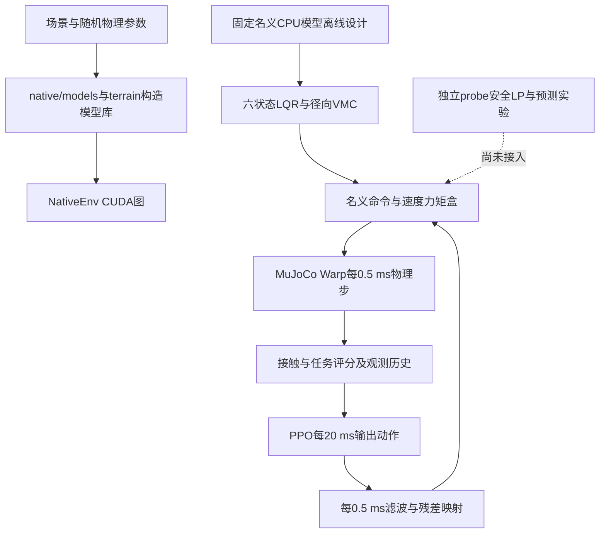

# 轮腿论文代码架构与模型约束审计

本次以 `wheelleg_warp/` 为当前论文工作目录，核对实际执行入口、动力学模型、控制输出、模型约束、安全实验与训练评估。最新结论是：**已修正真实物理验收和公开力矩分配；独立低位候选已通过六场景物理门，但高速停车、任务约束接入、在线信息与时序尚未闭合。闭链初始化和已测VMC映射未发现符号错误，不能据此声称全部模型约束正确或实机安全。现有LP无解也不等于0.115 m物理不可控。**

原始审计对象为2026-10-01的工作树，基于提交 `4a5186f`。原审计仅作诊断；后续用户要求“修正错误并继续按计划推进”，实现和复验进展单列如下，原失败与历史证据保留。

## 当前瓶颈复核：任务、物理与预测必须分开

本节基于归档提交 `a2cde41` 后的活动代码及已有原始结果，优先于下方标为“原审计”的历史问题。此次复核没有重新运行长物理试验、调参或训练；新增检查只复用既有数组。

| 层次 | 当前实现与证据 | 结论 |
| --- | --- | --- |
| 动力学与几何 | 固定名义CPU离线设计；随机被控对象由模型库构造；闭链与接触为MuJoCo软约束 | 分离方式正确；XML关节range和connect不是不可穿越的机械硬止挡 |
| 控制执行 | `NativeEnv`每策略步40×0.5ms：Nom→残差→最终盒分配→物理→接触与评分；策略50Hz | 2kHz是仿真子步频率；独立host预测器不能继承这项实时结论 |
| 实际物理验收 | `range115/physical_v1`逐子步记录A/B链、八关节、实际力矩与证据计数 | 已修正理想FK假安全和隐藏增益导致实际扭矩超额；闭链误差仍仅记录，没有标定后的拒绝阈值 |
| 低位可行参考 | 独立可行参考、轮髋协调、径向保护模式 | 六正常物理6/6、任务4/6；开关默认关闭，不能把独立候选效果当作默认训练效果 |
| 高速停车任务 | 环境按到达后历史最大平面位移≤0.6m、到达1.5s以后历史最大平面速度≤0.03m/s判分，到达2s结束；最新独立选择器已接这些任务状态 | 原任务预算现进入5ms筛选，终端/备份可行性仍缺失；局部安全和LQR成本改善不构成停车成功 |
| 预测与鲁棒性 | 固定7kg平地模型，当前完整仿真q/v、已知传感输出及过去滤波状态；已核18点/小动作/5ms | 未覆盖传感可得性、随机质量/摩擦/驱动、未知地形和接触变化的误差界，不构成递归安全 |
| 训练与论文 | 默认训练入口仍是历史固定高度；高度探针为旧0.16～0.38m协议 | 新范围的工程门、统一正式训练契约和公平比较未完成，当前不适合继续同配方长训练 |

### 已复现的停车契约缺口

此前版本的`native/environment.py:181–187,238`保存到达时间、到达位置、历史最大停车位移和尾速，并在success中使用。`probe_braking_feedback.py:71–109`只把当前q/v及控制器内部记忆传给 `select_braking_common_action.batch_scores`；没有传入环境到达位置 `state[:,2:4]`、历史最大位移 `state[:,6]`、到达时间 `state[:,1]` 或尾速历史 `state[:,7]`。本轮已通过独立`task_forecast`接入这些状态，原物理评分接口保留。

筛选器检查5ms内A/B几何、设计关节域、关节终态停止锥、姿态、电机盒和有限性；选择仍仅依据原15状态LQR成本。位置目标在未锁定时跟随当前x，锁定后跟随控制器anchor。**这是遗漏任务预算的局部控制器，不是满足0.6m与尾速期限约束的停车规划器。** 原DARE终端P来自原局部线性模型，也没有证明在当前J修正、参考投影、径向保护、限幅与接触切换下是可行终端控制或任务保证。

最小检查复用234个归档候选：原成本/物理有效性/18个选择一致性与旧失败轨迹拒绝继续通过；将同一平地运动及其控制器位置参考平移，在同一固定到达原点下，最大距离分别为 **0.052359m与0.752359m**，原物理评分仍均有效且成本相同，新增任务筛选已区分为通过/拒绝。坐标计算采用float64，避免把归档float32平移舍入混成代价差。该反例验证任务谓词补接；它不证明最佳动作或整个1Nm域不可达。复现：`.venv/bin/python -B wheelleg_warp/check_braking_batch_scores.py`。

### 最新失败证据与下一项交付

合并预测记录核并去掉无用time/warm轨迹的[13候选复验](results/braking_feedback_fused_record_20261001/verification.json)仍物理2/2、任务0/2，停车0.620239/0.624837m；决策中位6.244ms/p95 9.904ms，GPU传播中位3.970ms/p95 7.329ms。清理记录没有解决实时问题。

补齐公共F/H/W相反符号组合的[19候选复验](results/braking_feedback_mixed_signs_20261001/verification.json)仍物理2/2、任务0/2，停车0.620235/0.624897m，尾速0.01158/0.00320m/s通过；决策中位6.566ms/p95 10.242ms。新增方向被选85次，却没有明显停车收益；因此没有依据继续单纯加候选追分。每例逐步证据计数与物理步数一致，原±1Nm盒、L1≤0.1Nm更新域与验收门保留。

下一项交付应先把原到达位置、累计位移、尾速历史和剩余时间明确纳入独立规划接口，并核任务约束在预测及终端/备份轨迹上的可行性。只筛5ms未越界仍不足以保证以后能停住；不能用未验证的瞬时匀减速距离替代轮髋俯仰耦合，也不能放宽门、增大旧动作盒或把DARE值函数当安全证书。停车完成后才扩完整六场景及随机域，随后处理完整计算时序和传感信息。现有独立反馈的limitations已改为实际13/19候选数，并明确它未筛原停车任务门；控制和选择行为未改。

文件清理仅处理当前目录中4个可再生`__pycache__`目录、37个缓存文件（418340字节）。源码、归档失败、模型、结果和CPU校对基准均保留；缺少直接import不能证明实验入口无用。

## 原停车契约接入与首次闭环拒绝

原0.6m、1.5s、0.03m/s与2s常量集中在`training_contract.py`，生产`after()`和独立`task_forecast`共用，数值与成功判据保持。预测逐子步用固定到达原点的二维距离、二维速度范数及已有累计最大值检查；按环境相同时间计算，在到达2s的终止子步记录最后证据，其后冻结。日志记录剩余时间及5ms窗之外尚未验证的时间，不给出未验证的终端可行性声明。

[GPU/host八例配对](results/braking_task_contract_20261001/gpu_host_task_parity.json)逐值一致：历史距离0.6边界/下一浮点值、历史尾速0.03边界/下一浮点值、横向超速、二维距离、当前位置越界、正常对照；终态结果为1/0/1/0/0/1/0/1。原轮心、退出、奖励、证据冻结及延迟/重置回归同时通过。CPU检查另覆盖1.5s尾窗前后、2s终止后样本、历史不可恢复和非有限任务状态；原234候选等价检查保持。

[新高速正反闭环](results/braking_feedback_task_contract_20261001/verification.json)在iteration1103停止，未完成回合且不计成功：反向world1停车后0.953s，当前累计位移0.599838734m，19个候选均通过5ms物理筛选，但预测最大位移最小也为0.600704432m，全部被任务门拒绝。剩余1.047s、窗外未验证1.042s，说明当时的小步修正已经太迟；拒绝动作不是安全回退或完整停车通过。决策中位10.045ms/p9510.419ms，本轮仍不满足5ms实时门。源码哈希、各完成决策的任务窗及原±1Nm/L1≤0.1Nm执行域独立核过，失败和对应源码保存。

下一步从到达时的当前可得状态做贯穿原2s截止的有限名义备份轨迹检查：复用当前预测图、Nom和已定公共方向，在原每5ms增量L1≤0.1Nm及逐电机±1Nm域内构造未来动作，逐步核物理、累计距离和尾窗。先找得到可独立执行的完整可行序列，再接反馈保留该备份；不以当前5ms筛选或DARE终端成本宣称递归可行，不改原目标和门，也不扫Q/R或扩大动作域。

## 第一阶段修正与复验

- 晚期标定入口已改为按实际响应数组长度迭代，并支持`--output`指定独立新目录。新[13臂单步复验](results/height_115_late_response_recheck_20261001/verification.json)完整落盘，CPU/Warp配对q差1.864e−6、v差1.927e−4、接触一致，paired_gate_pass；原结果不覆盖。1Nm模型仍无解、2Nm拟合模型仍有解，只是入口修复，未晋升在线域。
- `range115`默认采用独立的`height_safety='physical_v1'`契约，逐0.5ms记录真实A/B链腿长、八关节余量、闭链误差及实际/命令扭矩相对发令前速度包络的超额。终态要求完整逐步证据和真实几何/关节/电机门；不以理想FK替代实际几何。闭链误差暂只记录，未伪造未标定的鲁棒界或硬件认证。它是验收门，尚不是阻止越线的安全控制。
- 旧固定高度任务与旧0.16～0.38m默认协议不启用这项新契约；历史range115可显式使用`height_safety='legacy_fk'`，输出标签区分。手工拆分执行图若遗漏新监测核，证据计数不足时不得宣称新契约成功。
- [真实物理验收回归](results/height_physical_contract_20261001/verification.json)拒绝全部352个假安全逐腿帧；GPU实际A对归档最大差5.270e−9m、A/B及闭链对CPU site最大差5.246e−9m。有效、A越线、关节越限、实际扭矩超限、缺证据五个终态的success依次为1/0/0/0/0；40子步监测计数及重置通过。首次测试的被动关节扰动方向不符合预期，CPU核对后仅修正测试输入，未放宽生产门。
- [旧任务回归](results/height_physical_contract_20261001/legacy_task_regression.json)8世界轮心退出、奖励/评分、证据冻结、延迟环与重置均通过；现有[六高度×四地形物理回归](results/height_physical_contract_20261001/legacy_height_range.log)24/24通过，27mm单侧范围外诊断仍失败，不计入主任务门。新[六正常0.115m完整零残差基准](results/height_physical_baseline_20261001/verification.json)6/6轨迹完成，真实几何＋八关节＋电机及任务联合成功仍0/6，逐步证据数与物理步数全一致。

| 正常场景 | 最低真实A链 m | 最低八关节余量 rad | 最大实际扭矩超额 Nm |
| --- | ---: | ---: | ---: |
| 平地0.5m/s | 0.113784821 | −0.0225780 | 0 |
| 20mm对称台阶 | 0.112974753 | −0.0235068 | 0 |
| 3°横坡 | 0.107772892 | −0.0234761 | 0 |
| 4mm粗糙路 | 0.113776259 | −0.0228660 | 0 |
| 平地1m/s | 0.113250044 | −0.0657672 | 0 |
| 平地−1m/s | 0.113983843 | −0.0642164 | 1.147e−7 |

实际/命令扭矩门使用固定1e−6Nm浮点数值容差，没有放宽几何线或关节范围。本轮结果支持“验收口径已接线且能识别失效”，不支持“控制瓶颈已解决”。下一阶段仍需统一名义径向/角域请求、实际扭矩分配与动态制动约束；本轮没有修改控制/PPO或开启长训练。

## 第二阶段实际扭矩分配与采集图修正

range115/physical_v1现采用公开增益上界分配命令：`A_cmd=A_nom/max(1,g_upper)`，髋上界1，两轮统一1.05，来自冻结场景的±5%驱动差异。六状态/VMC输出、残差投影和最终限幅使用同一盒；固定名义LQR设计不读随机世界参数。真实世界增益仅用于检查模型是否超域或不支持，不参与在线分配。旧`control`与`residual_projection`接口保留名义协议。

LiveNativeEnv和RecordedEnv会重建执行图，原先未接第一阶段的监测核。本次三条图都改为继承控制模式并逐子步监测，采集元数据标注公开上界和实际/命令限幅口径，原32维观测与PPO保持不变。

[最终公开上界验证](results/actual_torque_public_bound_20261001/verification.json)覆盖4种域内驱动差异和4种轮速（含超空载及反向），16条件的旧实际扭矩超额峰0.225Nm降到1.788e−7Nm，低于既定1e−6Nm浮点门。同状态不同隐藏增益的控制命令逐值相同，Native、Live、Recorded各40子步证据齐全；向共享函数提供单位增益时，命令和诊断与旧实现完全一致。[旧残差投影回归](results/actual_torque_allocation_20261001/legacy_projection.json)1006例、非有限零命令及非绑定1s配对通过；[12000步CPU/GPU同状态控制校对](results/actual_torque_allocation_recorded_20261001/legacy_controller_pair.log)最大差4.700e−7Nm。

初轮测试误用冻结域外的±.1驱动差异而被拒绝，只修测试输入、不扩大域。两个早期精确增益诊断[第一版](results/actual_torque_allocation_20261001/verification.json)、[含遥测版](results/actual_torque_allocation_recorded_20261001/verification.json)读取了随机世界真实增益，具有额外信息，不能作为同信息在线成绩；结果及对应source源码包保留。当前默认与最终验证使用公开上界。

[最终六正常低位完整回合](results/actual_torque_public_bound_20261001/normal115/verification.json)6/6完成、实际扭矩超额全0，几何/关节/任务联合成功仍0/6，监测计数与物理步数逐例相同。最低A链约0.107773～0.113984m，关节余量最低−0.0229～−0.0660rad。修正实际扭矩门没有解决动态几何瓶颈，下一步仍应统一径向/角域请求与共模安全分配，并审查立即制动约束。独立host/GPU安全LP尚未接同一公开命令盒，初始oracle、模型误差、实时和全高度门仍未关闭，不启动PPO长训练。

## 关节联合屏障试验与起点条件

原立即制动条件要求所有接近限位的关节立刻反向加速，不是一般反馈可行域。本次仅在独立CPU试验模式中加入关节高阶屏障：h>0、ψ1=dh+kh≥0、ddh+2kdh+k²h≥0；k=200/s取既有5ms预测窗倒数，未按效果扫参。连续标量动力学在初始集合内且不等式持续成立时可解释关节正不变性；有限采样、接触速度变化、加速度/G误差和被动关节仍未闭门。原位置余量线、关节范围、误差预留和1Nm增量盒保留，腿长仍用原条件。默认控制/GPU安全核未启用此试验。

[完整离线检查](results/height_joint_hocbf_heldout_20261001/verification.json)得到：46个旧LP样本的44个可行点全部保留，旧动作回代一致；新关节条件加公开命令盒仍44/46，两个延迟失败不因更换关节条件而消失。在原物理通过的40步保持窗口，立即关节制动拒绝34步，新关节条件没有拒绝。六场景提前15ms的可行数4→6，但原首次报警仍只有1个可行，另两例ψ1已为负，表明需要更早启动而不能直接从集合外加入。108个留出动作的首步关节代理中18个初始集合外，剩余90个预测和实测平均加速度代理均过、0假安全；这不是腿长、连续或整回合安全证据。

按预先固定的首个新增非零候选，world0提前15ms动作约(F,H,W)=(3.66669,−0.176684,0.116824)，作一次[冷起点CPU/Warp单步复核](results/height_joint_hocbf_candidate_20261001/verification.json)。两后端真实双链/八关节/姿态/电机及制动代理门通过，CPU/Warp整体q/v差2.256e−6/1.284e−3，超过原2e−6/1e−3配对门，故整体失败。归档有非零warm，为补齐数值初始化，仅增加可选warm参数并作一次[归档warm复核](results/height_joint_hocbf_candidate_warm_20261001/verification.json)，候选和门不变，仍整体失败，停止该配对流程。

[误差定位](results/height_joint_hocbf_candidate_warm_20261001/pairing_diagnosis.json)将最大q差定位到轮2相位、最大v差定位到轮1；主动关节q/v差4.131e−7/7.994e−4，真实A差9.473e−8m。大轮相位float32一ULP约3.815e−6，可能贡献坐标误差，未证明轮速差的机制；恢复warm没有解决。保持原整体失败标签，不能改用局部一致就声称配对通过，也不能从配对失败推导机器人物理不可控。

下一步不继续扫屏障系数。先查因果名义输入历史：当前加速度估计扣除了上一额外动作，却未显式补偿已执行名义命令变化。代码说明这项输入建模尚不完整，但尚未证明是既有失败主因。应核共同子空间投影残差与标定域，并按逐案例最坏误差检验后再决定完整反馈。模型、初始oracle、实时预算及全高度任务仍未完成。

## 因果名义输入与统一总命令审计

加速度估计原先扣除了上一额外动作，却把名义输入作用视为常量。固定传播已执行名义命令、只用旧q/v和旧输入的[共同三维投影检查](results/height_nominal_input_history_20261001/verification.json)没有通过：86案例5572个真实双链/八关节失效前窗口中，23例最坏误差增加，5048窗口不满足原投影精度或支持域条件。2ms恢复速度峰0.192550→0.194560rad/s，不能按平均改善上线。

已有三个平地六电机±0.1Nm有限差分记录可以复用。首步铰链位置灵敏度按implicitfast积分关系转换为有效加速度响应，再在六独立虚拟坐标中留出被测整世界、仅平均另两个世界。[完整名义输入检查](results/height_nominal_input_full6_20261001/verification.json)42例40例最坏误差不增，但仍有2例增加与428个支持域外窗口。校验积分器时改用实际MuJoCo枚举常量；没有重跑物理或调整反馈参数，旧源码留存。

名义与额外输入分别用不同响应矩阵还有一项结构问题：即使两者相互抵消、实际总命令不变，模型仍可能报告输入诱发的加速度变化。新的统一传播直接用已执行六路总命令：`a_j=a_previous_measured+H6*(command_j-command_previous)`，避免按两部分划分，固定总命令闭式检查通过。

[统一总命令结果](results/height_total_input_history_20261001/verification.json)42个平地转移例全部最坏误差不增；三组速度峰分别从0.04863/0.04942/0.04685降至0.01518/0.00603/0.01204rad/s，加速度峰约36.01/36.95/34.50降至7.88/5.10/6.83rad/s²。该模型只使用旧观测和已执行输入、没有读取目标新状态。837窗口只有195位于旧±0.1Nm轴向凸包、642未获支持，且缺地形与恢复完整六通道数据。它修正了表示层的输入抵消问题，尚未证明可部署模型或递归安全，默认估计器与PPO不变。

[名义角向请求诊断](results/height_total_input_history_20261001/nominal_reference_diagnosis.json)提供了更直接的上游线索：world0在7.383s实际腿极角约10.209°，名义角向位置项的静态等效请求15.838°；0.115m站立支路在原硬限内半角只有10.790°，该等效请求的IK无解。该计算扣除了角速度反馈、重建旧gyro，并非完整LQR期望稳态或完整因果证明。下一步应先做径向与角向请求的模型可行域投影，保留原名义目标、速度反馈和实际验收门；输入模型需另补Warp原生完整响应/输入域与误差验证，不继续扫趋势系数或启动长训练。

## 名义请求投影与轮髋协调试验

本次将已识别的静态不相容请求放入独立`feasible_reference`模式，默认关闭。左右径向参考投影时保留原平均名义高度，并限定在原模型代理下限～0.38m设计区间；角向位置项等效请求用站立支路IK限制在±1.4rad设计关节域（0.1rad旧设计预留），保留公共角速度/俯仰速度反馈。原目标速度、高度、32维观测、PPO以及实际±1.5rad、代理线、姿态、停车门全部保留。单次静态可达不保证动态安全。

[首轮试验](results/feasible_reference_20261001/verification.json)175个静态构型通过GPU/CPU IK核对，原非绑定请求不变；六正常完整回合中八关节余量全部转正，最小约0.1045rad，几何联合门仍0/6。平地/粗糙最低A约0.11437m，台阶约0.11300m，横坡约0.11314m，均低于原线。高速正反向新增俯仰峰约9.63/9.52°，说明只投影髋路会破坏原两输入协同，首轮不能晋升，结果与原源码包保留。

按固定两路LQR的同一速度参考关系，平均髋改变ΔH时同步轮改变`ΔW=(K_W,v/K_H,v)ΔH`，不扫描系数、不修改增益。[协调试验](results/coordinated_reference_20261001/verification.json)六回合全部完成，关节余量均≥0.1048rad，俯仰峰≤0.728°，姿态门通过；腿长仍全失守，联合0/6。低速停车约0.203m且末速度约0.0035m/s，高速停车约0.684/0.688m仍超过原0.6m门。投影诊断只在20ms策略边界抽样，不能据此声称每步激活频率或2kHz实时。[旧投影回归](results/coordinated_reference_20261001/legacy_projection.json)1006例、非有限零命令与非绑定配对通过。

这一结果支持“先协调两路输入”，不支持“低位瓶颈已关闭”。下一步必须处理径向动态余量与停车约束，并在真实几何/八关节/姿态/原任务门下验真，不靠抬高目标或放宽门。两个试验开关都默认False，未替换原控制基线。

## 径向动态保护与停车剩余门

[2kHz失败窗口](results/coordinated_radial_events_v2_20261001/verification.json)区分了两类问题：平地低速/正向高速在到达后约0.176s慢收缩越线；台阶、横坡、粗糙路分别在5.058/4.265/4.1625s行驶中越线，闭合速度约51/57/31mm/s。首次采集因NumPy布尔序列化失败，但原始窗口已存，数据和失败记录保留；只修序列化后独立复验。

独立`radial_guard`以当前主动q/dq、原名义长度、公开8kg上界及名义髋转子折算惯性构造单向公共径向跟踪力：既有5ms尺度k=200/s，参考表达式`-2k*Ldot-k²*(L-Lnom)`，解析电机头空间限制补量，角向虚拟请求保持。它不使用未标定学习G的较大动作外推，不提高原长度目标，也不是未知扰动下安全证书。[径向保护完整回合](results/radial_guard_reference_20261001/verification.json)六个正常场景物理6/6、完整任务4/6，最低真实A≥0.114909m，关节余量≥0.1048rad，姿态/电机门通过。仅高速±1m/s的停车距离0.684/0.688m未过0.6m门，原门不放宽。

| 固定停车试验 | 物理门 | 任务门 | 高速主要失败 |
| --- | --- | --- | --- |
| [径向保护与原协调](results/radial_guard_reference_20261001/verification.json) | 6/6 | 4/6 | 距离0.684/0.688m |
| [立即追返到达位置](results/radial_guard_arrival_hold_20261001/verification.json) | 6/6 | 0/6 | 2s尾速约0.56m/s，低速也约0.169m/s |
| [独立公共轮制动力矩](results/radial_parking_guard_20261001/verification.json) | 6/6 | 4/6 | 距离0.815/0.819m、尾速0.132/0.134m/s |
| [角度参考坐标协同](results/radial_pose_coordinate_20261001/verification.json) | 6/6 | 4/6 | 距离0.761/0.764m，尾速0.017/0.019m/s过门 |

两个参考坐标的同步均按既有LQR系数推导，不调增益。上述对照说明保持输入协同是必要条件，单路加轮矩或过早追返位置不能解决停车。公共径向力完整诊断峰最高约65.3N，未触发髋盒限幅。[三例独立头空间检查](results/radial_pose_coordinate_20261001/headroom_check.json)验证正/负/零径向映射和虚拟角向保持；[旧投影回归](results/radial_pose_coordinate_20261001/legacy_projection.json)1006例等通过。

本面板首次完成真实几何/八关节/姿态/电机联合物理6/6，但不能当完整任务6/6或全高度完成。较好的方案仍为径向保护与原协调。下一步应在保持这组几何保护的条件下识别制动响应和停车约束兼容性，不扫裕量或停车系数；所有新增模式默认关闭，旧CPU/PPO/验收门保留，延迟/噪声、独立场景和完整实时仍需验证。

## 固定制动响应与名义模型适用域

[六例2kHz制动记录](results/radial_braking_response_20261001/verification.json)复现较好候选的物理6/6、任务4/6；停车距离与前次差小于1e−5m，证据计数完整。高速两例停车后的静态等效角请求峰约36.13°，投影半角仍8.90°，约48%子步被投影。.1～.75s平均减速约.826/.822m/s²，公共轮矩峰仅.123/.121Nm，全制动段仅2步执行限幅。因此持续电机饱和不是这两个失败的直接解释；投影改变参考后减速不足有轨迹支持，但不能从该控制器失败推出任务物理不可达。

[固定15状态两输入诊断](results/radial_braking_response_20261001/response_analysis.json)保留径向PD、名义工作点完整动态和原设计关节预留，公共轮/髋输入每5ms保持、每0.5ms核线性腿长、关节、5°俯仰、原命令盒、.6m停车和1.5～2s全程.03m/s尾速。名义线性最小最大位移约.361594m。平衡点小扰动独立自检过，只支持该局部线性化；首版只核2s末尾速的结果已明确标记契约不完整，保留源码与数据，不用其冒充原任务通过。

[固定解非线性CPU回放](results/radial_braking_response_20261001/nonlinear_lp_replay.json)在37ms/74步真实A/B腿长降至.11458870m，低于原.114704466m线；同时线性模型预测.11553668m，理想FK也约.1145846m。此前八关节、姿态及实际力矩通过，但49步计划命令被实际盒裁剪。该计划拒绝，不接默认控制；回放未使用额外径向保护且不是CPU/Warp配对，偏差混有非线性、实际映射与限幅作用，不能归结为单一动力学项。

这项诊断明确了模型约束的另一处边界：**正确的局部动力学线性化与正确的线性约束，不保证大输入下的实际执行和真实几何满足约束。**下一步应先建立当前构型与实际命令盒下的局部响应、输入支持域和预测误差，随后做有反馈的轮髋共同制动；不靠扫描安全预留、放宽停车门或PPO训练补这项缺口。完整任务仍未验收。

## 当前构型VMC的线性化漏项与修正验证

生产输入是`J(q)*[F,H]`，原名义制动模型固定平衡点的`G`，只写`A−B*G*outer`，遗漏了非零平衡支撑输入经当前构型变化产生的导数。独立制动入口现统一使用`A+B*(du_physical/dx)`，电机线性约束也使用同一个实际输入导数；未改变CPU原模型入口或Warp默认控制表。

[组合一步映射核验](results/braking_input_mapping_v2_20261001/verification.json)使用原平衡点、32个独立小扰动，速度块相对误差峰从0.0900%降到0.00261%，通过既有0.5%小扰动门。原遗漏输入雅可比峰约1.405Nm/状态单位。该核验只覆盖局部名义模型；没有证明大幅制动或未知接触下的预测界。

复用原74步失败前缀后，补平衡点雅可比项的速度递归误差仍约0.1005m/s。用真实已执行六电机输入传播，关节位置与线性腿长误差明显减小，但速度递归误差仍0.105m/s，一步速度误差峰0.0865m/s，尚无可用误差保证。映射/限幅差首步已出现、最大约3.46Nm；不能只用平衡点的虚拟输入响应解释实际大输入执行，也不能把输入历史修正当成安全证书。

[独立修正名义设计](results/current_vmc_nominal_design_20261001/verification.json)复用原LQR流程和Q/R、五节点、关节预留以及全部验收门，仅改变上述动力学链式项。五节点线性设计门通过；六正常0.115m完整回合仍物理6/6、任务4/6，高速停车改善到0.6636/0.6665m但仍超过0.6m。**线性化漏项已在独立模型修正，停车瓶颈尚未解决。**原默认表与历史证据保留，不继续扫代价或裕量，不训练PPO。下一步需要当前真实命令盒下的局部输入支持域、预测误差与有反馈的轮髋共同制动。

## 停车局部六电机响应、绝对预测与轮相位表示

[固定局部支持域](results/braking_motor_response_20261001/verification.json)复用较早径向保护候选六场景停车后0.1/0.5/1秒的18个状态，测试单电机±0.1Nm轴和总增量L1≤0.1Nm的预定留出公共F/H/W混合。468个0.5ms臂全部物理通过，最低真实A/B为0.11498318m，八关节余量≥0.10661rad；零孪生q/v逐值一致。轴拟合对留出动作的真实腿长、关节及速度增量误差很小，但拟合G6与零基线是离线未来响应，不可直接接在线控制。

[当前状态绝对预测](results/braking_motor_response_20261001/absolute_forecast.json)进一步仅由当前q/v、已知发令、过去数值warmstart和固定名义模型自行计算基线，不使用未来Warp零响应或拟合G6。留出混合腿长/关节/vx/主动角速度误差峰约3.77e−8m、1.82e−7rad、8.59e−6m/s、2.91e−4rad/s。这是18点的一步证据；完整仿真状态与公开布局输入尚未证明传感可得。测得FD和基线组件最大0.137ms不包含完整链路，不能称已满足2kHz。

原无界轮相位下，完整q基线误差峰3.15e−6仍超过原2e−6门。[等价周期坐标诊断](results/braking_phase_chart_v2_20261001/verification.json)仅将双方初始轮相位变为[−π,π)，先核双精度几何、质量矩阵、偏置力与加速度物理等价，再按原完整q、v及接触集合门检验468臂，全部通过，q/v峰约3.46e−7/6.37e−4。未缩小检查坐标或放宽门，也没有改变生产相位处理；只是独立初始坐标表示的一步验证，不能抹去原大动作配对失败。

下一步在独立预测复制中核5ms传播、未来名义命令计算和信息限制，随后验证反馈共同制动。本批有限状态的小动作响应不能扩作递归误差界、未知地形/参数保证或全高度任务通过；高速停车仍未关闭。

## 五毫秒传播与未来名义命令的因果计算

[固定总命令5ms传播](results/braking_phase_chart_5ms_20261001/verification.json)把原18状态×26小动作臂延长至10子步，保持初始周期坐标与原完整q/v/接触门，4680逐步配对全部通过，峰约1.70e−6/6.55e−4，真实物理逐步通过。它验证已知命令保持时的模型，不代表实际控制器未来Nom也会保持。

为解决后者，[新增控制器状态采集](results/braking_controller_state_20261001/verification.json)记录当前发令后的过去滤波状态及公开名义表。预测器用一个固定公开7kg平地模型，在自己的预测q/v及模型传感输出上每0.5ms运行同一控制代码，生成后续Nom，不读取实际未来命令、未来零响应或每世界地形布局。

首个零动作5ms比较180步全过，但复制了实际过去数值warmstart。[直接冷启动](results/braking_nominal_rollout_cold_20261001/verification.json)在两个发令比较上略超原1e−5Nm门，178/180，状态、接触和物理仍过，失败未抹去。改为在当前状态用预测器自身名义模型做无积分forward、用自身加速度初始化后，[不读实际warmstart的版本](results/braking_nominal_rollout_model_start_20261001/verification.json)180/180通过；初始q/v逐值不变，原门不改。

[已知公共混合输入](results/braking_nominal_rollout_common_20261001/verification.json)进一步加入18状态各13个预定零/公共F/H/W与混合双符号臂，总增量L1≤0.1Nm。输入持有5ms，未来Nom逐步重算并与增量在同一公开命令盒分配；2340个状态/接触/发令比较全过，峰q/v/发令误差约2.38e−7/7.63e−6/9.83e−6，两侧4680个物理步通过。该预测器的数值初始化、未来命令均来自自己计算，但完整仿真q/v的传感可得性尚未关闭。

下一步才是利用该有限支持域选择共同制动候选并验证完整停车。当前是18点、标准7kg、小输入和5ms证据；不构成随机域递归安全、完整2kHz链路或任务成功，不能据此晋升默认控制或开始PPO训练。

## 模型约束候选选择与独立执行

[候选筛选与选择](results/braking_candidate_selection_checked_20261001/verification.json)只从名义预测的13个已定公共小动作中选择，使用原15状态物理LQR的Q/R/P，恢复原增益的断言通过；逐步真实A/B与原物理门之外，保留1.4rad主动设计域、2.5rad被动域及已有5ms终态关节停止锥。旧37ms越界LP轨迹被同一函数拒绝，避免只在全安全样本上空验检查分支。

阶段代价最初误用x1～x10求和，已按原离散问题修正为x0～x9与x10终端项；首版数据与源码标记保留，未改Q/R、输入或物理轨迹。18个模型决策全部为非零小动作，早期多增加支撑，后期有轮/髋调整。决策冻结后才读取实际未来做评估，18个实际成本均改善；这不证明短距离停车或递归稳定。

[独立执行冻结选择](results/braking_selected_actions_20261001/verification.json)只执行这18个动作，不重新观察实际未来选方向；180个状态/接触/发令比较及两侧物理步全过，q/v/发令误差峰约4.66e−10/1.91e−6/5.96e−7。独立初态、输入及原始接触核验一致，实际代价18/18优于此前同初态零动作，最小改善约0.03133。

下一项工程验收仍是独立反馈的高速完整回合，随后六正常门。当前有限状态的5ms选择不能当固定时间规则、随机域安全或完整停车通过；默认控制与训练未晋升。

## 独立完整回合反馈试验

新增独立5ms反馈原型：预测器使用当前仿真q/v、已知过去IMU与控制器状态，固定公开7kg平地模型自行初始化与逐步计算未来Nom，原15状态代价从13个公共候选选择；真实Nom保持2kHz，实际公共执行量记入诊断残差，原真实物理/任务门逐步监测。预测器不读取未来实测轨迹，但完整仿真状态的传感可得性仍未证明。

| 独立协议 | 高速±1m/s停车距离 | 物理/任务通过 | 决策中位/p95 |
| --- | --- | --- | --- |
| [绝对小动作0.1Nm](results/braking_feedback_highspeed_20261001/verification.json) | 0.6828/0.6872m | 2/2、0/2 | 26.79/29.96ms |
| [原1Nm域内小步累积](results/braking_feedback_incremental_20261001/verification.json) | 0.6390/0.6429m | 2/2、0/2 | 26.91/30.16ms |
| [结合当前J名义模型修正](results/braking_feedback_current_vmc_20261001/verification.json) | 0.6202/0.6248m | 2/2、0/2 | 26.19/29.75ms |

后两项仅允许每次L1≤0.1Nm变化，逐电机额外量仍在原±1Nm盒内；原Q/R、设计预留、物理门与停车门不变，没有扩大PPO/LP权限。三次两例均完整、尾速通过、无预测无解；修正量已触及原盒，仍没有通过0.6m停车。组合版身高RMSE约2.72/2.77mm，名义高度目标未变。计算耗时远超5ms自身更新周期，不能用于实时控制，更不能称2kHz实现。

本版拒绝晋升，先行高速门失败后不扩到六场景。下一步需要区分有限候选、预测时域与动作盒的影响，并测清计算耗时来源；不能把一次有限网格贪心失败等同于机械或整个1Nm可达域失败。默认控制、旧CPU和PPO未改。

## 反馈计算成本的核实与等价优化

[同步分段计时](results/braking_feedback_profile_20261001/timing_summary.json)发现约15.48ms在逐候选几何/姿态/盒检查和原代价评分，约5.92ms在未捕获的自身初始化，传播与回传约4.07ms；不能将完整约27ms都算成物理GPU耗时。

批量评分保持原切空间、Q/R/P、阶段时序与约束。`check_braking_batch_scores.py`对234个已存预测候选检查成本误差峰约2.04e−10，有效性、18个选择一致，并拒绝旧越界轨迹。[完整回合复验](results/braking_feedback_batch_score_20261001/verification.json)物理门保持，评分中位降到约1.09ms，决策中位约11.92ms，停车仍约0.6202/0.6248m。

进一步仅捕获相同当前Nom、无积分forward和自身数值初始化运算，[初始化图复验](results/braking_feedback_captured_init_20261001/verification.json)仍完整物理2/2、任务0/2。初始化中位约0.390ms，完整决策中位6.13ms/p959.84ms/max14.62ms；传播与回传中位4.06ms/p957.43ms仍主导。成本已减少，**5ms更新及0.6m停车仍未通过**，没有用优化计算宣称控制性能提升或PPO端到端加速。

下一步分开测传播GPU与传输，并核原动作盒内候选覆盖；不缩短时域或放宽门追通过。默认控制、原CPU与训练保持，整体任务仍未完成。

## 传播耗时与无效几何优化的排除

[传播/回传同步分界](results/braking_feedback_transfer_profile_20261001/timing_summary.json)显示图发起至GPU完成中位约3.989ms/p957.343ms，回传仅约0.102ms/p95.140ms；不能再将主要成本归因于回传。饱和裁剪后的13候选有部分重复，800个活动世界决策中461次全异、153次9异、112次11异、74次12异；这只描述有限网格，尚未证明连续动作域可达性。

固定平地预测器中18个地下占位geom并不参与当前接触。独立删除它们后动态质量/惯量、meaninertia及状态/传感维度不变，真实环境未改。[完整回合核验](results/braking_feedback_compact_model_20261001/verification.json)保持停车0.6202/0.6248m和物理通过，但传播仍中位3.983ms/p957.334ms，决策约6.38ms/p9510.05ms，没有性能收益。因此这项配置已从活动入口删除，原失败和源码保留。

后续应处理实际传播成本与候选覆盖，不能用无效几何精简、缩短时域或放宽门替代实时/停车验收。默认控制与PPO仍未晋升。

## 原审计时的架构与范围



原生训练链见 `native/environment.py:337–346`。一个策略步包含40个0.5 ms子步，即策略50 Hz、名义控制和物理2 kHz。`baseline.py`、`gpu_env.py`、`fast_physics.py`是CPU控制配对或单世界物理桥接路径；它们不等于当前原生GPU训练路径。`native/safety_problem.py`与近期host-in-loop安全LP仍为独立实验。

全部137个非结果目录Python文件通过AST语法解析；详细阅读覆盖模型/地形库、原生控制与环境、CPU离线设计和VMC、训练入口/契约/评估、当前恢复/延迟/标定/安全LP及直接依赖。历史probe按当前失败链和调用关系选读，未逐行重新审查每份历史实验脚本；语法通过也不代表每个入口可运行。复用旧证据逐项区分源码匹配、历史来源与当前测量，不打开最终留出。

## 优先处理的问题

### 低位参考没有满足共同安全域

`native/controller.py:132–136`使用 `Lleft=Ltarget+offset`、`Lright=Ltarget-offset`，`offset=clip(0.30 roll+0.12 filtered_roll_rate,±0.035)`。默认参考只有三列，因此实验性的下限投影分支不启用。最终径向输出在170–171行继续使用这两个参考。

0.115 m目标距当前几何代理线0.1147044660616607 m仅 **295.534 µm**。只取3° roll和零角速度，代数重算得到offset=15.708 mm、低侧目标0.099292037 m，低于代理线15.412 mm。这是输入状态下的可复现参考冲突，不是宣称真实机器人必然保持3°倾斜。旧横坡事件窗口也存在相同方向的目标下探；其滤波状态是重建估计，不能当原内部状态逐值测量。

此外，0.115 m的站立连通支路只允许腿极角约±10.790°；每个主动关节留0.1 rad后约±8.901°。控制器没有将径向和角向请求联合约束在该工作空间内。169–171行用 `vl[1]+hub-average` 替换共模，左右对称时旧关节姿态PD的共同角向修正会被抵消。这是六状态共模替换的结构事实，不能单凭代数认定它是全部失效的原因。

已有目标下限投影把横坡最低真实轮心从约0.107773 m改善到0.113564 m，六个正常场景联合门仍0/6。**不能只夹住参考就宣布修复，平地的动态余量和角域是独立问题。** 直接证据见 `HEIGHT_115_ENGINEERING.md:38–44`、`results/height_115_target_floor_20260928/verification.json`。

### 环境验收使用理想FK，没有统一真实几何与八关节门

`native/environment.py:169–172,199–202`记录由四主动关节推得的理想闭链FK最小腿长，在回合终态加入success条件。没有逐步阻止越线，也没有八关节范围、真实A/B链与闭链残差的统一成功条件。MuJoCo XML中的关节范围和connect约束不能代替这个工程验收门。

本轮对 `results/height_115_passive_20260928/passive_trace.npz` 作只读独立核验：在有效轨迹中发现 **352个逐腿帧**满足理想FK≥代理线而真实A链轮心<代理线。首例是world5左腿t=2.061 s：FK=0.114716502845 m、真实A=0.114702653003 m，闭链误差16.376 µm，八关节仍在范围内。最深的此类假安全帧真实A低于代理线49.170 µm；有效帧最大|A−FK|约103.667 µm。四个代表状态经CPU `mj_forward` 的世界site位置独立重建，误差≤4.17e−17 m。

**这里证实的是瞬时谓词不等价，不是已经发现最终success误接收**：这14个旧回合后来连FK门也失败。原始NPZ哈希已核对；模型、环境、地形、CPU几何来源与当前一致，旧轨迹的控制器源码哈希与当前不同，所以这是历史几何证据，不是本轮当前控制性能复测。

MuJoCo将关节限位和闭链等式交给软约束求解器；`range`不意味着积分状态永远无法越界。这与旧轨迹中的软限穿越一致，不能靠把文档里的“限位”改称“硬止挡”消除。[MuJoCo约束计算说明](https://mujoco.readthedocs.io/en/latest/computation/)

### 安全LP代数正确，但当前形式过于保守且缺少误差保证

`probe_height_115_braking_budget.py:21–43`的腿长导数、方向二阶项和关节上下界符号一致。`probe_height_115_live_braking.py:32–55`对每个 `rate<0` 的收紧距离h要求

`a0 + g·c ≥ rate²/(2h)`，同时限制起点增量峰值≤1 Nm及名义绝对速度力矩盒。

这个公式在立即施加并维持恒定制动加速度的假设下有正确的停止距离含义。**它不等同于一般时变反馈的可行域，也不是有扰动界的鲁棒CBF证书。** 对仍距限位约0.44～0.46 rad的关节也要求立刻反向加速，会与腿长救援争夺同一个共模动作。已有持续20 ms分支34/40步不满足至少一个此类立即制动条件，却通过该窗口真实物理门，直接说明该条件比有限窗口安全更强；不说明可长期忽略关节约束。

同时，a0由上一0.5 ms速度差分减去已执行额外动作响应，G是固定局部拟合；LP右端未扣除在线名义加速度和G失配的有界不确定性。旧位置误差reserve不能自动转成加速度误差界，轴向拟合残差也不是连续组合或新状态的留出保证。动作切换、接触冲击和名义反馈变化都会使恒a0假设失配。延迟预测的闭式积分/索引检查通过，不能据此把模型误差也判通过。

最新 `height_115_scheduled_guard_20260929` 中，1 ms更新两个相位在998/998.5 ms到期时因模型无解停止；理想0.5 ms即时参考也在997.5 ms无解。实际A仍安全，因此**这次模型无解不是已经发生物理越界，也不能全归因于通信时延**。

### 原M3子空间不提供共同支撑，新安全层尚未进入默认执行图

`native/controller.py:189–196`的diff3映射为左右 `F,−F / H,−H / W,−W`，平均虚拟共模为零。已有三个局部六电机救援解投回M3的相对L2误差约99.998%～99.99999%；这与当前缺共同腿/轮权限的局部证据一致，但不证明所有时变M3反馈均不可能。virtual6允许共模，也没有自动获得经过验证的安全控制能力。

PPO输出每20 ms更新，内部滤波每0.5 ms最多改变0.01：请求0→1至少50 ms、完全反向至少100 ms。`environment.py:163–168`只观察最终执行残差，未提供内部滤波请求、λ和基础限幅状态。λ=0时，不同内部请求可映成同一观测，后续同一动作却执行不同残差，属于已证的隐藏执行状态。它是否是当前失败主因尚未独立证明。

当前CUDA图没有安全LP调用；安全实验不能直接算作PPO环境已经拥有的能力。`recovery_feedback.py:128–131`遇到模型失败会结束诊断；多臂比较中的失败后零增量只供其他臂继续且永久排除评分，未证明安全回退。GPU `execute_solution`失败输出名义命令的行为也尚未作为物理闭环回退验收。

### 电机约束限制了命令，没有限制所有随机模型的实际扭矩

`native/controller.py:61–65,174–188,230`的名义包络与CPU理想供电配置一致：髋峰40 Nm、175/280 rpm；轮峰4.5 Nm、490/710 rpm，超过额定转速后线性降到空载零力矩。该名义命令模型的单位与符号未发现错误。

但 `native/models.py:29–30`还把轮actuator gain乘以 `1±drive_difference`。XML的motor只有ctrllimited，没有force限幅。本轮纯CPU、零物理步的反例：`Scenario(drive_difference=.05)`，左轮ctrl=4.5 Nm，`mj_forward`得到actual actuator_force=**4.725 Nm**。所以名义命令盒正确不等于实际输出轴力矩始终≤4.5 Nm。`environment.py:390`已明确scope为nominal_command；这是已披露的模型定义与完整物理力矩门之间的缺口，不能称既有训练暗中违反其名义命令契约。[MuJoCo执行器控制与力限制](https://mujoco.readthedocs.io/en/stable/XMLreference.html#actuator-general)

若论文要声称物理峰值约束，应以实际扭矩统一控制分配、模型随机化和验收；如果有意将gain差异作为执行误差，则需单独记录真实输出，并明确约束口径。不能用额外1/2 Nm标定增量盒代替这项检查。

### 模型尚不覆盖连杆干涉与真实供电热约束

XML中腿杆、机身和电机壳碰撞均关闭；启用的非轮碰撞几何只有前后caster。因此“nonwheel_contact=0”不能证明连杆无自碰撞、电机壳不触地或低位结构无干涉。髋转子惯量为估计值，轮转子质量按惯量等效，均在 `hardware_profile.py`明确注明；这些是模型假设，不应包装成实测参数错误。

编译后的轮/地面/地形接触维数为condim=3，仅启用法向与切向滑动摩擦；摩擦向量中的0.02扭转和0.001滚动项不参与这类接触。没有证据证明缺少这两项造成当前失效，不能直接改condim追成绩。[MuJoCo接触维数说明](https://mujoco.readthedocs.io/en/stable/XMLreference.html#body-geom)

理想电源、无限峰值时间、不模拟热/压降/回生是当前纯仿真的显式约定。不能为了扩大训练范围擅自补一个未经标定的硬件模型，也不能拿现有仿真门证明实机安全。最短腿长加20 mm是确认过的模型代理线，不是CAD碰撞包络或硬件止挡。

## 最新证据与状态校正

`results/height_115_late_candidate_20260929/verification.json`已存在，status为 `single_step_pass`，当前所列源码哈希全部匹配。固定组合(F,H,W)≈(28.764393 N,−0.024319 Nm,1.199604 Nm)，实际附加电机峰1.199604 Nm，CPU/Warp q差1.696e−6、v差1.845e−4；组合首0.5 ms的真实几何/关节/姿态/电机及制动门通过。初始q/v、零响应和局部G仍为离线oracle，数值warmstart为零，名义力矩冻结，只支持这一单步，未支持持续闭环或1 ms调度扩域。原记忆中“下一步核一个组合”已经落后于证据，本轮更新为“该单步已完成，持续/在线仍未完成”。

当前还有一个确定的运行bug：`probe_height_115_late_response.py:67`的 `range(n)` 使用未定义的n。n只存在于 `paired_step()` 局部，`run()`在第55行写trace之后会报NameError，不能生成新的verification。旧归档源码哈希匹配提交 `61a6b57`，helper抽取后的当前源码不同；因此历史 `paired_gate_pass`不因当前bug自动失效。当前 `late_candidate`使用paired_step，不执行该坏的run路径。本次只报告，不修改被审查代码。

GPU装配/LP热点最新归档132次中位0.498972 ms、p95 0.607833 ms、最大0.790233 ms，65次超过0.5 ms，并且未覆盖完整名义控制、传感、物理和调度。它没有满足完整2 kHz控制链，也不能称PPO端到端训练加速。

## 已核实正确的部分与验证范围

| 检查 | 结果 | 能支持的结论 |
| --- | --- | --- |
| 137个Python文件AST解析 | 无语法错误 | 语法完整，不证明运行入口全部可用 |
| 0.115/0.16/0.30/0.38 m初始闭链与八关节 | CPU site闭合误差≤5.14e−16 m，0.115 m最小关节余量0.451125 rad | 初始化可达，不证明动态安全 |
| 名义质量与物理步长 | 7 kg、0.0005 s | 与当前配置一致，不是实测认证 |
| 48个六档构型解析VMC对FK有限差分 | 最大绝对差5.545e−10，门1e−7通过 | 已测映射符号正确，不证明整个奇异工作域 |
| `test_height_115_delay_prediction.py` | PASS闭式积分与旧forecast/LP接口等价 | 延迟传播数学自检通过，非真实噪声/接触预测保证 |
| 旧NPZ与四帧CPU site重建 | 哈希匹配，重建误差≤4.17e−17 m | 真实链与理想FK存在可量化差异 |
| 最新2 Nm标定域组合单步归档 | single_step_pass、源码匹配 | 该局部合法动作线索成立，不是在线持续安全 |

名义控制离线设计来自固定CPU模型，随机被控对象不隐式重新设计；这项分离正确。六状态设计显式保留径向PD并检查完整15状态局部闭环；离线节点稳定并不证明插值调度、限幅、接触切换下全局稳定。

现有v2正式地形流程已对源码/协议/ZIP/PKL冻结、VecNormalize只读评估、失败候选不覆盖最佳、终态deadline不bootstrap等作实际检查。未发现应把这些已修旧问题再次列为当前缺陷的依据。

## 当前论文入口与下一步顺序

`train_native.py`、`train_terrain.py`、`train_terrain_v3.py`默认仍为固定0.30 m历史任务。`train_height_capability.py:20–28,72–85`仅运行旧0.16～0.38 m、128世界/102400步公开能力探针，明确不晋升。新0.115～0.38 m采样/设计存在，完整新任务训练与安全层接线尚未完成；这是有意未通过工程门的阶段状态，不是应立即放开长训练的理由。高度探针保存哈希但尚未复用正式verify_protocol冻结流程，也不能直接升格正式训练。

以下保留原审计的阶段依赖顺序。第一阶段和实际扭矩修正已经复验；当前处于第二阶段的高速停车及第三阶段的模型/时序门，具体下一项以顶部复核为准：

1. **先统一验收事实。** 独立新模式按每0.5 ms实际A/B链、八关节、闭链残差、姿态、实际电机命令/扭矩评分；保留旧协议，新增门版本。门槛：已归档352帧不能被新真实几何谓词接受；不修改原0.114704466 m线、不掩盖旧失败。若此阶段不过，停止能力比较。
2. **再核名义控制与动态可行域。** 将径向参考、极角、关节和速度力矩盒放入同一安全分配语义；先区分可测的参考下探和即时制动的保守约束。门槛：六个正常0.115 m场景完整回合同时通过真实几何/八关节和原任务门，随后才查单侧场景。若仍无可行动作，做同信息、受限六电机上界或机械/任务可达性诊断，不能从一个LP点否定整个机械能力。
3. **关闭在线预测与时序。** 将初始20 ms oracle救援、未来零响应标定与在线可得输入分开；以独立状态/接触/动作组合核名义加速度和G误差，再选有明确误差裕量及可递归保持的约束。门槛：初始与恢复均因果可得、指定更新和总延迟下完整回合通过，完整计算路径尾延迟满足该时序；不把位置reserve或中位耗时当证书。失败则保留模型/权限/时序的独立诊断，不直接扩1 Nm域。
4. **最后评价学习增益。** 工程门通过后建立新高度协议及源码/归一化/检查点冻结，同场景同可见信息比较零残差、经典安全分配和差模PPO；全范围及独立场景按最差高度报告。PPO应解释剩余非对称控制收益，不能用它补救未定义的安全约束。若强经典控制已解决任务，先评估论文比较问题是否仍有研究空间。

原审计建议先完成第一、二阶段；最新物理验收已完成，停车和模型/时序仍开放。当前证据不支持再启动同配方PPO长训练，也不支持声称0.115 m本身物理不可达。

## 最小复现命令

延迟数学检查：`.venv/bin/python -B wheelleg_warp/test_height_115_delay_prediction.py`。实际扭矩反例可在项目根执行以下纯CPU代码，无物理积分：

```python
import sys
sys.path[:0] = ['wheelleg_warp', 'wheelleg_ppo/tools']
import mujoco
from ppo_env import Scenario
from native.models import model
m = model(Scenario(drive_difference=.05))
d = mujoco.MjData(m)
i = m.actuator('motor_wheelL').id
d.ctrl[i] = 4.5
mujoco.mj_forward(m, d)
assert abs(d.actuator_force[i] - 4.725) < 1e-12
```

原始几何NPZ SHA256：`88676f7c89f2aa658f8b5605fca2f9cf9fe46a9035f46609fbef467b656ce746`。本次未以当前入口重跑旧物理实验；标注的历史源码差异需按相应提交复原后才能声称原实验可复现。
