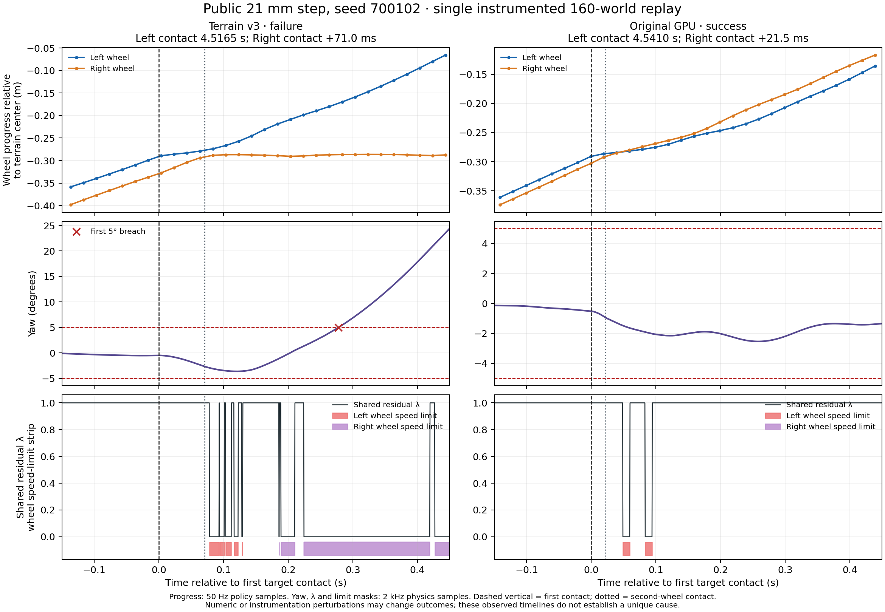

# 接触前动作差异：局部可恢复，困难台阶全组未过门

## 结论

原GPU策略在接触前的动作能帮助少量已公开案例，但**不能直接替换或混合为全任务优化策略**。两例定向试验显示其动作前缀可使反向不对称障碍330083两次由失败变成功，并使21mm低速场景700102两次成功；但在48例真实台阶上统一采用同样接触前替换，两次仅34/48、35/48成功，完成数41/48、44/48，低于固定强门45/48成功、46/48完成。没有更新权重或启动训练，也没有打开720000留出。

此试验在模拟器中读取接触掩码来切换策略，当前32维策略观测**没有该掩码**；因此它是行为可达性的探索性干预，不是可直接部署的控制器。GPU接触求解存在逐次波动，两次局部成功不能证明某一动作通道是唯一根因。

## 冻结对照与证据

- 基于任务契约v2的160例已公开开发面板，保持原世界顺序、同MuJoCo Warp GPU物理后端、同两个已选M3检查点及各自冻结的归一化。两个策略从同一原始32维观测分别归一化；CPU逐值验证该归一化与各自既有轨迹记录完全一致。
- 原始详细记录由`trace_policy_pair_v2.py`对完整160世界进行物理回放，仅保存330083和700100～700103的2kHz接触/动作/限幅信息与50Hz双轮进度。原始终态、检查点和源码指纹在相邻`policy_trace_pair_v2_20260923/`目录。
- 定向干预是两种策略的全程对照，加上“首次目标接触前用原GPU动作，检测到接触后**下一次50Hz决策**切回terrain-v3”。其余158世界始终用terrain-v3。顺序为A/B/C/C/B/A，记录每个世界的完整终态。随后在全部48例困难台阶上以同样方式做A/B/C/C/B/A，其他112世界均用terrain-v3；不从中点挑选有利回放。
- `source_sha256`、检查点ZIP/归一化PKL哈希和160例场景面板被冻结；权重前后未变。原有控制增益、动作空间、奖励和电机限制不变。全部回放不是新留出测试，也不作策略选模。

## 实际轨迹时序：21mm、0.5m/s、种子700102

一对带遥测的160世界回放中，terrain-v3失败、原GPU成功。以下为**单次观察**，不同策略的闭环轨迹并不共享接触后的物理状态。

| 事件或状态 | terrain-v3 | 原GPU |
|---|---:|---:|
| 第一轮接触台阶 | 4.5165s | 4.5410s |
| 第二轮接触台阶 | 4.5875s | 4.5625s |
| 两轮接触间隔 | 71.0ms | 21.5ms |
| 接触附近两轮纵向位置差 | 约3.8cm | 约1.2cm |
| 首次偏航达到2° | 4.5725s | 4.6340s |
| 首次轮电机速度包络限幅 | 4.5950s | 4.5900s |
| 首次越过5° | 4.7945s | 未发生 |

terrain-v3在第一轮接触后、第二轮接触前已出现超过2°的偏航；明显限幅晚于偏航开始。随后一侧轮进度在台阶入口附近停滞，轮速度限幅和残差λ清零增多。原GPU两轮接触更接近同步，后续偏航恢复。在接触前，terrain-v3左右主关节角约为±0.09rad，原GPU约为±0.03rad；该差异与轮子前后错位一致，但尚未通过仅替换单个残差通道证明因果。

图与`plot_700102_timeline.py`均存于相邻详细记录目录。图按各策略首次接触对齐：上部是50Hz轮进度，中部和下部是2kHz偏航与λ/轮限幅。它只展示这次带仪器回放的时序。

对于legacy 330083，旧87列记录器只把`terrain_00..15`列作“目标地形接触”，不会将左右旧障碍记入该列。本试验另用累计左右障碍掩码以50Hz给出首次接触的上界，**不伪称2kHz精确障碍接触时刻**。更关键的是：原GPU在这次带遥测回放也越过5°，尽管普通同批基线三次都通过；所以不能拼接不同回放，宣称观察到了“原GPU成功、terrain-v3失败”的同次330083时序。后面的低侵入干预对照才是此场景的有效比较。

## 两个定向场景的动作替换

| 160世界成对交叉回放 | 330083 | 700102 |
|---|---:|---:|
| A：全程terrain-v3（2次） | 0/2 | 1/2 |
| B：接触前原GPU，接触后terrain-v3（2次） | **2/2** | **2/2** |
| C：两个指定世界全程原GPU（2次） | **2/2** | **2/2** |

700102在A的失败回放两轮首次接触相隔约80ms；B两次约40ms，接触时纵向位置差由失败回放的4.3cm缩到约2.5/1.3cm。A的另一次本来成功，接触间隔也约40ms。因此“更同步的初次接触”与成功同现，且前缀替换可以改变它；仍不能把两次回放当成严格统计显著性或单一力矩通道因果证明。330083的B也两次成功，但50Hz累计掩码没有分辨出两轮接触时间差，可能还有其他预接触姿态/速度因素。

## 扩展到48个困难台阶

| 动作条件（仅48个困难世界改变） | 成功，2次 | 完成，2次 | 全160例成功，2次 |
|---|---:|---:|---:|
| A：全程terrain-v3 | 34、34/48 | 44、43/48 | 145、144/160 |
| B：接触前原GPU，接触后terrain-v3 | 34、35/48 | 41、44/48 | 145、144/160 |
| C：困难世界全程原GPU | 35、35/48 | 43、42/48 | 146、146/160 |

下表各格为4个公开场景×2次回放的关联结局，顺序为`A / B / C`，分母均为8，不是8个独立场景：

| 高度 | 0.5m/s | 0.7m/s | 0.9m/s |
|---|---:|---:|---:|
| 18mm | 7/8 · 8/8 · 8/8 | 8/8 · 8/8 · 8/8 | 8/8 · 8/8 · 8/8 |
| 21mm | 5/8 · 8/8 · 8/8 | 8/8 · 8/8 · 8/8 | 8/8 · 8/8 · 8/8 |
| 24mm | 2/8 · 1/8 · 2/8 | 6/8 · 6/8 · 6/8 | 8/8 · 8/8 · 8/8 |
| 27mm | 0/8 · 0/8 · 0/8 | 4/8 · 2/8 · 2/8 | 4/8 · 4/8 · 4/8 |

第一对A→B：21mm低速新增700100、700102，却丢失24mm低速700203和27mm、0.7m/s的700312，净增0且完成44→41。第二对新增18mm低速700002、21mm低速700100，丢失700312，困难组净增1；另一个**没有修改策略动作**的原回归世界340004也发生成功翻转，说明不能把全160例的每个差异归给动作替换。B的结果与C都未接近开发强门至少45/48成功、46/48完成，不晋升、不续训、不打开720000留出。

## 下一步

已找到**某些场景**可复用的接触前M3动作。要解决24～27mm困难组，下一步先用原电机/动作包络做受约束短时动作可达性检查，并定位同批次GPU微小分歧怎样被接触与闭环放大；不能把低速21mm上的小范围改善推广为全任务方案。若只有对高度/位置有不同的预接触动作才能稳定通过，才有证据投入地形预瞄或传感信息；若有同一通用动作能够兼顾24/27mm，则先验证其原场景回归，再考虑定向学习。

本轮的接触开关读取模拟器特权状态。实际策略要复现该上界，必须在观测中获得可靠接触或通过可观测状态学会同等行为；目前没有验证这个条件。更不能把本轮的全程原GPU或前缀借用视作满足强门的候选。原动画、检查点和历史终评不变，正式训练仍不成熟。
